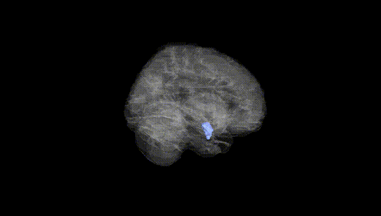
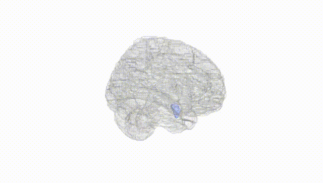
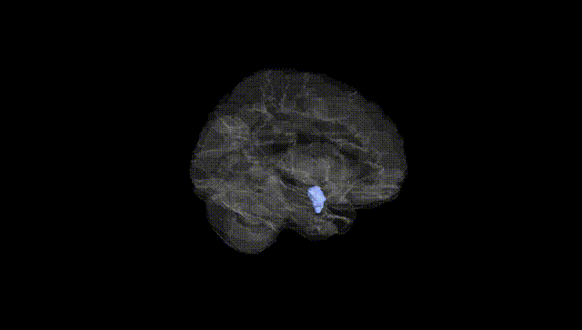
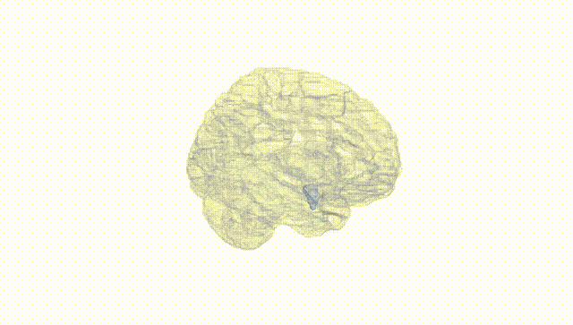
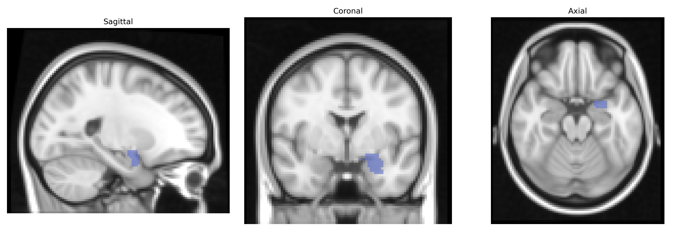
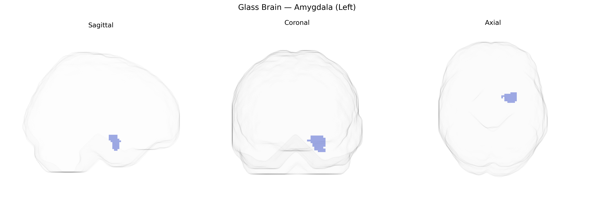

# Amygdala (Left)
 
## Overview
 
The left amygdala is an almond-shaped collection of nuclei located in the medial temporal lobe, forming part of the limbic system and closely associated with the hippocampus and parahippocampal structures. It plays a central role in emotional processing, particularly the detection and encoding of threat-related and salient stimuli, and contributes to fear conditioning, emotional memory formation, and modulation of autonomic and endocrine responses via extensive connections with the hypothalamus and brainstem. Functionally, the left amygdala has been implicated in language-related emotional processing and more detailed, context-dependent evaluation of emotional stimuli, complementing the right amygdala’s often more global, rapid threat detection. It maintains dense reciprocal connections with the prefrontal cortex, anterior cingulate cortex, and sensory association areas, supporting integration of affective, cognitive, and perceptual information. [Amygdala](https://en.wikipedia.org/wiki/Amygdala)
 
The left amygdala, as defined in the AAL Atlas, shows robust heritability and has been implicated in multiple GWAS linking common genetic variants to its volume, functional activity, and connectivity, with many associations overlapping with psychiatric and neurological traits. Large-scale imaging-genetics consortia (e.g., ENIGMA, UK Biobank) have identified loci in or near genes involved in synaptic function, neurodevelopment, and calcium signaling (such as SLC39A8, DLG2, MAD1L1, and variants near the major histocompatibility complex) that influence left amygdala volume or structure, often in partially lateralized patterns. Polygenic risk scores for major depressive disorder, schizophrenia, bipolar disorder, autism spectrum disorder, and anxiety-related traits correlate with left amygdala volume or reactivity, and specific risk variants for these conditions have been associated with altered left amygdala activation to emotional stimuli. GWAS of post-traumatic stress disorder, neuroticism, and stress reactivity also implicate genetic variation affecting left amygdala circuitry, while Alzheimer’s disease and other neurodegenerative risk loci (e.g., APOE) have been linked to amygdala atrophy, including on the left side. Overall, convergent evidence from imaging-GWAS, disorder-focused GWAS, and polygenic analyses supports a genetically modulated role of the left amygdala in emotion regulation, threat processing, and vulnerability to mood, anxiety, psychotic, and stress-related disorders.
 
*Overview generated by GPT-4o (2026).*
 
---
 
**Region ID:** 4201  
**Hemisphere:** left  
**Atlas:** AAL 
 
---
 
## Amygdala (Left) – Black Background (Full Brain)
 

 
**Full Quality Version:** <a href="full_black.mp4" download>Download MP4</a>
 
---
 
## Amygdala (Left) – White Background (Full Brain)
 

 
**Full Quality Version:** <a href="full_white.mp4" download>Download MP4</a>
 
---

## Amygdala (Left) – Black Background (Hemisphere)
 

 
**Full Quality Version:** <a href="hemi_black.mp4" download>Download MP4</a>
 
---
 
## Amygdala (Left) – White Background (Hemisphere)
 

 
**Full Quality Version:** <a href="hemi_white.mp4" download>Download MP4</a>
 
---

## Triplanar View – T1 Background
 

 
---
 
## Triplanar View – Ghost Brain
 


