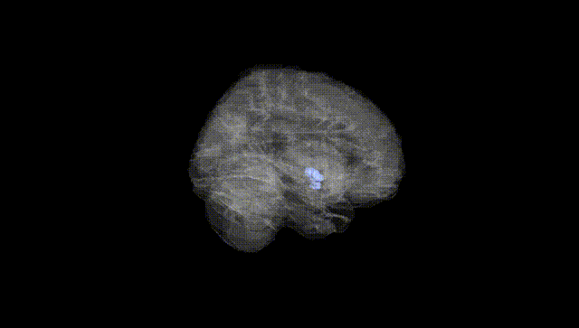
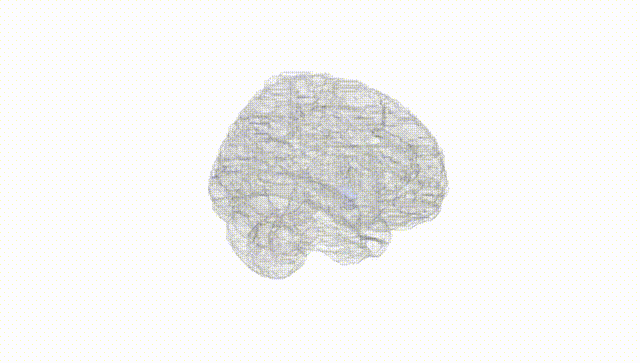
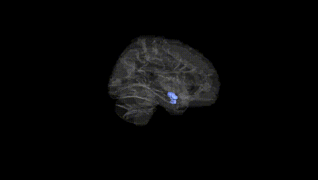
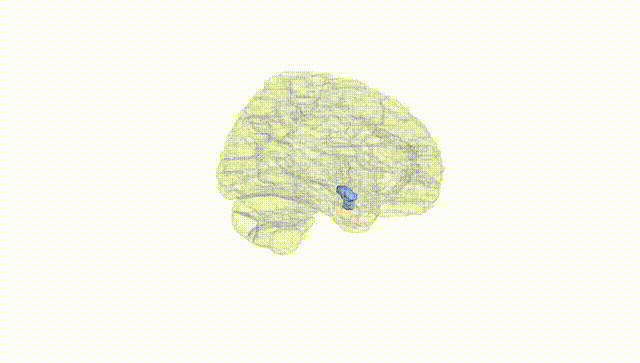
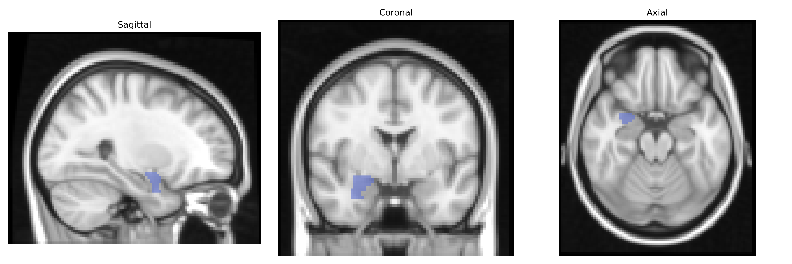
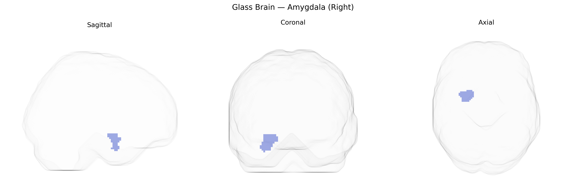

# Amygdala (Right)
 
## Overview
 
The right amygdala is a paired, almond-shaped nucleus complex located in the medial temporal lobe, forming part of the limbic system and extensively interconnected with the hippocampus, prefrontal cortex, sensory association areas, and hypothalamus. In the AAL atlas, it corresponds to the right-sided aggregation of several subnuclei (e.g., basolateral, centromedial, and cortical nuclei) that collectively participate in processing emotional salience, particularly fear and threat detection, as well as modulating autonomic and endocrine responses via projections to hypothalamic and brainstem centers. The right amygdala has been implicated in rapid appraisal of emotional stimuli, especially those with negative valence, and contributes to emotional memory encoding, social cognition, and modulation of attention. Lesions or dysfunction in this region are associated with altered fear responses, anxiety disorders, post-traumatic stress disorder, and abnormalities in social and emotional behavior. [Amygdala](https://en.wikipedia.org/wiki/Amygdala)
 
The right amygdala, as defined in the AAL atlas, has been repeatedly implicated in genetic studies linking variation in limbic circuitry to psychiatric and behavioral phenotypes; GWAS and imaging-genetics work show that common variants in genes related to synaptic plasticity, neurotransmission, and neurodevelopment (for example in BDNF, SLC6A4, CACNA1C, and COMT) are associated with individual differences in right amygdala volume and reactivity, particularly in response to emotional or threat-related stimuli. Large-scale neuroimaging GWAS consortia such as ENIGMA and UK Biobank have identified heritable components of right amygdala volume and shape, with specific loci near genes involved in neuronal growth, calcium signaling, and immune function, though many effects are small and polygenic. Genetic variants influencing right amygdala structure and function have been linked to risk or endophenotypes for major depressive disorder, anxiety disorders, post-traumatic stress disorder, bipolar disorder, and schizophrenia, often via altered fear conditioning, emotional processing, and stress responsivity. Additionally, polymorphisms associated with personality traits such as neuroticism, extraversion, and harm avoidance, as well as behavioral tendencies like aggression and impulsivity, have been connected to differences in right amygdala activation or morphology, underscoring a polygenic and pleiotropic architecture in which numerous common variants each exert modest influence on this region’s structural and functional characteristics.
 
*Overview generated by GPT-4o (2026).*
 
---
 
**Region ID:** 4202  
**Hemisphere:** right  
**Atlas:** AAL 
 
---
 
## Amygdala (Right) – Black Background (Full Brain)
 

 
**Full Quality Version:** <a href="full_black.mp4" download>Download MP4</a>
 
---
 
## Amygdala (Right) – White Background (Full Brain)
 

 
**Full Quality Version:** <a href="full_white.mp4" download>Download MP4</a>
 
---

## Amygdala (Right) – Black Background (Hemisphere)
 

 
**Full Quality Version:** <a href="hemi_black.mp4" download>Download MP4</a>
 
---
 
## Amygdala (Right) – White Background (Hemisphere)
 

 
**Full Quality Version:** <a href="hemi_white.mp4" download>Download MP4</a>
 
---

## Triplanar View – T1 Background
 

 
---
 
## Triplanar View – Ghost Brain
 


