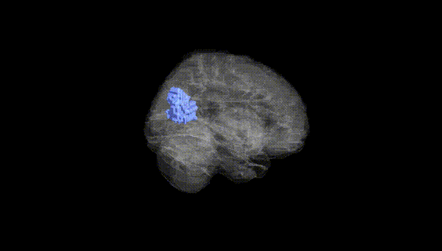
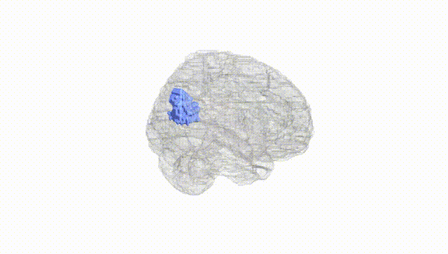
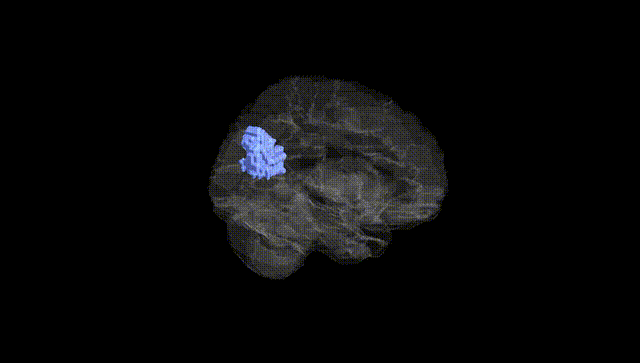
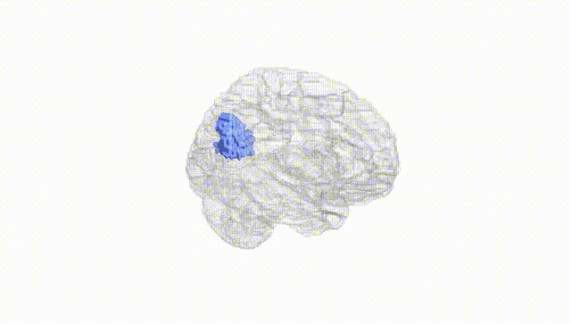
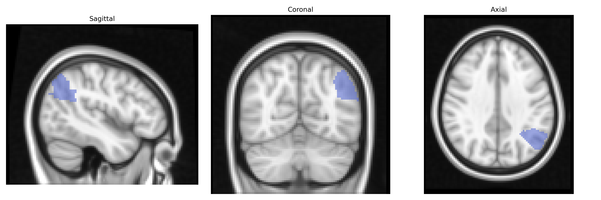
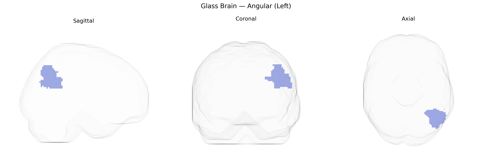

# Angular (Left)
 
## Overview
 
The left angular gyrus (Angular_L in the AAL atlas) is a cortical region located in the posterior part of the inferior parietal lobule, bordering the superior temporal and occipital lobes around the end of the superior temporal sulcus. Cytoarchitectonically corresponding roughly to Brodmann area 39, it receives multimodal input from visual, auditory, and somatosensory association areas and is strongly interconnected with perisylvian language regions, prefrontal cortex, and medial parietal structures. Functionally, the left angular gyrus is implicated in language comprehension (including reading and writing), semantic processing, number processing and calculation, spatial cognition, theory of mind, and episodic memory retrieval. Lesions in this region can lead to alexia, agraphia, acalculia, and components of Gerstmann syndrome, reflecting its integrative role in linking symbolic representations with sensory and conceptual information. [Angular gyrus](https://en.wikipedia.org/wiki/Angular_gyrus)
 
The left angular gyrus (AAL: Angular_L) has been implicated in several genetic and genome‑wide association findings, primarily through imaging‑genetics and neuropsychiatric GWAS. Variants in genes affecting cortical development and synaptic function—such as those in the CNTNAP2, FOXP2, and KIAA0319/KIAA0319L loci—have been associated with structural and functional differences in inferior parietal regions encompassing the angular gyrus, particularly in relation to language, reading, and dyslexia. Large‑scale imaging GWAS (e.g., ENIGMA, UK Biobank) have identified common variants influencing cortical thickness and surface area in inferior parietal and temporoparietal regions that include the left angular gyrus, with enrichment for neurodevelopmental and synaptic pathways. Functional and structural alterations in the left angular gyrus show heritable components and have been linked to risk loci for schizophrenia, major depression, and autism spectrum disorder, in which carriers of specific risk alleles exhibit altered activation or connectivity in this region during language, semantic, or default‑mode tasks. Additional associations involve mathematical ability and educational attainment, traits whose polygenic scores correlate with angular gyrus structure and activity, consistent with its role in number processing and higher‑order cognition. Overall, genetic influences on the left angular gyrus appear to converge on pathways regulating cortical patterning, language‑related circuitry, and higher cognitive functions, although region‑specific GWAS focused exclusively on Angular_L remain limited and most evidence comes from broader parietal or temporoparietal ROIs.
 
*Overview generated by GPT-4o (2026).*
 
---
 
**Region ID:** 6221  
**Hemisphere:** left  
**Atlas:** AAL 
 
---
 
## Angular (Left) – Black Background (Full Brain)
 

 
**Full Quality Version:** <a href="full_black.mp4" download>Download MP4</a>
 
---
 
## Angular (Left) – White Background (Full Brain)
 

 
**Full Quality Version:** <a href="full_white.mp4" download>Download MP4</a>
 
---

## Angular (Left) – Black Background (Hemisphere)
 

 
**Full Quality Version:** <a href="hemi_black.mp4" download>Download MP4</a>
 
---
 
## Angular (Left) – White Background (Hemisphere)
 

 
**Full Quality Version:** <a href="hemi_white.mp4" download>Download MP4</a>
 
---

## Triplanar View – T1 Background
 

 
---
 
## Triplanar View – Ghost Brain
 


