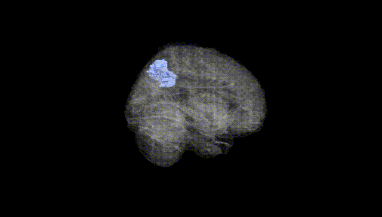
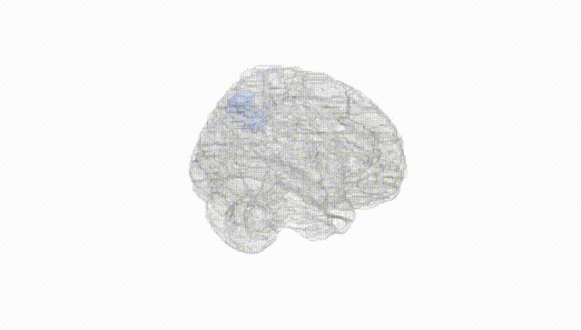
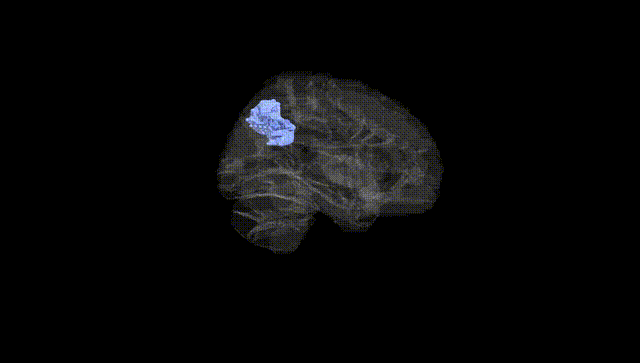
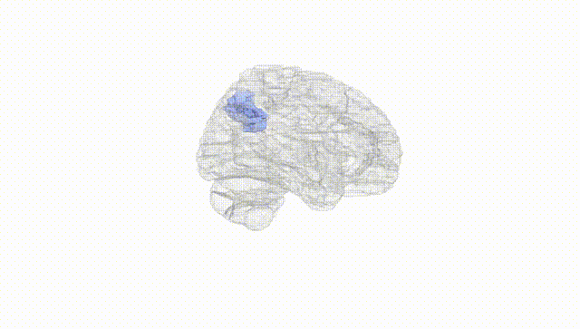
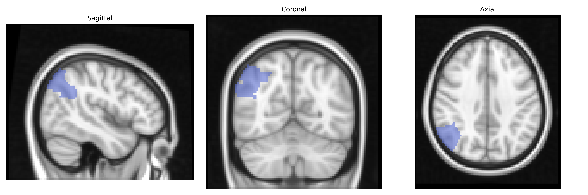
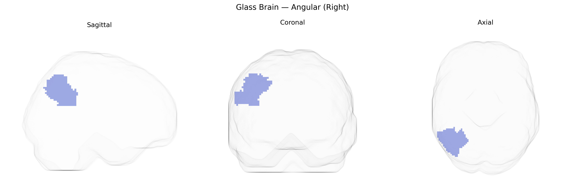

# Angular (Right)
 
## Overview
 
The right angular gyrus, as defined in the AAL atlas (Angular_R), is a heteromodal association region located in the posterior part of the inferior parietal lobule, bordering the superior temporal and occipital cortices. Cytoarchitectonically, it corresponds largely to Brodmann area 39 and is characterized by dense corticocortical connectivity with temporal, frontal, and occipital association areas, as well as with key nodes of the default mode and language-related networks. Functionally, the right angular gyrus is implicated in multimodal integration, spatial attention and reorientation, aspects of semantic processing, number processing, theory of mind, and episodic memory retrieval, with hemispheric asymmetries relative to the left angular gyrus in language and spatial cognition. Vascular supply is primarily via branches of the middle cerebral artery, and lesions in this region can contribute to deficits such as neglect, certain forms of aphasia, and disruptions of higher-order associative functions.  

[Angular gyrus](https://en.wikipedia.org/wiki/Angular_gyrus)
 
The right angular gyrus, as defined in the AAL atlas, has been implicated in several genetic and neuroimaging GWAS findings involving cognition, language, and psychiatric risk, although few associations are specific solely to the right-lateralized region. Large-scale imaging genetics studies (e.g., ENIGMA, UK Biobank) have identified SNPs and gene sets influencing cortical thickness and surface area in inferior parietal and temporo‑parietal junction regions that include or overlap the angular gyrus, with loci near genes involved in neurodevelopment, synaptic function, and axon guidance (such as variants around PAX6, KIAA0586, and other neurodevelopmental genes) contributing to interindividual variation. Functional and structural measures involving the angular gyrus show polygenic correlations with general cognitive ability, working memory, reading and language skills, and mathematical ability, and right angular gyrus activation and connectivity have been linked in imaging–genetics studies to risk alleles for schizophrenia, major depressive disorder, autism spectrum disorder, and ADHD, mainly via network-level effects in the default mode and fronto‑parietal systems. In Alzheimer’s disease, GWAS loci such as APOE and CLU have been associated with atrophy and hypometabolism in parietal regions including the angular gyrus, and similar regionally distributed genetic effects have been reported for frontotemporal dementia and mild cognitive impairment. Additionally, polygenic scores for educational attainment and intelligence show associations with angular gyrus structure and function, supporting a broader role for genetically influenced parietal–temporal circuitry in high-level associative cognition rather than a single robust locus uniquely tied to the right angular gyrus.
 
*Overview generated by GPT-4o (2026).*
 
---
 
**Region ID:** 6222  
**Hemisphere:** right  
**Atlas:** AAL 
 
---
 
## Angular (Right) – Black Background (Full Brain)
 

 
**Full Quality Version:** <a href="full_black.mp4" download>Download MP4</a>
 
---
 
## Angular (Right) – White Background (Full Brain)
 

 
**Full Quality Version:** <a href="full_white.mp4" download>Download MP4</a>
 
---

## Angular (Right) – Black Background (Hemisphere)
 

 
**Full Quality Version:** <a href="hemi_black.mp4" download>Download MP4</a>
 
---
 
## Angular (Right) – White Background (Hemisphere)
 

 
**Full Quality Version:** <a href="hemi_white.mp4" download>Download MP4</a>
 
---

## Triplanar View – T1 Background
 

 
---
 
## Triplanar View – Ghost Brain
 


