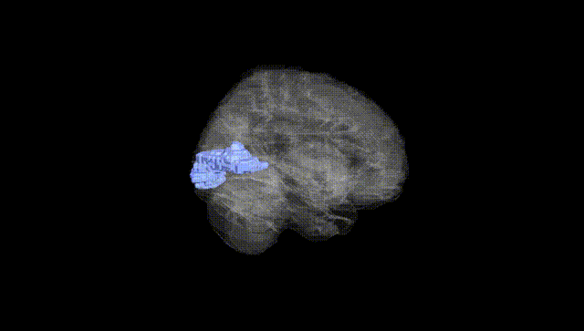
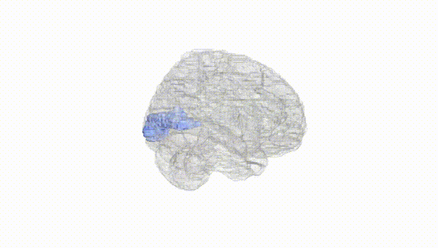
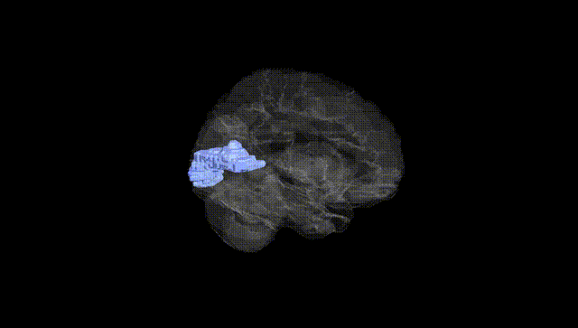
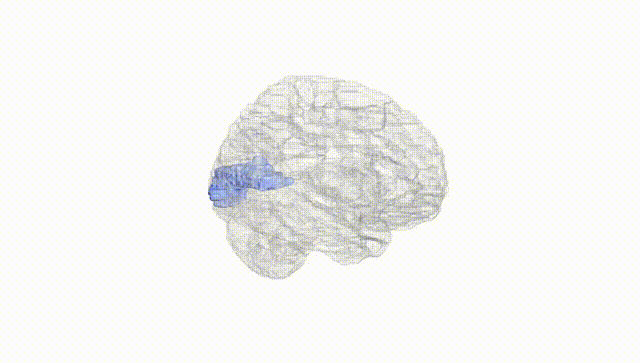
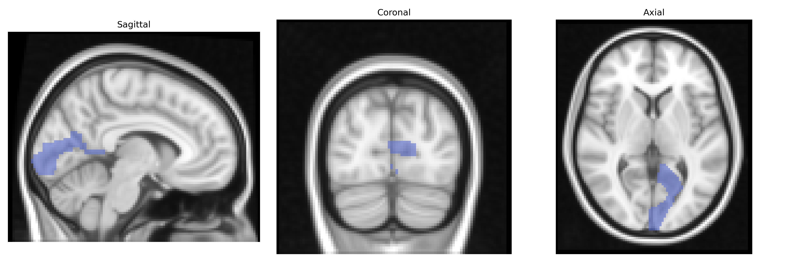
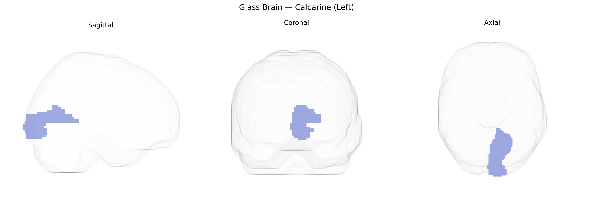

# Calcarine (Left)
 
## Overview
 
The left calcarine region, as defined in the AAL atlas, corresponds predominantly to the left primary visual cortex (V1, Brodmann area 17) located along the banks of the calcarine sulcus in the occipital lobe. This cortical area receives the majority of its input from the lateral geniculate nucleus of the thalamus via the optic radiation and is organized retinotopically, with a precise spatial mapping of the visual field onto cortical surface. Neurons within this region are highly specialized for processing basic visual features such as orientation, spatial frequency, contrast, and motion direction, forming the initial cortical stage of visual perception. The left calcarine cortex primarily processes visual information from the right visual hemifield and is critical for conscious visual awareness; lesions in this area can result in contralateral homonymous visual field defects.  

[Primary visual cortex](https://en.wikipedia.org/wiki/Primary_visual_cortex)
 
The left calcarine cortex (primary visual cortex, V1) from the AAL atlas has been implicated in several imaging–genetics and GWAS-based studies, though typically as part of broader occipital or visual networks rather than as an isolated region. Twin and SNP-heritability studies indicate moderate to high heritability of cortical thickness, surface area, and volume in the calcarine/occipital cortex, with contributions from genes involved in neurodevelopment (e.g., microtubule and axon guidance pathways) and synaptic signaling. Large-scale brain MRI GWAS (e.g., ENIGMA and UK Biobank–based consortia) have identified loci near or within genes such as HMGA2, MIR2113, and others influencing global and regional cortical morphology that include the calcarine region, although associations are usually reported for “occipital” or “visual” rather than strictly calcarine measures. Functionally, genetic variants affecting the calcarine cortex have been linked to individual differences in visual processing, visual field maps, and susceptibility to disorders with strong visual cortex involvement, including occipital lobe epilepsy, albinism-related misrouting of optic fibers, and certain forms of cortical visual impairment, with candidate genes in these contexts often relating to axonal guidance (e.g., ROBO/SLIT pathways) and photoreceptor or optic pathway development. Psychiatric and neurodevelopmental GWAS that examine imaging endophenotypes (e.g., schizophrenia, autism) sometimes report altered calcarine structure or activation associated with polygenic risk scores, but these typically reflect distributed cortical effects rather than calcarine-specific risk loci, and robust, region-exclusive genetic associations for the left calcarine cortex remain limited.
 
*Overview generated by GPT-4o (2026).*
 
---
 
**Region ID:** 5001  
**Hemisphere:** left  
**Atlas:** AAL 
 
---
 
## Calcarine (Left) – Black Background (Full Brain)
 

 
**Full Quality Version:** <a href="full_black.mp4" download>Download MP4</a>
 
---
 
## Calcarine (Left) – White Background (Full Brain)
 

 
**Full Quality Version:** <a href="full_white.mp4" download>Download MP4</a>
 
---

## Calcarine (Left) – Black Background (Hemisphere)
 

 
**Full Quality Version:** <a href="hemi_black.mp4" download>Download MP4</a>
 
---
 
## Calcarine (Left) – White Background (Hemisphere)
 

 
**Full Quality Version:** <a href="hemi_white.mp4" download>Download MP4</a>
 
---

## Triplanar View – T1 Background
 

 
---
 
## Triplanar View – Ghost Brain
 


