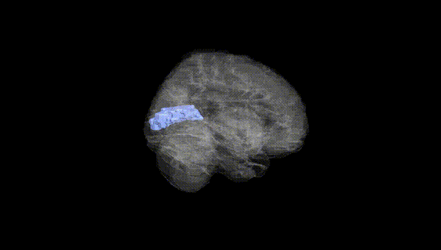
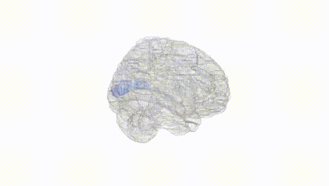
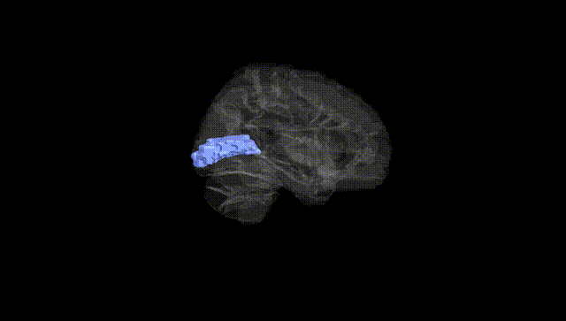
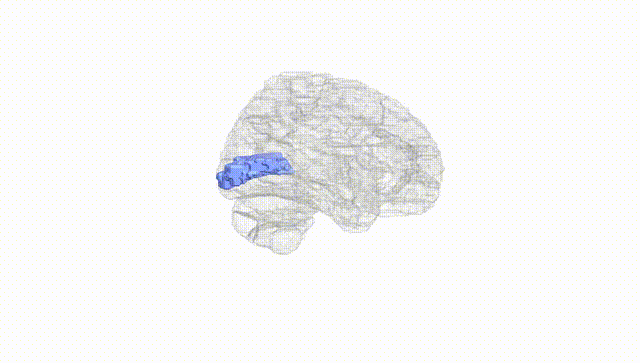
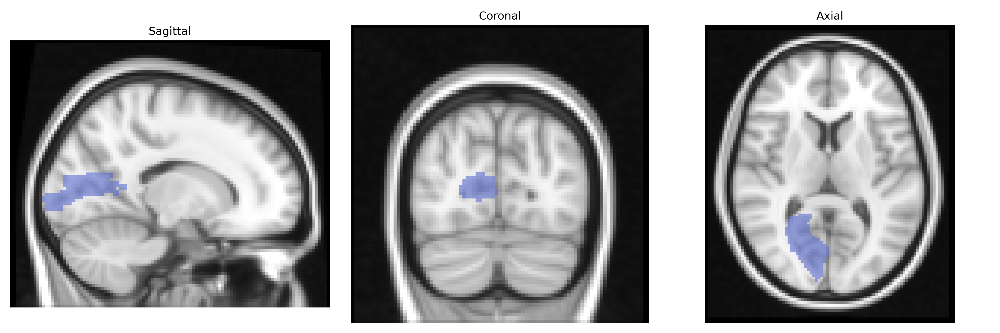
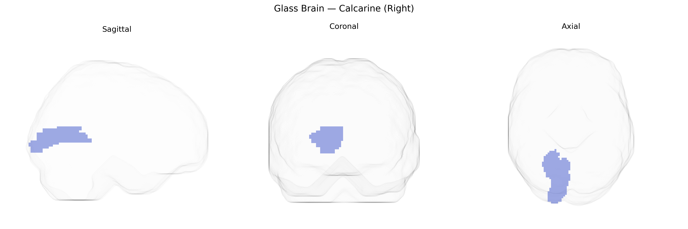

# Calcarine (Right)
 
## Overview
 
The right calcarine region, as defined in the AAL atlas, corresponds primarily to the right primary visual cortex (V1, Brodmann area 17) situated along the calcarine sulcus on the medial surface of the occipital lobe. This cortical area receives the densest thalamocortical input from the lateral geniculate nucleus of the right hemisphere, representing predominantly the contralateral (left) visual field in a precise retinotopic map. Neuronal populations here exhibit orientation, spatial frequency, and ocular dominance selectivity, forming the initial cortical stage of conscious visual processing before information is relayed to extrastriate visual areas (e.g., V2, V3). Lesions restricted to the right calcarine cortex typically result in left homonymous visual field defects, emphasizing its role in basic visual perception. [Calcarine sulcus](https://en.wikipedia.org/wiki/Calcarine_sulcus)
 
The right calcarine cortex (primary visual cortex, V1) in the AAL atlas has been implicated in several imaging-genetics and GWAS-based studies, though typically as part of broader occipital or visual network patterns rather than through region-exclusive loci. Common variants in genes involved in synaptic plasticity, neurodevelopment, and myelination (for example, BDNF, NRG1, and various glutamatergic and GABAergic pathway genes) have been associated with calcarine gray matter volume, cortical thickness, and functional activation in large-scale imaging-genetics consortia such as ENIGMA and UK Biobank analyses, often in the context of visual processing or general brain morphometry traits. Polygenic risk scores for schizophrenia, bipolar disorder, major depression, autism spectrum disorder, and Alzheimer’s disease have shown associations with structural or functional alterations in the calcarine/primary visual cortex, suggesting that distributed genetic risk for neuropsychiatric and neurodegenerative disorders can influence this region. In addition, GWAS of visual acuity, refractive error, and related ophthalmologic traits have reported correlations between identified loci (e.g., in genes like GJD2 and others affecting retinal and visual pathway development) and variation in occipital and calcarine morphology or activity, implicating shared genetic influences on early visual cortex structure and visual function, although findings are generally not specific to the right calcarine alone.
 
*Overview generated by GPT-4o (2026).*
 
---
 
**Region ID:** 5002  
**Hemisphere:** right  
**Atlas:** AAL 
 
---
 
## Calcarine (Right) – Black Background (Full Brain)
 

 
**Full Quality Version:** <a href="full_black.mp4" download>Download MP4</a>
 
---
 
## Calcarine (Right) – White Background (Full Brain)
 

 
**Full Quality Version:** <a href="full_white.mp4" download>Download MP4</a>
 
---

## Calcarine (Right) – Black Background (Hemisphere)
 

 
**Full Quality Version:** <a href="hemi_black.mp4" download>Download MP4</a>
 
---
 
## Calcarine (Right) – White Background (Hemisphere)
 

 
**Full Quality Version:** <a href="hemi_white.mp4" download>Download MP4</a>
 
---

## Triplanar View – T1 Background
 

 
---
 
## Triplanar View – Ghost Brain
 


