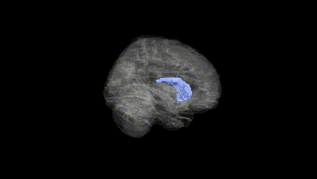
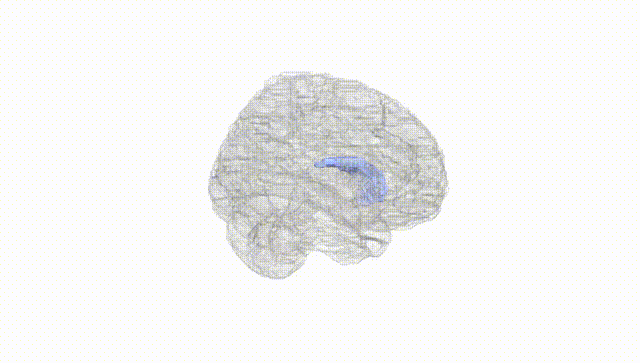
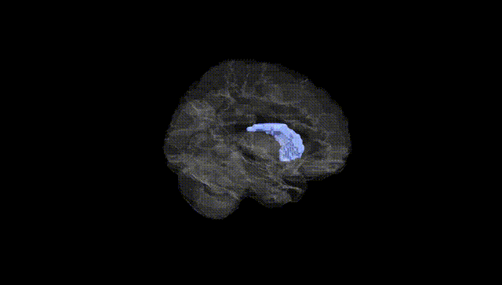
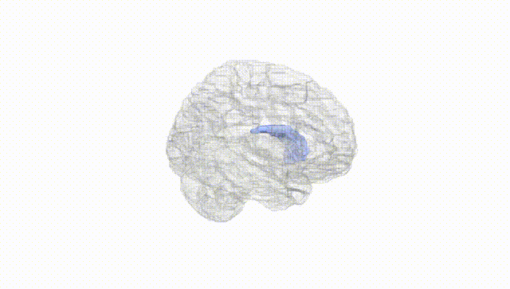
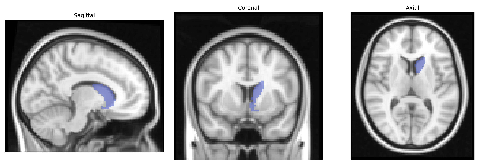
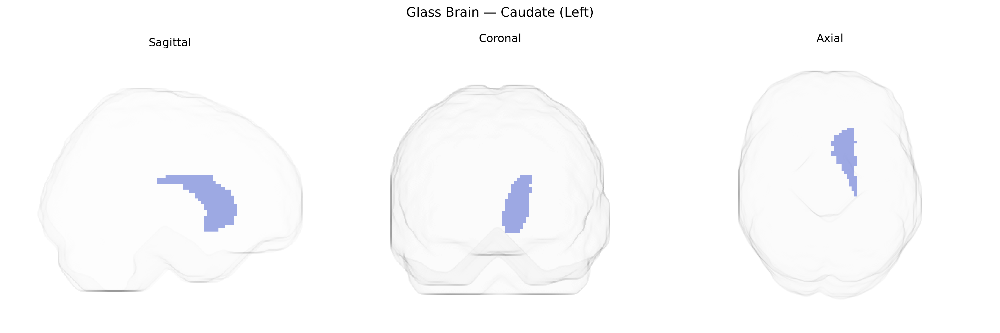

# Caudate (Left)
 
## Overview
 
The left caudate, as defined in the AAL atlas, is the left-sided portion of the caudate nucleus, a C‑shaped gray matter structure located deep within the basal ganglia of the telencephalon and bordering the lateral ventricles. It consists of a head, body, and tail, with dense reciprocal connections to the prefrontal cortex, premotor regions, thalamus, and other basal ganglia nuclei, forming critical loops for motor, cognitive, and limbic processing. Functionally, the left caudate participates in action selection, procedural learning, habit formation, reward-based learning, and aspects of executive function and language-related processes, and is modulated heavily by dopaminergic input from the substantia nigra pars compacta. Pathologically, structural and functional alterations of the caudate are implicated in disorders such as Parkinson’s disease, Huntington’s disease, obsessive–compulsive disorder, and attention-deficit/hyperactivity disorder. [Caudate nucleus](https://en.wikipedia.org/wiki/Caudate_nucleus)
 
Genetic associations with left caudate volume and function, as defined in the AAL atlas, have emerged primarily from neuroimaging GWAS that implicate variants in genes involved in neurodevelopment, synaptic function, and dopaminergic signaling. Large consortia such as ENIGMA have identified loci near genes like KNTC1, HMGA2, and DCC associated with caudate volume, alongside polygenic influences from general brain size and intracranial volume. The caudate is consistently implicated in psychiatric and neurodevelopmental disorders, and genetic liabilities for schizophrenia, bipolar disorder, major depression, obsessive-compulsive disorder, ADHD, and autism spectrum disorder show associations with caudate structure or connectivity, often mediated by dopaminergic pathway genes (e.g., DRD2, COMT) and glutamatergic or synaptic genes (e.g., CACNA1C, GRIN family). Parkinson’s disease and other movement disorders, influenced by variants in genes such as LRRK2 and SNCA, also demonstrate caudate-related structural and functional changes. Polygenic risk scores for cognitive traits (intelligence, educational attainment) and substance use phenotypes have been correlated with caudate volume or activity, underscoring the region’s role as an intermediate phenotype linking distributed genetic effects to executive function, reward processing, and disease risk, although most associations are small in effect and highly polygenic rather than driven by single genes.
 
*Overview generated by GPT-4o (2026).*
 
---
 
**Region ID:** 7001  
**Hemisphere:** left  
**Atlas:** AAL 
 
---
 
## Caudate (Left) – Black Background (Full Brain)
 

 
**Full Quality Version:** <a href="full_black.mp4" download>Download MP4</a>
 
---
 
## Caudate (Left) – White Background (Full Brain)
 

 
**Full Quality Version:** <a href="full_white.mp4" download>Download MP4</a>
 
---

## Caudate (Left) – Black Background (Hemisphere)
 

 
**Full Quality Version:** <a href="hemi_black.mp4" download>Download MP4</a>
 
---
 
## Caudate (Left) – White Background (Hemisphere)
 

 
**Full Quality Version:** <a href="hemi_white.mp4" download>Download MP4</a>
 
---

## Triplanar View – T1 Background
 

 
---
 
## Triplanar View – Ghost Brain
 


