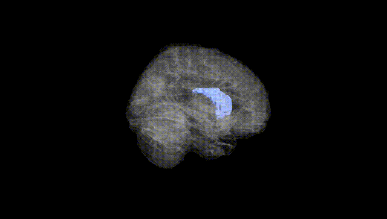
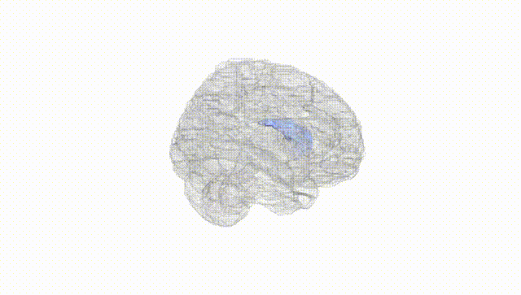
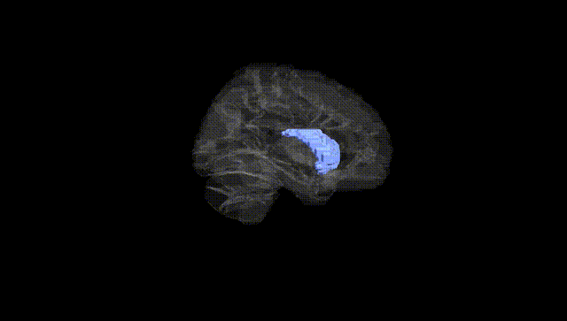
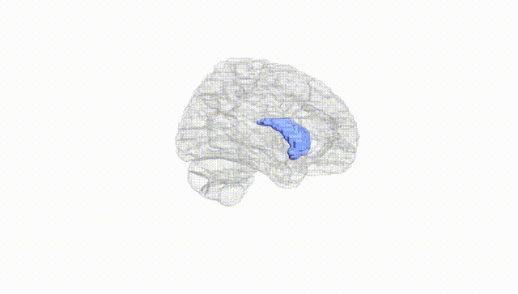
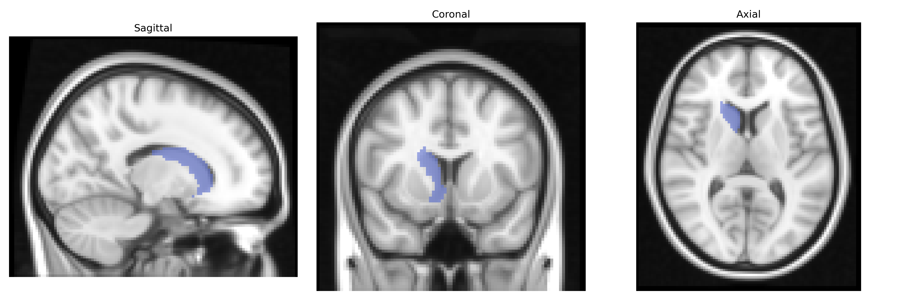
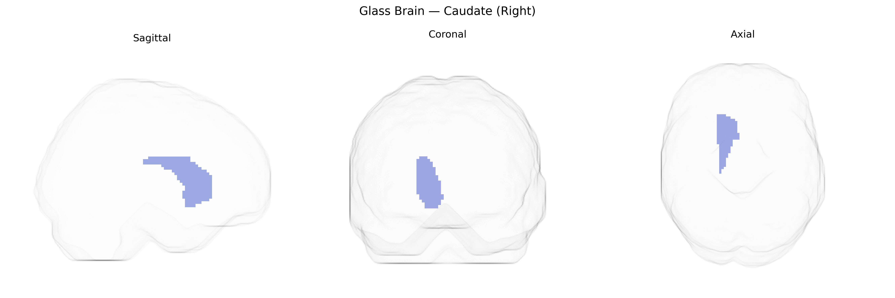

# Caudate (Right)
 
## Overview
 
The right caudate nucleus is a C-shaped subcortical gray matter structure within the dorsal striatum of the basal ganglia, located adjacent to the lateral ventricle and primarily involved in motor control, cognitive processes, and associative learning. Composed predominantly of GABAergic medium spiny neurons, it receives extensive glutamatergic input from the cerebral cortex and dopaminergic input from the substantia nigra pars compacta, integrating these signals to modulate thalamocortical loops that influence planning, execution, and inhibition of movements, as well as executive functions and goal-directed behaviors. Functionally, the caudate participates in procedural learning, habit formation, action selection, and aspects of reward-based decision-making, and its dysfunction has been implicated in movement disorders such as Parkinson’s disease and Huntington’s disease, as well as in neuropsychiatric conditions including obsessive–compulsive disorder and attention-deficit/hyperactivity disorder.  
[Caudate nucleus](https://en.wikipedia.org/wiki/Caudate_nucleus)
 
The right caudate nucleus, as defined in the AAL atlas, shows robust heritability in twin and family studies and has been implicated in multiple GWAS of subcortical brain volumes, with variants in and near genes such as HMGA2, FAT3, DPP4, and IGF1 associated with caudate size and morphology; these volumetric associations often overlap with loci linked to neurodevelopment and neuronal differentiation. Large-scale imaging genetics consortia (e.g., ENIGMA, UK Biobank) have demonstrated that polygenic scores for schizophrenia, bipolar disorder, major depressive disorder, ADHD, and autism spectrum conditions correlate with altered caudate volume or shape, and specific risk variants for schizophrenia (including loci in the MHC region and genes affecting synaptic signaling and dopamine function) have been associated with right caudate alterations. Genetic variants in dopamine-related genes (e.g., DRD2, DAT1/SLC6A3, COMT) and cortico-striatal glutamatergic signaling pathways have been repeatedly linked to caudate structural and functional differences, particularly in disorders of motor control and reward processing such as Parkinson’s disease, Tourette syndrome, and substance use disorders. GWAS of cognitive traits (e.g., intelligence, educational attainment, working memory) and personality dimensions (e.g., neuroticism, impulsivity) also show overlapping genetic architecture with caudate volume, implicating pleiotropic loci that influence both striatal structure and higher-order cognition and behavior, with some studies reporting lateralized effects that include the right caudate in particular.
 
*Overview generated by GPT-4o (2026).*
 
---
 
**Region ID:** 7002  
**Hemisphere:** right  
**Atlas:** AAL 
 
---
 
## Caudate (Right) – Black Background (Full Brain)
 

 
**Full Quality Version:** <a href="full_black.mp4" download>Download MP4</a>
 
---
 
## Caudate (Right) – White Background (Full Brain)
 

 
**Full Quality Version:** <a href="full_white.mp4" download>Download MP4</a>
 
---

## Caudate (Right) – Black Background (Hemisphere)
 

 
**Full Quality Version:** <a href="hemi_black.mp4" download>Download MP4</a>
 
---
 
## Caudate (Right) – White Background (Hemisphere)
 

 
**Full Quality Version:** <a href="hemi_white.mp4" download>Download MP4</a>
 
---

## Triplanar View – T1 Background
 

 
---
 
## Triplanar View – Ghost Brain
 


