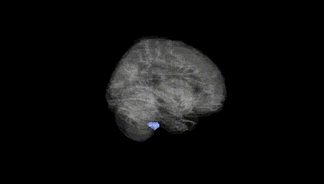
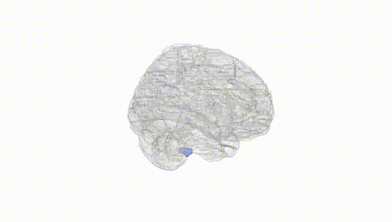
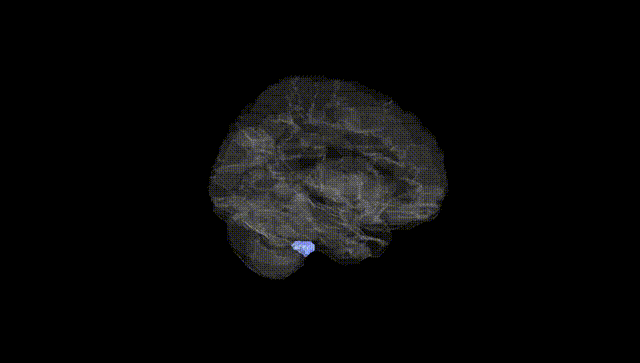
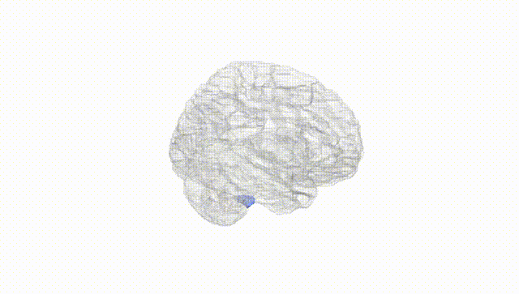
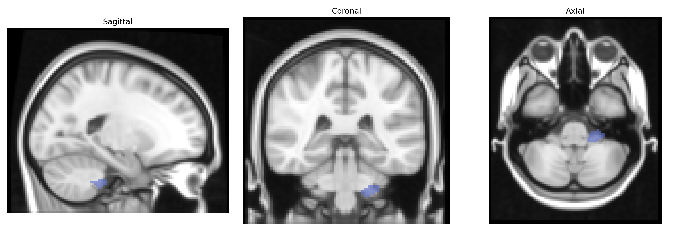
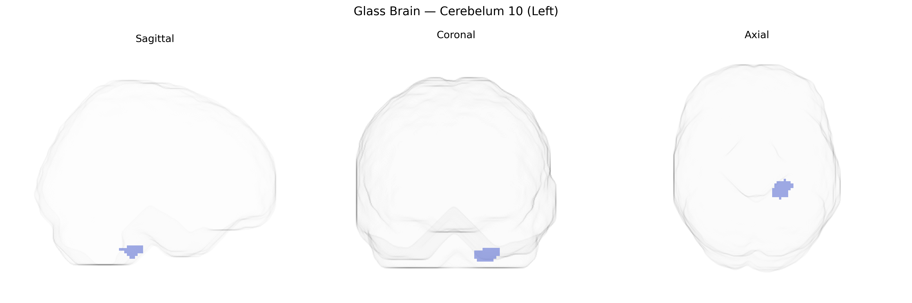

# Cerebelum 10 (Left)
 
## Overview
 
The AAL region “Cerebelum 10 (Left)” corresponds to the left hemispheric portion of cerebellar lobule X, also known as the flocculonodular lobe, which is the phylogenetically oldest part of the cerebellum (archicerebellum). This lobule is strongly connected with vestibular nuclei and other brainstem structures and plays a central role in balance, posture, and the coordination of eye and head movements, particularly through vestibulo-ocular reflex control and gaze stabilization. Functionally, cerebellar lobule X contributes to processing vestibular and proprioceptive information to maintain equilibrium and orient the body in space, with less involvement in fine limb coordination compared to more dorsal cerebellar regions. There is no direct Wikipedia article for “Cerebelum 10 (Left)”; a related structure and functional analogue is described under [Flocculonodular lobe](https://en.wikipedia.org/wiki/Flocculonodular_lobe).
 
The left Cerebellum 10 (AAL region) has been implicated in genetic studies primarily through imaging genetics and cerebellar volume GWAS rather than region-specific loci, with large consortia such as ENIGMA and UK Biobank identifying polygenic influences on cerebellar structure that include genes involved in neurodevelopment (e.g., CELSR3, PAX3, and variants near MAPT and GRIN2B) and synaptic signaling; these loci often show pleiotropy with neuropsychiatric disorders. Although few GWAS isolate Cerebellum 10 specifically, cerebellar lobule X (flocculonodular lobe/vestibulocerebellum) volume and connectivity share heritable variation with autism spectrum disorder, schizophrenia, major depressive disorder, and ADHD, consistent with broader cerebellar–cortical network genetics. Polygenic risk scores for schizophrenia, bipolar disorder, and autism have been associated with altered cerebellar morphology and functional connectivity encompassing inferior cerebellar regions that include or neighbor AAL Cerebellum 10, while rare variant and copy-number studies in neurodevelopmental disorders (e.g., 22q11.2 deletions and other chromosomal microdeletions) frequently report cerebellar hypoplasia or volume changes that extend to the posterior-inferior vermis and hemispheric lobules. Overall, current evidence suggests that genetic influences on left Cerebellum 10 arise from distributed polygenic architecture shared with global and lobule-specific cerebellar measures and with common psychiatric and cognitive traits, rather than from well-characterized, region-unique loci.
 
*Overview generated by GPT-4o (2026).*
 
---
 
**Region ID:** 9081  
**Hemisphere:** left  
**Atlas:** AAL 
 
---
 
## Cerebelum 10 (Left) – Black Background (Full Brain)
 

 
**Full Quality Version:** <a href="full_black.mp4" download>Download MP4</a>
 
---
 
## Cerebelum 10 (Left) – White Background (Full Brain)
 

 
**Full Quality Version:** <a href="full_white.mp4" download>Download MP4</a>
 
---

## Cerebelum 10 (Left) – Black Background (Hemisphere)
 

 
**Full Quality Version:** <a href="hemi_black.mp4" download>Download MP4</a>
 
---
 
## Cerebelum 10 (Left) – White Background (Hemisphere)
 

 
**Full Quality Version:** <a href="hemi_white.mp4" download>Download MP4</a>
 
---

## Triplanar View – T1 Background
 

 
---
 
## Triplanar View – Ghost Brain
 


