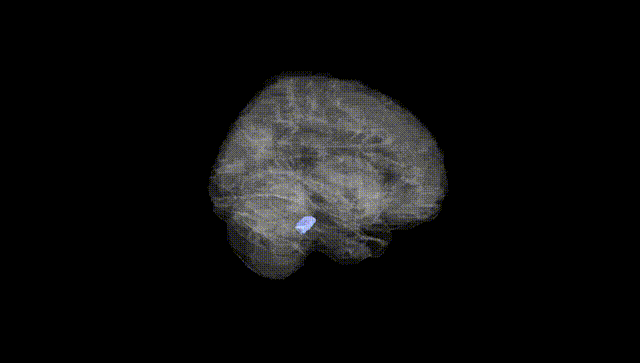
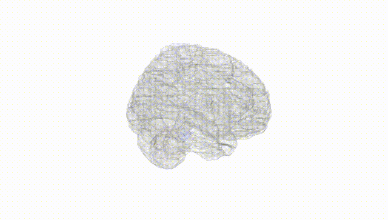
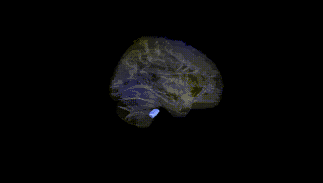
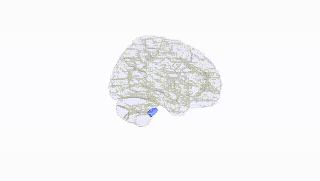
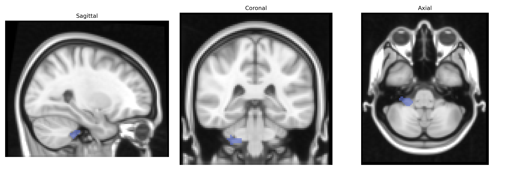
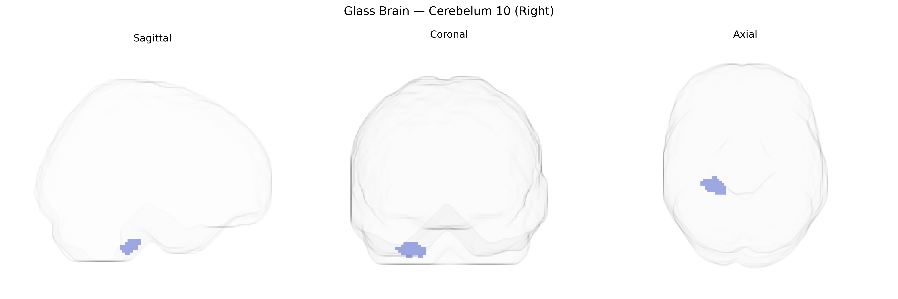

# Cerebelum 10 (Right)
 
## Overview
 
The AAL atlas region “Cerebelum_10_R” corresponds to lobule X (nodulus) of the right cerebellar hemisphere, part of the flocculonodular lobe that is primarily involved in vestibular and oculomotor functions. This region plays a key role in processing vestibular input, maintaining balance and posture, and coordinating eye movements through its connections with vestibular nuclei and brainstem circuits. It contributes to the fine-tuning of reflexive eye responses, stabilization of gaze during head movements, and integration of sensory information necessary for equilibrium. Although “Cerebelum_10_R” as a label is atlas-specific and not used clinically, it maps onto the nodulus within the vestibulocerebellum. There is no direct Wikipedia article for “Cerebelum_10_R”; a closely related structure is the [Flocculonodular lobe](https://en.wikipedia.org/wiki/Flocculonodular_lobe).
 
Right cerebellar lobule X (Cerebellum 10, Right) from the AAL atlas lies in the flocculonodular (vestibulocerebellar) region, and genetic associations to this specific parcel are sparse, but broader imaging‑genetics and GWAS work implicates nearby or overlapping cerebellar territories in several traits and disorders. Large-scale brain MRI GWAS (e.g., ENIGMA and UK Biobank–based studies) report that common variants in genes involved in neurodevelopment and synaptic function (such as those in the MAPT region, NRGN, and loci near FOXP1/FOXP2 and RELN) show associations with cerebellar gray-matter volume and surface measures, including inferior and vestibulocerebellar lobules that encompass or border lobule X. Polygenic risk for schizophrenia, major depression, bipolar disorder, and autism spectrum disorder has been associated with altered cerebellar structure and connectivity, and several risk loci for these disorders (e.g., CACNA1C, GRIN2A, DRD2, and synaptic scaffolding genes) show enriched expression or functional relevance in cerebellar circuits that include the nodulus and flocculus. GWAS of balance, gait, and vestibular phenotypes, as well as eye-movement and oculomotor traits, implicate genes affecting cerebellar and brainstem circuitry (e.g., allelic variation in ion-channel, cytoskeletal, and axon-guidance genes), consistent with the known role of lobule X in vestibulo-ocular and postural control, although parcel-level associations specifically and uniquely targeting AAL Cerebelum 10 (Right) remain to be clearly delineated.
 
*Overview generated by GPT-4o (2026).*
 
---
 
**Region ID:** 9082  
**Hemisphere:** right  
**Atlas:** AAL 
 
---
 
## Cerebelum 10 (Right) – Black Background (Full Brain)
 

 
**Full Quality Version:** <a href="full_black.mp4" download>Download MP4</a>
 
---
 
## Cerebelum 10 (Right) – White Background (Full Brain)
 

 
**Full Quality Version:** <a href="full_white.mp4" download>Download MP4</a>
 
---

## Cerebelum 10 (Right) – Black Background (Hemisphere)
 

 
**Full Quality Version:** <a href="hemi_black.mp4" download>Download MP4</a>
 
---
 
## Cerebelum 10 (Right) – White Background (Hemisphere)
 

 
**Full Quality Version:** <a href="hemi_white.mp4" download>Download MP4</a>
 
---

## Triplanar View – T1 Background
 

 
---
 
## Triplanar View – Ghost Brain
 


