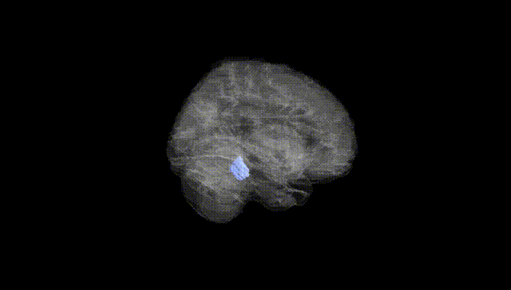
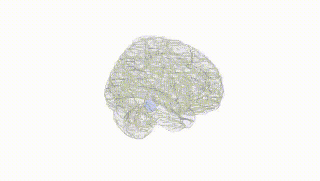
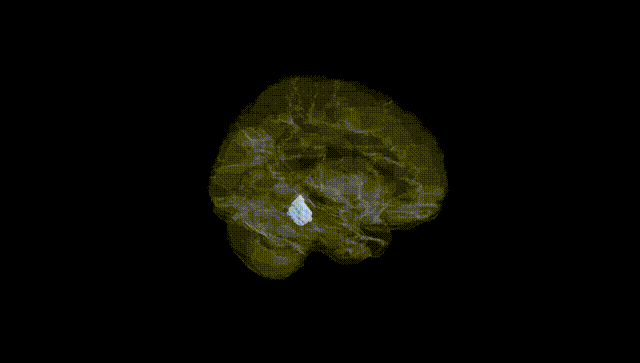
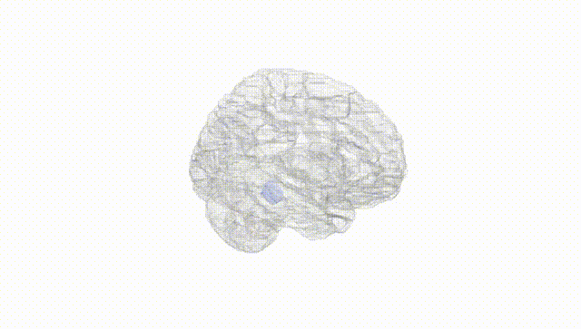
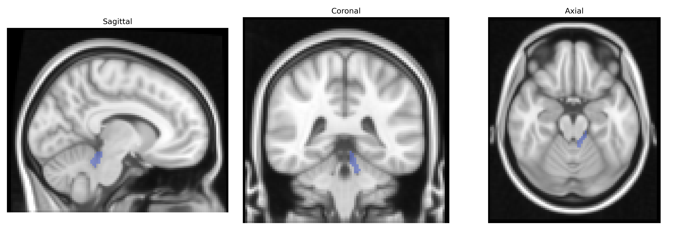
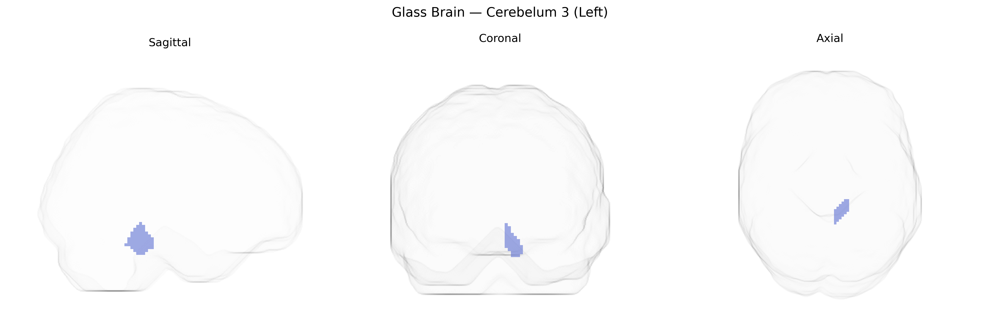

# Cerebelum 3 (Left)
 
## Overview
 
The left Cerebelum 3 region in the AAL atlas corresponds to a portion of the anterior cerebellar hemisphere, primarily involving lobules III–IV, which participate in fine-tuning motor execution, postural control, and coordination of limb movements. This region receives dense input from the cerebral cortex via pontine nuclei and sends output through the deep cerebellar nuclei to thalamic and cortical motor areas, forming part of the cortico-cerebellar loops that modulate movement timing, precision, and adaptation. Functionally, activity in this area has also been implicated in sensorimotor integration and in the adjustment of ongoing movements based on proprioceptive and vestibular feedback. There is no direct Wikipedia article specifically for “Cerebelum 3”; a related structure is the cerebellum: [Cerebellum](https://en.wikipedia.org/wiki/Cerebellum).
 
The left cerebellar lobule III (Cerebelum_3_L in the AAL atlas), part of the anterior cerebellar lobe involved in sensorimotor coordination, has been implicated in several imaging-genetics and GWAS-based neuroimaging studies, though few associations are specific solely to this subregion. Large-scale brain MRI GWAS consortia (e.g., ENIGMA, UK Biobank) have reported heritable variation in cerebellar gray matter volume, cortical thickness, and functional connectivity, with significant associations between variants in genes involved in neurodevelopment, synaptic function, and axon guidance (such as variants near MAPT, RELN, and genes in the Wnt and Notch pathways) and structural measures that include anterior cerebellar regions encompassing lobule III. Polygenic risk for schizophrenia, major depressive disorder, bipolar disorder, and autism spectrum disorder has been associated with altered cerebellar structure and activity, including anterior lobules, in multimodal studies combining GWAS-derived polygenic scores with MRI, although such findings usually refer to broader cerebellar clusters rather than Cerebelum_3_L alone. Additionally, cerebellar volume and connectivity involving lobules I–IV, including lobule III, show genetic correlations with general cognitive ability, motor performance, and neurodevelopmental traits, indicating that shared genetic factors contribute to both cerebellar morphology and these behavioral phenotypes, but current evidence does not yet identify a robust, region-exclusive set of genetic variants uniquely tied to Cerebelum_3_L.
 
*Overview generated by GPT-4o (2026).*
 
---
 
**Region ID:** 9021  
**Hemisphere:** left  
**Atlas:** AAL 
 
---
 
## Cerebelum 3 (Left) – Black Background (Full Brain)
 

 
**Full Quality Version:** <a href="full_black.mp4" download>Download MP4</a>
 
---
 
## Cerebelum 3 (Left) – White Background (Full Brain)
 

 
**Full Quality Version:** <a href="full_white.mp4" download>Download MP4</a>
 
---

## Cerebelum 3 (Left) – Black Background (Hemisphere)
 

 
**Full Quality Version:** <a href="hemi_black.mp4" download>Download MP4</a>
 
---
 
## Cerebelum 3 (Left) – White Background (Hemisphere)
 

 
**Full Quality Version:** <a href="hemi_white.mp4" download>Download MP4</a>
 
---

## Triplanar View – T1 Background
 

 
---
 
## Triplanar View – Ghost Brain
 


