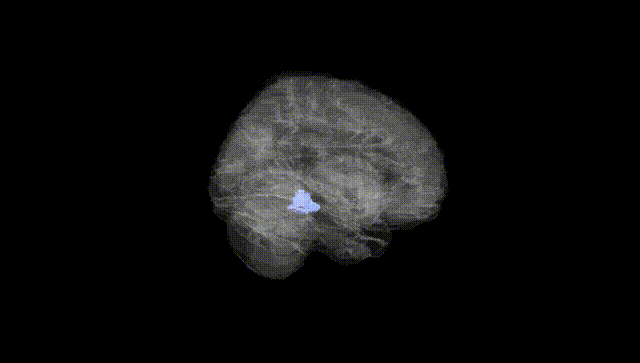
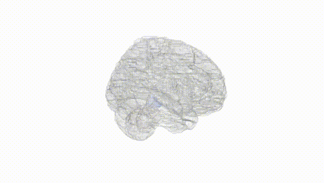
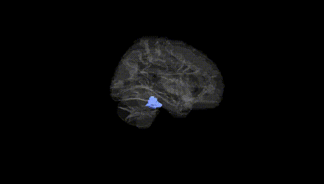
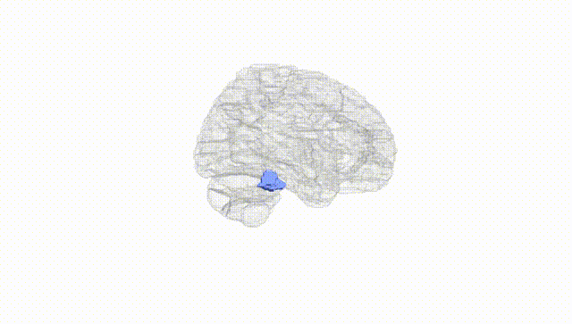
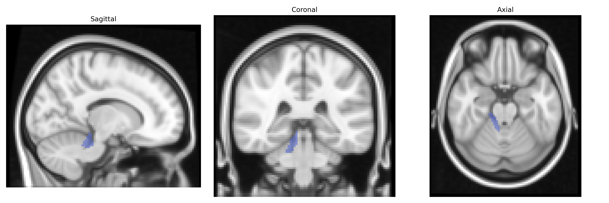
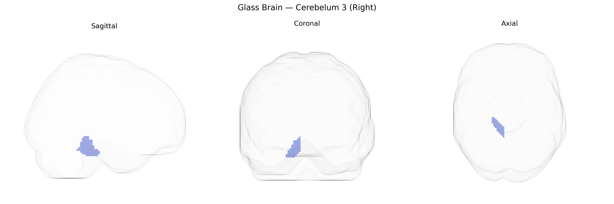

# Cerebelum 3 (Right)
 
## Overview
 
The AAL atlas label “Cerebelum 3 (Right)” corresponds to a lobular sector within the right anterior cerebellum, typically encompassing parts of the anterior lobe (e.g., lobules I–III) implicated in sensorimotor coordination and fine-tuning of movement. This region receives dense mossy fiber input from spinal and cortical pathways and projects via deep cerebellar nuclei—particularly the dentate and interposed nuclei—to motor and premotor cortical areas, contributing to error correction, postural control, and the timing and scaling of muscle activity. Neuronal circuitry is organized in a highly regular laminar architecture with Purkinje cells providing the sole output of the cerebellar cortex, integrating excitatory parallel fiber and climbing fiber input to modulate downstream motor commands. Clinically, lesions in the anterior cerebellum can cause gait ataxia, dysmetria, and impaired coordination, especially affecting ipsilateral limb movements due to the double decussation of cerebellar efferent pathways. There is no direct Wikipedia article for “Cerebelum 3 (Right)”; a related structure description is available at [Cerebellum](https://en.wikipedia.org/wiki/Cerebellum).
 
The right Cerebelum 3 (Right) region in the AAL atlas, part of the cerebellar anterior lobe involved in motor coordination and higher-order cognitive processing, has been implicated in several genetic and GWAS findings through its volume, connectivity, and functional activity. Large neuroimaging GWAS consortia (e.g., ENIGMA, UK Biobank–based studies) have identified polygenic influences on cerebellar gray matter volume and morphology, with common variants in genes related to neurodevelopment, synaptic function, and neuronal signaling (such as those near KIAA0586, DLG2, and variants in calcium channel and glutamatergic pathways) contributing to inter-individual differences in cerebellar structure, including lobular regions overlapping AAL Cerebelum 3. Cerebellar measures, including right-sided regions, show genetic correlations with general cognitive ability, educational attainment, and motor skills, and are part of broader polygenic architectures for neurodevelopmental and psychiatric disorders such as schizophrenia, autism spectrum disorder, ADHD, and major depression, where cerebellar structural and functional changes recur across imaging genetics studies. In movement disorders, risk variants for ataxias and spinocerebellar degenerations (e.g., in ATXN1–3, CACNA1A, and other ion channel genes) affect cerebellar circuits that encompass the anterior lobule, and volumetric or functional alterations in this region often appear as downstream manifestations of these genetic mutations, although associations are typically reported at the level of the cerebellum or specific lobules rather than the precise AAL Cerebelum 3 mask. Overall, genetic findings support a highly polygenic, pleiotropic influence on right cerebellar structure and function, with this region contributing to the neural substrates through which common and rare variants impact motor control, cognition, and vulnerability to neuropsychiatric and movement disorders, even though few studies isolate Right Cerebelum 3 as a unique locus of association.
 
*Overview generated by GPT-4o (2026).*
 
---
 
**Region ID:** 9022  
**Hemisphere:** right  
**Atlas:** AAL 
 
---
 
## Cerebelum 3 (Right) – Black Background (Full Brain)
 

 
**Full Quality Version:** <a href="full_black.mp4" download>Download MP4</a>
 
---
 
## Cerebelum 3 (Right) – White Background (Full Brain)
 

 
**Full Quality Version:** <a href="full_white.mp4" download>Download MP4</a>
 
---

## Cerebelum 3 (Right) – Black Background (Hemisphere)
 

 
**Full Quality Version:** <a href="hemi_black.mp4" download>Download MP4</a>
 
---
 
## Cerebelum 3 (Right) – White Background (Hemisphere)
 

 
**Full Quality Version:** <a href="hemi_white.mp4" download>Download MP4</a>
 
---

## Triplanar View – T1 Background
 

 
---
 
## Triplanar View – Ghost Brain
 


