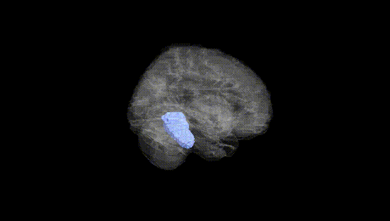
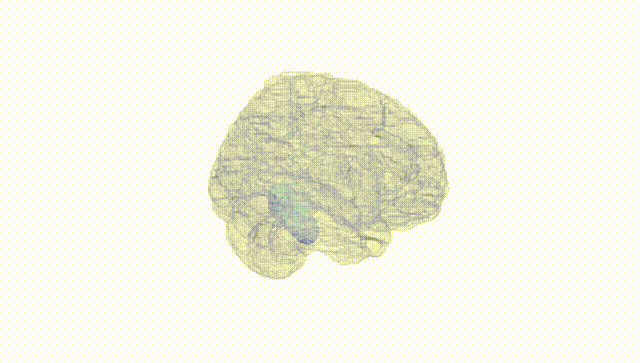
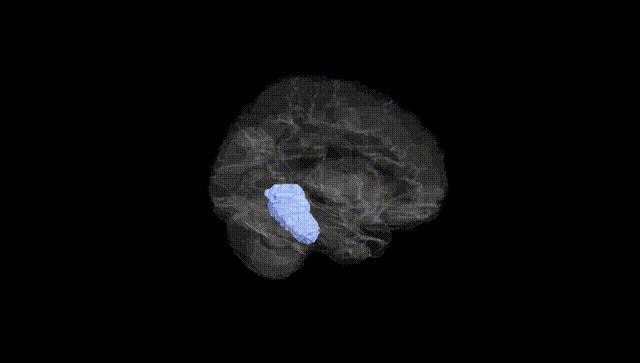
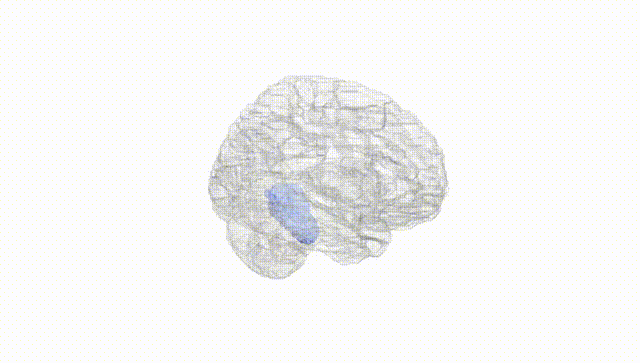
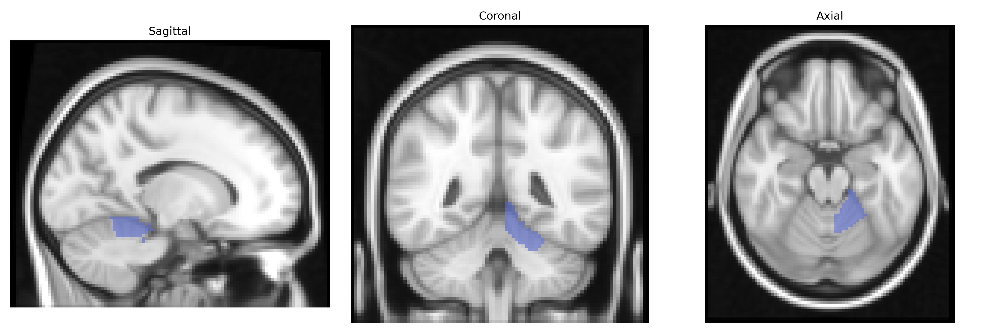
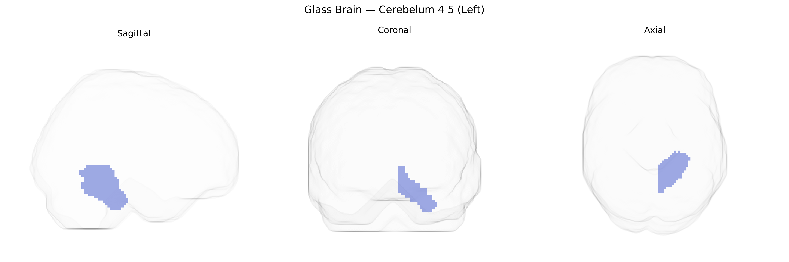

# Cerebelum 4 5 (Left)
 
## Overview
 
The left Cerebelum 4 5 (Left) region in the AAL atlas corresponds primarily to lobule IV–V of the anterior cerebellar hemisphere on the left side, a portion of the spinocerebellum involved predominantly in sensorimotor processing. Anatomically, this lobular complex receives extensive somatosensory and proprioceptive input via spinocerebellar and pontocerebellar pathways and projects mainly to the deep cerebellar nuclei, particularly the interposed and dentate nuclei, which in turn influence motor cortical and brainstem motor circuits. Functionally, left lobule IV–V contributes to the coordination and timing of limb movements, postural control, and fine-tuning of ongoing motor commands, and is also implicated in error correction during movement and aspects of motor learning. In clinical and imaging studies, lesions or functional alterations in this region have been associated with ataxia, dysmetria, and other cerebellar motor syndromes. There is no dedicated Wikipedia article for “Cerebelum 4 5 (Left)”; a closely related entry is [Cerebellum](https://en.wikipedia.org/wiki/Cerebellum).
 
The left Cerebellum 4–5 region (AAL atlas) has been implicated in several imaging-genetics and GWAS-based endophenotype studies, particularly those examining cerebellar volume, cortical–subcortical connectivity, and motor-cognitive integration. Large-scale neuroimaging GWAS consortia (e.g., ENIGMA, UK Biobank–based analyses) have reported associations between cerebellar lobular volumes—including lobules IV–V—and common variants in genes involved in neurodevelopment, synaptic function, and axonal guidance (such as loci near KIAA0999, PAPPA, and MSRB3, though not always specific to left lobule IV–V). Polygenic influences on cerebellar structure appear to overlap with risk architectures for neurodevelopmental and psychiatric conditions, including schizophrenia, major depressive disorder, bipolar disorder, autism spectrum disorder, and ADHD, where case–control imaging genetics work often shows altered volume or connectivity in anterior cerebellar regions encompassing left lobules IV–V. GWAS of motor coordination, cognitive performance, and educational attainment have identified partially overlapping polygenic signals with cerebellar volume loci, supporting a shared genetic substrate for cerebellar structure and higher-order traits. In neurodegenerative diseases, such as spinocerebellar ataxias and some forms of hereditary spastic paraplegia, pathogenic variants in genes like ATXN1–3, CACNA1A, and others produce atrophy patterns that frequently include anterior cerebellar lobules, although imaging reports usually describe broader cerebellar involvement rather than the AAL-defined left Cerebellum 4–5 region specifically.
 
*Overview generated by GPT-4o (2026).*
 
---
 
**Region ID:** 9031  
**Hemisphere:** left  
**Atlas:** AAL 
 
---
 
## Cerebelum 4 5 (Left) – Black Background (Full Brain)
 

 
**Full Quality Version:** <a href="full_black.mp4" download>Download MP4</a>
 
---
 
## Cerebelum 4 5 (Left) – White Background (Full Brain)
 

 
**Full Quality Version:** <a href="full_white.mp4" download>Download MP4</a>
 
---

## Cerebelum 4 5 (Left) – Black Background (Hemisphere)
 

 
**Full Quality Version:** <a href="hemi_black.mp4" download>Download MP4</a>
 
---
 
## Cerebelum 4 5 (Left) – White Background (Hemisphere)
 

 
**Full Quality Version:** <a href="hemi_white.mp4" download>Download MP4</a>
 
---

## Triplanar View – T1 Background
 

 
---
 
## Triplanar View – Ghost Brain
 


