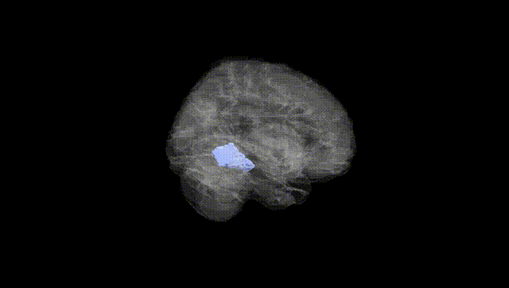
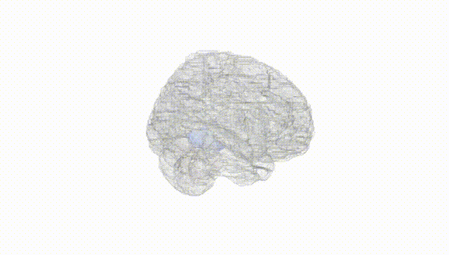
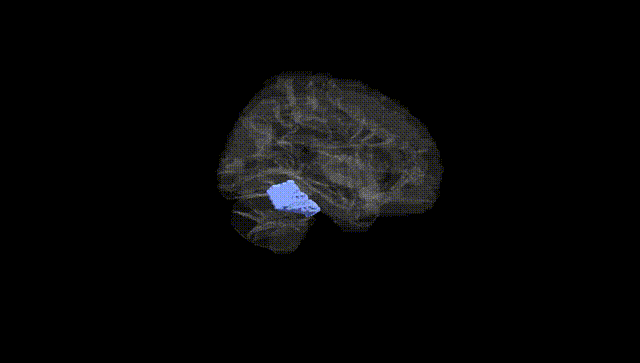
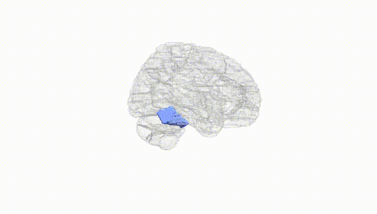
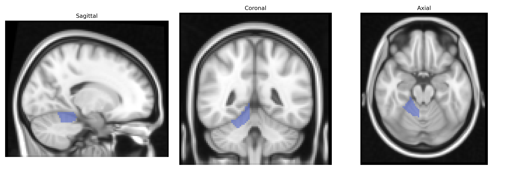
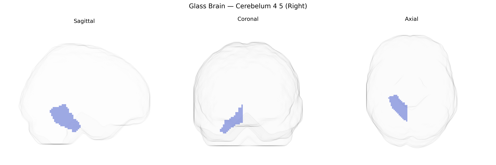

# Cerebelum 4 5 (Right)
 
## Overview
 
The right Cerebelum 4 5 region in the AAL atlas corresponds to parts of lobules IV and V of the anterior cerebellar hemisphere on the right side, which are primarily involved in somatomotor control and coordination of limb and trunk movements. These lobules receive input from spinal and cortical pathways and project via deep cerebellar nuclei to motor and premotor areas, contributing to fine-tuning of muscle tone, posture, and the timing and precision of voluntary movements. Functionally, this territory is classically associated with the spinocerebellum, and lesions here can produce ipsilateral motor deficits such as ataxia, dysmetria, and difficulties in gait and stance. There is no direct Wikipedia article for “Right Cerebelum 4 5,” but it is part of the anterior [Cerebellum](https://en.wikipedia.org/wiki/Cerebellum).
 
Right Cerebellum IV–V (AAL “Cerebelum_4_5_R”) has emerged in imaging‑genetics and GWAS-based neuroimaging studies as a locus where common variants influence cerebellar volume, functional connectivity, and related neurocognitive traits, although specific gene–region associations remain modest and often subthreshold after stringent correction. Large MRI–GWAS consortia (e.g., ENIGMA, UK Biobank analyses) have reported that polygenic influences on general brain and cerebellar volume—enriched for genes involved in neurodevelopment, synaptic organization, and axon guidance—extend to lobules IV–V, with notable signals in or near loci such as MAPT, KIAA0586, and other neurodevelopmental and cytoskeletal genes, though typically not uniquely restricted to this subregion. Imaging‑genetics studies in psychiatric and neurodevelopmental disorders (schizophrenia, major depression, autism spectrum disorder, ADHD) have implicated right anterior cerebellar lobules, including IV–V, as intermediate phenotypes where risk variants in synaptic, glutamatergic, and calcium-channel genes (e.g., CACNA1C, GRM genes, and broader synaptic gene sets) modulate activation or structure during motor and cognitive tasks. In movement disorders and ataxias, causative mutations (e.g., in ATXN, CACNA1A, and other spinocerebellar ataxia genes) produce volumetric loss and dysfunction that frequently involve anterior cerebellar lobules such as IV–V, though these mutations are not region-specific. Overall, genetic associations involving Right Cerebellum IV–V are best characterized as reflecting shared polygenic influences on cerebellar structure/function and related neuropsychiatric or motor traits, rather than unique, well-replicated locus-specific effects confined to this AAL-defined region.
 
*Overview generated by GPT-4o (2026).*
 
---
 
**Region ID:** 9032  
**Hemisphere:** right  
**Atlas:** AAL 
 
---
 
## Cerebelum 4 5 (Right) – Black Background (Full Brain)
 

 
**Full Quality Version:** <a href="full_black.mp4" download>Download MP4</a>
 
---
 
## Cerebelum 4 5 (Right) – White Background (Full Brain)
 

 
**Full Quality Version:** <a href="full_white.mp4" download>Download MP4</a>
 
---

## Cerebelum 4 5 (Right) – Black Background (Hemisphere)
 

 
**Full Quality Version:** <a href="hemi_black.mp4" download>Download MP4</a>
 
---
 
## Cerebelum 4 5 (Right) – White Background (Hemisphere)
 

 
**Full Quality Version:** <a href="hemi_white.mp4" download>Download MP4</a>
 
---

## Triplanar View – T1 Background
 

 
---
 
## Triplanar View – Ghost Brain
 


