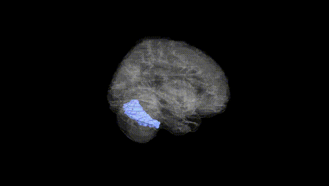
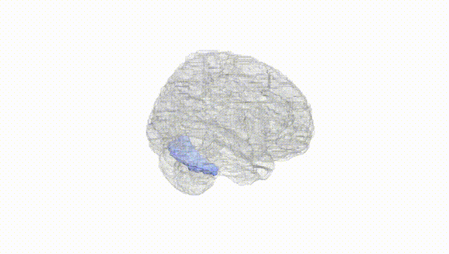
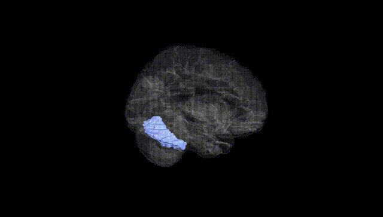
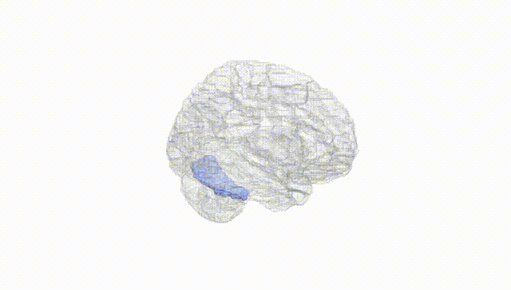
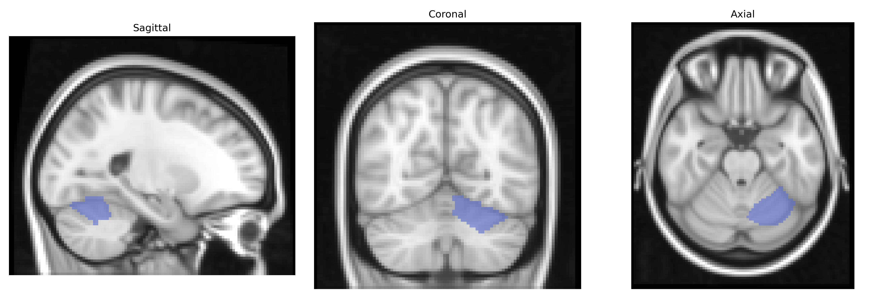
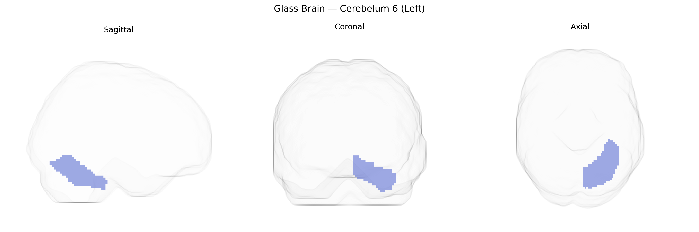

# Cerebelum 6 (Left)
 
## Overview
 
Cerebelum 6 (Left), corresponding to lobule VI of the left cerebellar hemisphere in the AAL atlas, is part of the anterior–superior portion of the cerebellar cortex, situated posterior to the primary fissure and anterior to lobule VII. It is composed predominantly of tightly folded cerebellar cortex with Purkinje cells projecting to deep cerebellar nuclei, especially the dentate nucleus, and receives afferent input from pontine nuclei relaying cortical information, as well as spinocerebellar pathways. Functionally, left lobule VI is implicated not only in fine-tuning limb and eye movements and coordinating multijoint motor activity but also in higher-order processes such as motor planning, visuomotor integration, working memory, language-related processing, and aspects of cognitive control via cerebro-cerebellar loops with frontal and parietal association cortices. There is no direct link for this specific lobule; a related structure is the broader cerebellum: [Cerebellum](https://en.wikipedia.org/wiki/Cerebellum).
 
Left Cerebellum VI (AAL-derived) has been implicated in genetic studies primarily through imaging genetics and GWAS of brain structure, cognition, and neuropsychiatric disorders, rather than through region-specific candidate genes. Variants in genome-wide significant loci for total and regional cerebellar volume (e.g., near KAT8, PAPPA, and genes involved in neurodevelopmental and synaptic pathways) show associations that extend to lobule VI, consistent with its role in motor timing and higher-order cognitive functions. Large-scale imaging GWAS (UK Biobank and related consortia) report polygenic influences on lobule VI volume implicating pathways for neuronal differentiation, axon guidance, and myelination, with overlapping genetic architecture with intracranial volume and cortical association areas. Genetic correlations link cerebellar VI structure with general cognitive ability, educational attainment, and neurodevelopmental conditions such as autism spectrum disorder and ADHD, as well as mood and psychotic disorders, though individual locus-level associations often lack lobule-specific resolution. Some studies of schizophrenia, major depression, and bipolar disorder note case–control differences in left cerebellar VI volume or activation that co-localize with disorder risk loci identified in brain-wide GWAS, suggesting shared polygenic mechanisms, but no single gene or variant has been uniquely and robustly assigned specifically to left Cerebellum VI to date.
 
*Overview generated by GPT-4o (2026).*
 
---
 
**Region ID:** 9041  
**Hemisphere:** left  
**Atlas:** AAL 
 
---
 
## Cerebelum 6 (Left) – Black Background (Full Brain)
 

 
**Full Quality Version:** <a href="full_black.mp4" download>Download MP4</a>
 
---
 
## Cerebelum 6 (Left) – White Background (Full Brain)
 

 
**Full Quality Version:** <a href="full_white.mp4" download>Download MP4</a>
 
---

## Cerebelum 6 (Left) – Black Background (Hemisphere)
 

 
**Full Quality Version:** <a href="hemi_black.mp4" download>Download MP4</a>
 
---
 
## Cerebelum 6 (Left) – White Background (Hemisphere)
 

 
**Full Quality Version:** <a href="hemi_white.mp4" download>Download MP4</a>
 
---

## Triplanar View – T1 Background
 

 
---
 
## Triplanar View – Ghost Brain
 


