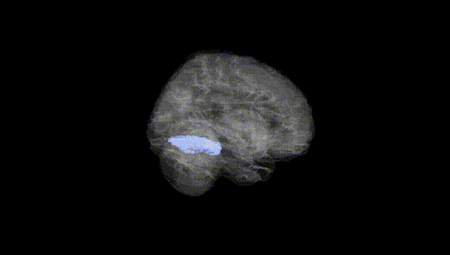
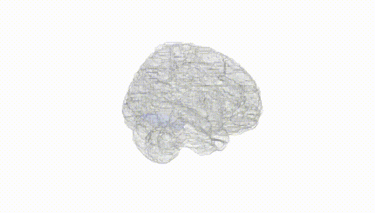
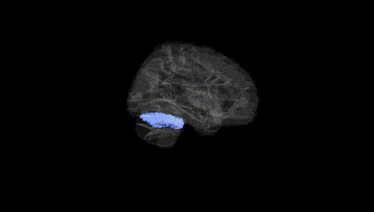
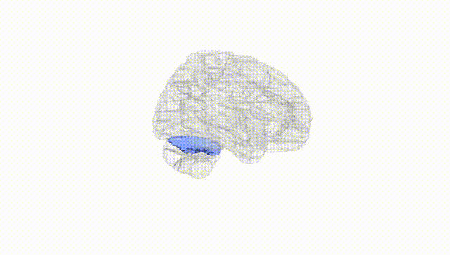
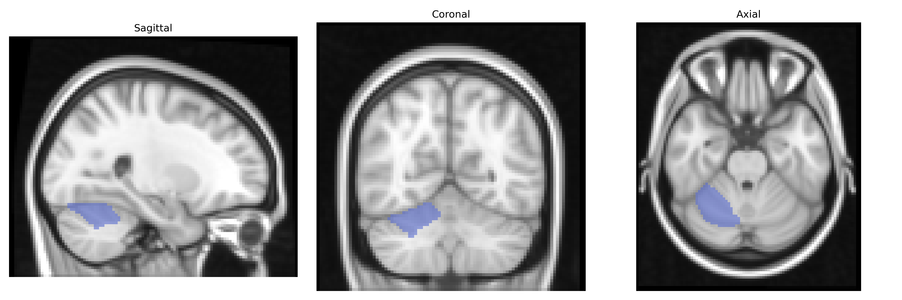
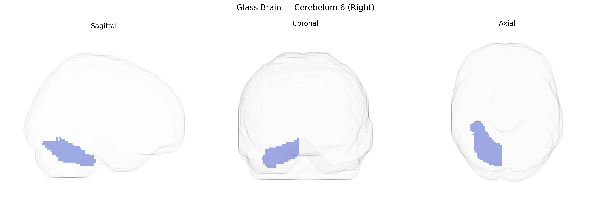

# Cerebelum 6 (Right)
 
## Overview
 
The right Cerebellum 6 (Right), as defined in the AAL atlas, corresponds to lobule VI of the cerebellar hemisphere on the right side, a key component of the cerebellar posterior lobe involved in fine-tuning motor control as well as higher-order cognitive and affective functions. This region receives extensive input from cerebral cortical areas via pontine nuclei and contributes to cerebello-thalamo-cortical loops that support coordination of voluntary movements, motor learning, timing, and error correction. Beyond motor roles, lobule VI has been implicated in visuomotor integration, language-related processing, working memory, and aspects of executive function, reflecting the cerebellum’s broader participation in non-motor networks. In the AAL parcellation, it is treated as a distinct anatomical and functional subdivision based on its cytoarchitecture and connectivity patterns within the cerebellar cortex. There is no direct Wikipedia article for “Cerebellum_6_R”; a related entry is [Cerebellum](https://en.wikipedia.org/wiki/Cerebellum).
 
The right cerebellar lobule VI (AAL “Cerebelum 6 Right”) is repeatedly implicated in imaging–genetics and GWAS work as part of the broader cerebellar circuitry involved in motor coordination, cognitive control, and affective regulation, with genetic influences overlapping those for cortical association networks. Large-scale brain-structure GWAS (e.g., ENIGMA and UK Biobank–based studies) show that interindividual variation in right lobule VI volume, surface, and connectivity is moderately heritable and associated with polygenic scores for general cognitive ability, educational attainment, and psychiatric liability, including schizophrenia, bipolar disorder, and major depression, though specific genome-wide significant SNPs are typically reported for “cerebellar lobule VI” or “right cerebellum” rather than this atlas label alone. Imaging–genetics studies link variants in genes affecting neurodevelopment, synaptic signaling, and cerebellar morphogenesis (such as those in neurodevelopmental and synaptic gene sets enriched for ASD and ADHD risk) to altered structure and functional connectivity of right lobule VI, in line with its role in cortico–cerebellar loops connecting to prefrontal and parietal association areas. Cerebellar lobule VI, including its right subdivision, has also appeared in GWAS and polygenic risk analyses of neurodevelopmental and neurodegenerative traits (autism spectrum disorder, attention-deficit/hyperactivity disorder, and to a lesser extent Alzheimer’s disease) via imaging endophenotypes—where genetic risk scores for these disorders predict alterations in lobule VI volume or functional coupling—although robust, region-specific, single-gene associations remain sparse and most findings highlight distributed polygenic influences across the cerebellum and its networks.
 
*Overview generated by GPT-4o (2026).*
 
---
 
**Region ID:** 9042  
**Hemisphere:** right  
**Atlas:** AAL 
 
---
 
## Cerebelum 6 (Right) – Black Background (Full Brain)
 

 
**Full Quality Version:** <a href="full_black.mp4" download>Download MP4</a>
 
---
 
## Cerebelum 6 (Right) – White Background (Full Brain)
 

 
**Full Quality Version:** <a href="full_white.mp4" download>Download MP4</a>
 
---

## Cerebelum 6 (Right) – Black Background (Hemisphere)
 

 
**Full Quality Version:** <a href="hemi_black.mp4" download>Download MP4</a>
 
---
 
## Cerebelum 6 (Right) – White Background (Hemisphere)
 

 
**Full Quality Version:** <a href="hemi_white.mp4" download>Download MP4</a>
 
---

## Triplanar View – T1 Background
 

 
---
 
## Triplanar View – Ghost Brain
 


