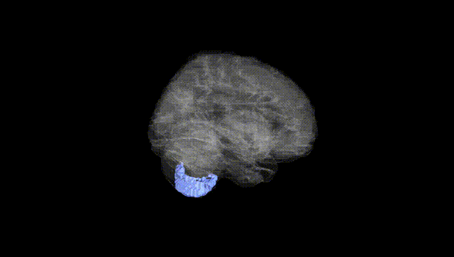
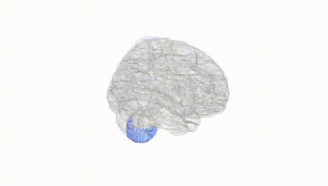
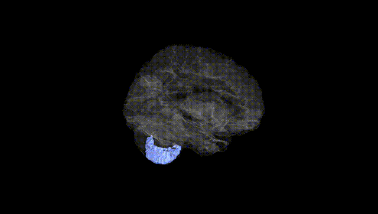
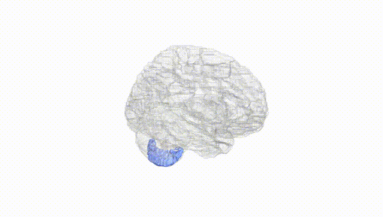
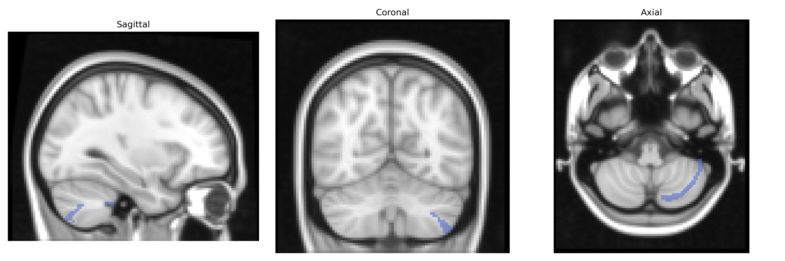
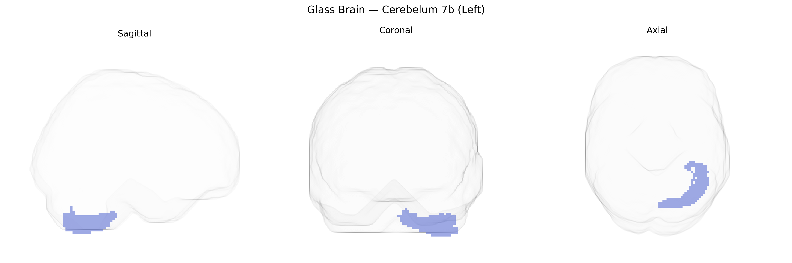

# Cerebelum 7b (Left)
 
## Overview
 
Cerebellum_7b_L (left Cerebellar lobule VIIb) is a lateral posterior cerebellar region defined in the AAL atlas that forms part of the hemispheric neocerebellum and is implicated in higher-order sensorimotor integration and cognitive processing rather than primary motor control. Anatomically, it lies within the posterior lobe of the cerebellum, bordering other hemispheric lobules such as Crus II and lobule VIII, and receives extensive cortico-ponto-cerebellar input from association areas of the cerebral cortex. Functional imaging studies associate lobule VIIb with aspects of executive function, working memory, language-related processes, and aspects of social cognition, consistent with the broader role of the posterior cerebellum in non-motor domains. There is no direct Wikipedia entry for Cerebellum_7b_L; a closely related and encompassing structure is the [Cerebellum](https://en.wikipedia.org/wiki/Cerebellum).
 
The left Cerebellum 7b region (AAL atlas) has been implicated in several genetic and GWAS-based associations, primarily through imaging genetics studies linking regional volume, cortical thickness, or functional connectivity to specific variants and polygenic risk scores. Genome-wide association studies of cerebellar volume and morphology (e.g., ENIGMA and UK Biobank-based analyses) have identified loci in or near genes such as RELN, KIAA1217, PAX3, and others that show effects on lobule-specific cerebellar structures, including posterior regions overlapping with 7b, although most reports describe lobular or voxelwise clusters rather than AAL-defined 7b specifically. Polygenic risk scores for schizophrenia, bipolar disorder, autism spectrum disorder, ADHD, and major depression have been associated with structural and functional alterations in posterior cerebellar regions, including Crus II and adjacent lobules that approximate AAL Cerebellum 7b, supporting a role in higher-order cognitive and affective processing. Additional GWAS of cognitive performance, educational attainment, and neuroticism have reported cerebellar mediation effects, with some clusters in left posterior cerebellum, and candidate-gene or smaller imaging-genetics studies have linked variants in dopamine- and glutamate-related genes, as well as synaptic and neurodevelopmental genes (e.g., CACNA1C, BDNF, and others), to altered activation or connectivity in posterior cerebellar territories during working memory, language, and emotion tasks. However, current evidence is largely indirect and regionally coarse, with few studies mapping genetic effects uniquely or specifically to the AAL-defined left Cerebellum 7b region, so most associations should be considered approximate to that territory rather than anatomically precise.
 
*Overview generated by GPT-4o (2026).*
 
---
 
**Region ID:** 9051  
**Hemisphere:** left  
**Atlas:** AAL 
 
---
 
## Cerebelum 7b (Left) – Black Background (Full Brain)
 

 
**Full Quality Version:** <a href="full_black.mp4" download>Download MP4</a>
 
---
 
## Cerebelum 7b (Left) – White Background (Full Brain)
 

 
**Full Quality Version:** <a href="full_white.mp4" download>Download MP4</a>
 
---

## Cerebelum 7b (Left) – Black Background (Hemisphere)
 

 
**Full Quality Version:** <a href="hemi_black.mp4" download>Download MP4</a>
 
---
 
## Cerebelum 7b (Left) – White Background (Hemisphere)
 

 
**Full Quality Version:** <a href="hemi_white.mp4" download>Download MP4</a>
 
---

## Triplanar View – T1 Background
 

 
---
 
## Triplanar View – Ghost Brain
 


