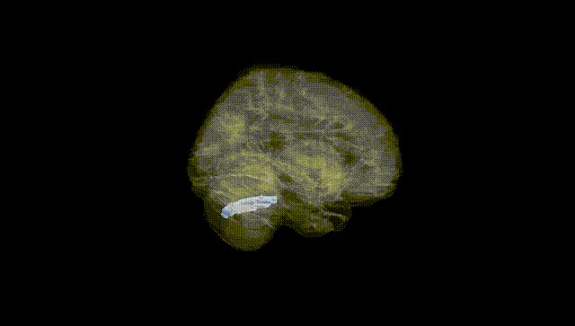
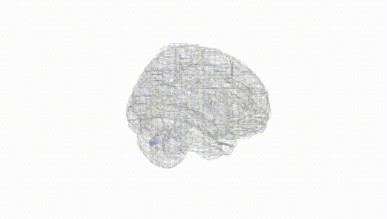
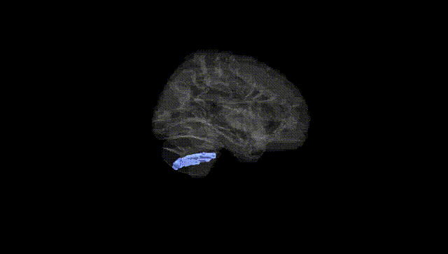
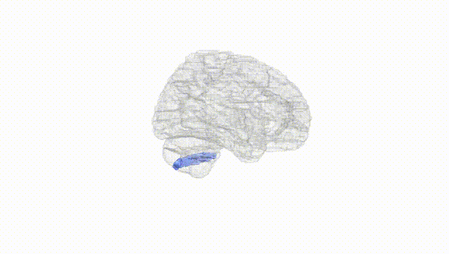
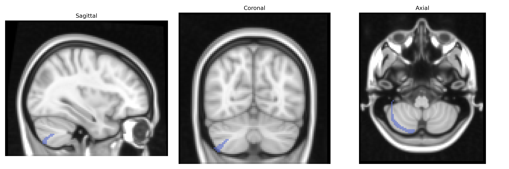
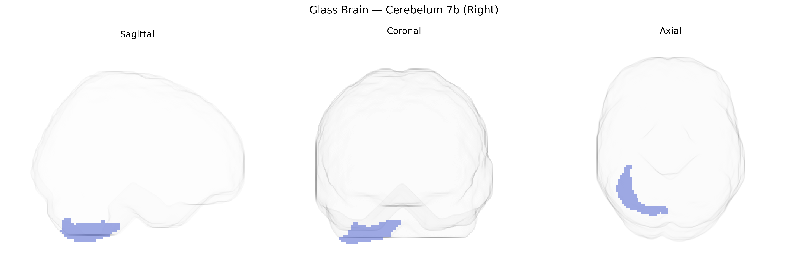

# Cerebelum 7b (Right)
 
## Overview
 
The right Cerebellum 7b (Right), as defined in the AAL atlas, refers to a lobule within the posterolateral cerebellar hemisphere, corresponding to part of the so‑called “Crus II / lobule VIIb” region. This area belongs to the neocerebellum and is primarily associated with higher-order cognitive and affective functions rather than purely motor control, including roles in working memory, language, attention, and aspects of executive processing through its extensive connections with prefrontal and parietal cortical areas. Functionally, right cerebellar lobule VIIb participates in cerebro-cerebellar loops that support coordination of complex cognitive operations, prediction, and error monitoring, and it shows lateralized interactions with left-hemisphere cortical language and executive networks. There is no direct link for “Cerebellum 7b” as labeled in the AAL atlas; a closely related and encompassing structure is the cerebellum: [Cerebellum](https://en.wikipedia.org/wiki/Cerebellum).
 
The right cerebellar lobule VIIb (AAL “Cerebelum_7b_R”) has not been a primary target in most GWAS, but several lines of imaging‑genetics and disorder-focused studies implicate it indirectly. Large brain-structure GWAS (e.g., ENIGMA and UK Biobank–based analyses) have identified common variants influencing cerebellar gray matter volumes and surface measures, including loci near genes involved in neurodevelopment and synaptic function (such as PAX6, RELN, and CACNA1C), though these findings generally report lobular or total cerebellar associations rather than region‑specific effects for VIIb_R. Polygenic risk for schizophrenia, bipolar disorder, and major depression has been associated with altered cerebellar structure and connectivity, and case–control neuroimaging frequently shows right lateral cerebellar abnormalities in these conditions as well as in autism spectrum disorder, ADHD, and dyslexia, implicating an overlap between psychiatric risk variants and cerebellar morphometry, including in posterior lobules. Rare, high‑penetrance mutations in genes causing cerebellar ataxias (e.g., ATXN1, ATXN2, CACNA1A) and other cerebellar malformation syndromes often produce widespread cerebellar involvement that includes lobule VIIb, but the genetic effect is not specific to this subregion. Overall, current evidence supports a polygenic, distributed genetic architecture influencing right cerebellar VIIb structure and function, primarily inferred from whole‑cerebellum or lobule-level analyses and from disorders with cerebellar involvement, rather than from GWAS targeting this exact AAL-defined region.
 
*Overview generated by GPT-4o (2026).*
 
---
 
**Region ID:** 9052  
**Hemisphere:** right  
**Atlas:** AAL 
 
---
 
## Cerebelum 7b (Right) – Black Background (Full Brain)
 

 
**Full Quality Version:** <a href="full_black.mp4" download>Download MP4</a>
 
---
 
## Cerebelum 7b (Right) – White Background (Full Brain)
 

 
**Full Quality Version:** <a href="full_white.mp4" download>Download MP4</a>
 
---

## Cerebelum 7b (Right) – Black Background (Hemisphere)
 

 
**Full Quality Version:** <a href="hemi_black.mp4" download>Download MP4</a>
 
---
 
## Cerebelum 7b (Right) – White Background (Hemisphere)
 

 
**Full Quality Version:** <a href="hemi_white.mp4" download>Download MP4</a>
 
---

## Triplanar View – T1 Background
 

 
---
 
## Triplanar View – Ghost Brain
 


