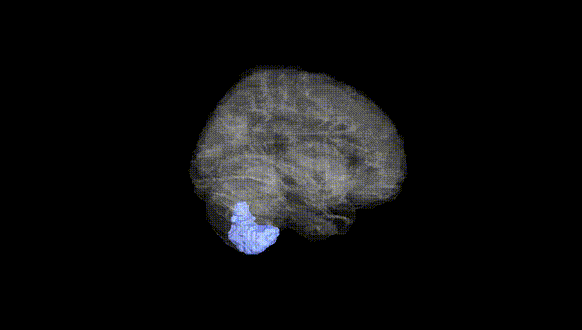
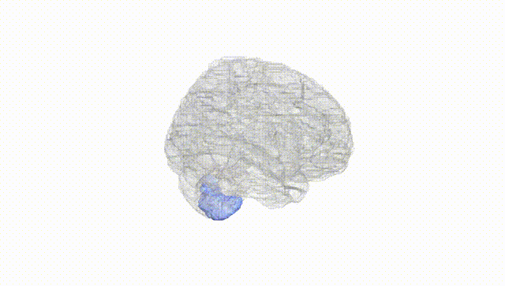
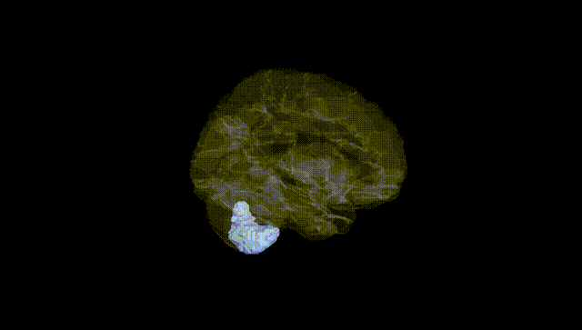
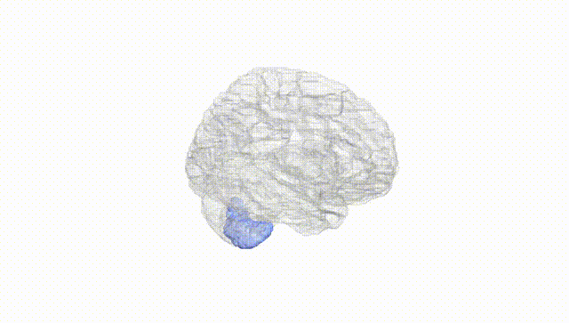
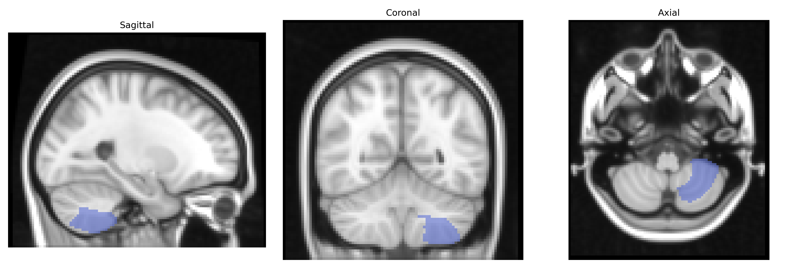
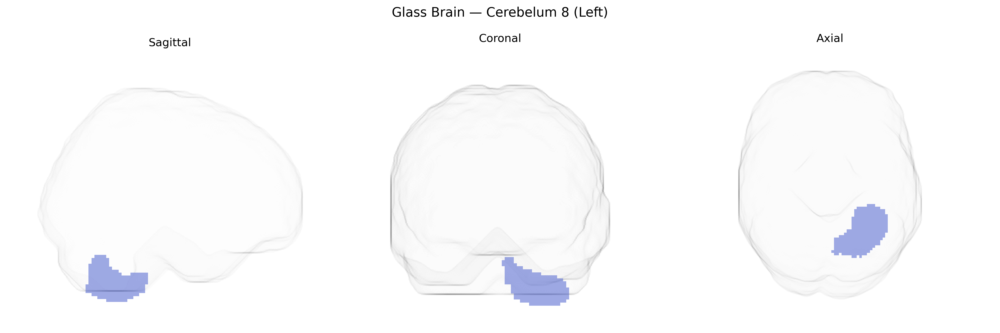

# Cerebelum 8 (Left)
 
## Overview
 
Left Cerebelum 8 (Left) in the AAL atlas corresponds to a portion of the left cerebellar hemisphere within lobule VIII of the posterior lobe, typically located in the inferior vermis and adjacent hemispheric cortex. This region participates in fine-tuning motor execution, postural control, and coordination of limb movements, and is increasingly implicated in sensorimotor integration and timing of complex motor tasks. Functional imaging studies associate cerebellar lobule VIII with precision of movement, adaptation to changing motor demands, and aspects of motor learning, and it may also contribute to higher-order processes through cerebro-cerebellar loops with motor and premotor cortices. There is no dedicated Wikipedia article for “Cerebelum 8”; a related structure is the cerebellar lobules described under [Cerebellum](https://en.wikipedia.org/wiki/Cerebellum).
 
Genetic associations with the left Cerebelum 8 region (AAL atlas) arise primarily from imaging genetics and cerebellar volume GWAS rather than region-specific candidate studies. Large-scale GWAS of cerebellar structure have identified loci in and near genes such as KIAA0586 (cilia function and Joubert syndrome), PTCH1 (Hedgehog signaling and medulloblastoma risk), DLG4 (synaptic scaffolding), and variants in MAPT and APOE that broadly influence posterior cerebellar volumes, including lobule VIII, although these effects are typically reported at lobular or total cerebellar scales rather than fine AAL parcels. Cerebellar lobule VIII, involved in sensorimotor and timing functions, shows heritable variation in volume and functional connectivity, with twin and family studies indicating substantial genetic contribution to its morphology. Polygenic risk scores for schizophrenia, bipolar disorder, depression, ADHD, and autism have been associated with altered cerebellar structure and connectivity, and some ENIGMA and UK Biobank analyses report that genetic risk for these disorders correlates with gray matter changes in inferior/posterior cerebellar regions overlapping lobule VIII. Additionally, GWAS of motor coordination, balance, and cognitive traits (e.g., processing speed, working memory) have implicated genetic variants that show downstream associations with cerebellar morphology, including the left lobule VIII, though the current evidence is indirect and regionally coarse. Overall, known genetic links to the left Cerebelum 8 are embedded within broader cerebellar and sensorimotor network findings, with no major GWAS to date isolating this AAL-defined region as a unique, primary locus of association.
 
*Overview generated by GPT-4o (2026).*
 
---
 
**Region ID:** 9061  
**Hemisphere:** left  
**Atlas:** AAL 
 
---
 
## Cerebelum 8 (Left) – Black Background (Full Brain)
 

 
**Full Quality Version:** <a href="full_black.mp4" download>Download MP4</a>
 
---
 
## Cerebelum 8 (Left) – White Background (Full Brain)
 

 
**Full Quality Version:** <a href="full_white.mp4" download>Download MP4</a>
 
---

## Cerebelum 8 (Left) – Black Background (Hemisphere)
 

 
**Full Quality Version:** <a href="hemi_black.mp4" download>Download MP4</a>
 
---
 
## Cerebelum 8 (Left) – White Background (Hemisphere)
 

 
**Full Quality Version:** <a href="hemi_white.mp4" download>Download MP4</a>
 
---

## Triplanar View – T1 Background
 

 
---
 
## Triplanar View – Ghost Brain
 


