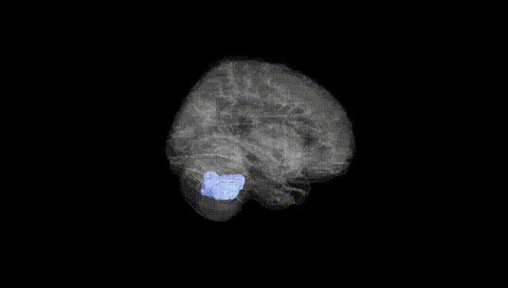
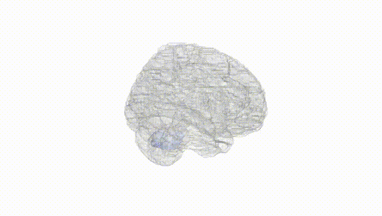
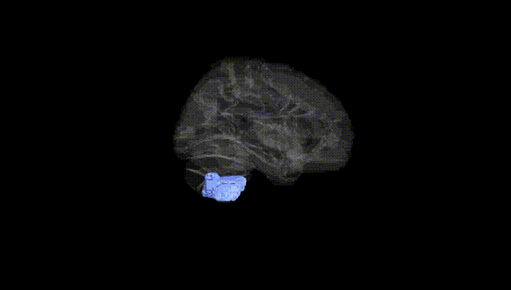
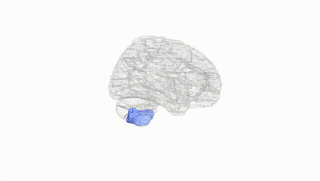
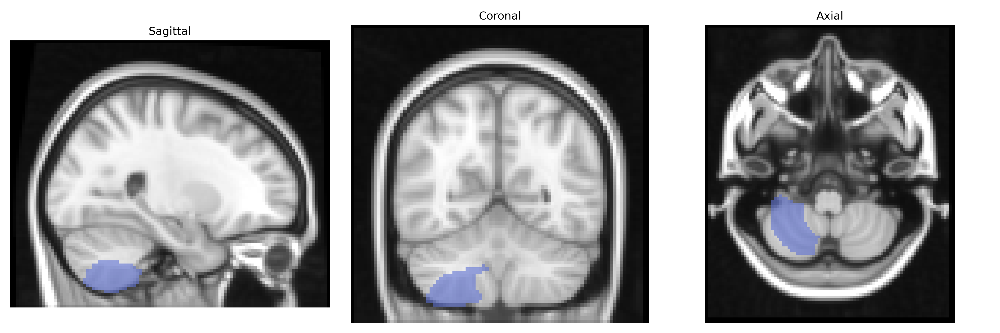
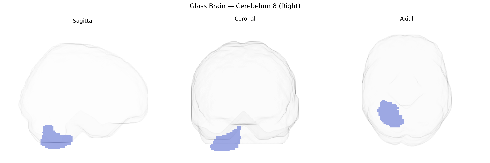

# Cerebelum 8 (Right)
 
## Overview
 
Right Cerebellum 8 (Right) in the AAL atlas corresponds to lobule VIII of the posterior cerebellar hemisphere on the right side, a region primarily involved in sensorimotor integration and fine-tuning of limb movements, especially those of the distal extremities. This lobule receives inputs from spinal and cortical pathways and contributes to the coordination, timing, and precision of voluntary motor activity, as well as to the adaptation of motor responses based on sensory feedback. Functional imaging studies implicate lobule VIII in tasks requiring complex hand movements, balance, and gait control, and lesions in this area can result in limb ataxia, dysmetria, and impaired balance. Although there is no specific Wikipedia article for “Right Cerebellum 8 (Right)” as defined in the AAL atlas, it is part of cerebellar lobule VIII within the broader [Cerebellum](https://en.wikipedia.org/wiki/Cerebellum).
 
Genetic associations specifically implicating the right Cerebelum 8 (Right) region of the AAL atlas are sparse, and most evidence comes from broader imaging-genetics and cerebellar volume GWAS rather than lobule- or subregion-specific analyses. Large-scale studies (e.g., ENIGMA, UK Biobank) have identified multiple loci influencing total and regional cerebellar volume—often involving genes related to neurodevelopment, synaptic function, and axon guidance (such as KIAA0586, PAX3, and variants near FOXP1 and ZIC genes)—but these typically report effects at the level of lobules or whole cerebellar hemispheres rather than AAL-defined Cerebelum 8. Polygenic architectures linked to neurodevelopmental and psychiatric traits (autism spectrum disorder, schizophrenia, major depression, ADHD) and motor or coordination traits frequently show overlapping enrichment in cerebellar regions, including inferior posterior lobules where AAL’s Cerebelum 8 resides, implicating shared genetic influences on cortico-cerebellar circuits. Additionally, rare pathogenic variants in genes affecting cerebellar development (e.g., in congenital ataxias or Joubert-related genes such as AHI1 and CEP290) can alter structure and function in posterior cerebellar territories that encompass or approximate this region, though these data are typically reported in anatomical rather than AAL terms. Overall, current genetic evidence links cerebellar, including posterior-inferior, morphology and function to a broad set of neurodevelopmental, motor, cognitive, and psychiatric traits, but no robust GWAS findings have isolated right Cerebelum 8 (Right) as a uniquely or preferentially associated region at fine-grained atlas resolution.
 
*Overview generated by GPT-4o (2026).*
 
---
 
**Region ID:** 9062  
**Hemisphere:** right  
**Atlas:** AAL 
 
---
 
## Cerebelum 8 (Right) – Black Background (Full Brain)
 

 
**Full Quality Version:** <a href="full_black.mp4" download>Download MP4</a>
 
---
 
## Cerebelum 8 (Right) – White Background (Full Brain)
 

 
**Full Quality Version:** <a href="full_white.mp4" download>Download MP4</a>
 
---

## Cerebelum 8 (Right) – Black Background (Hemisphere)
 

 
**Full Quality Version:** <a href="hemi_black.mp4" download>Download MP4</a>
 
---
 
## Cerebelum 8 (Right) – White Background (Hemisphere)
 

 
**Full Quality Version:** <a href="hemi_white.mp4" download>Download MP4</a>
 
---

## Triplanar View – T1 Background
 

 
---
 
## Triplanar View – Ghost Brain
 


