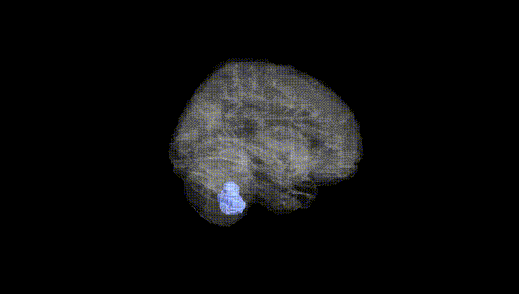
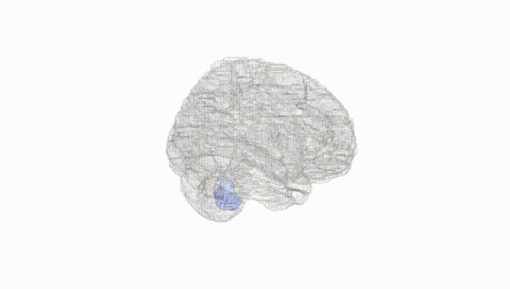
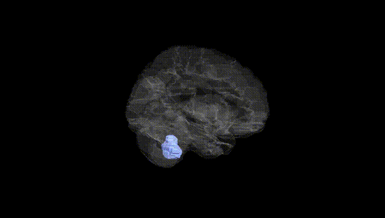
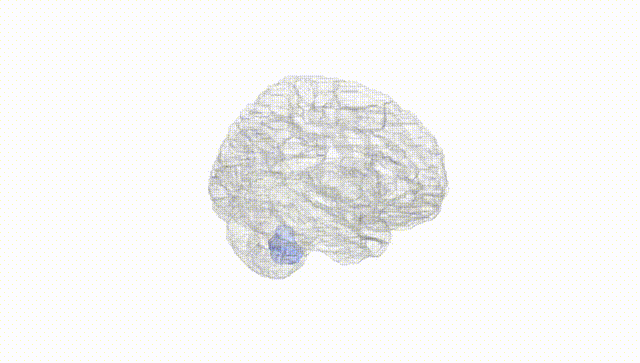
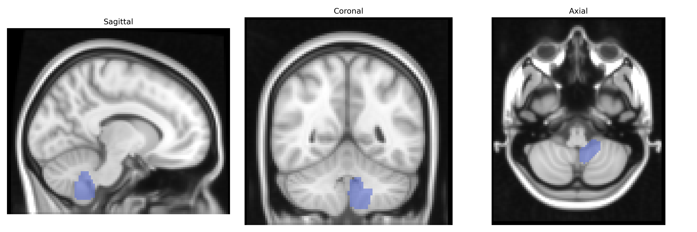
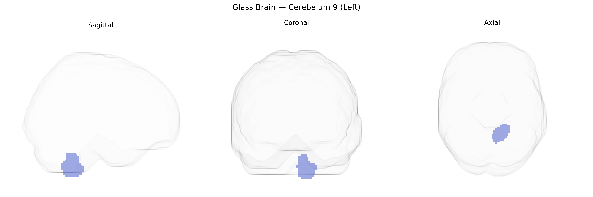

# Cerebelum 9 (Left)
 
## Overview
 
Cerebelum 9 (Left), corresponding to lobule IX of the left cerebellar hemisphere, is part of the posterior lobe of the cerebellum and is implicated in both motor coordination and higher-order cognitive and affective processing. Anatomically, lobule IX lies inferiorly and posteriorly, bordering the cerebellar tonsils and connected via cerebellar peduncles to brainstem nuclei and cortical association areas through cerebello-thalamo-cortical loops. Functional imaging studies link this region to balance, oculomotor control, and fine-tuning of voluntary movements, as well as to networks involved in working memory, language, and emotional regulation, reflecting the cerebellum’s broader role beyond pure motor functions. There is no direct Wikipedia article for “Cerebelum 9 (Left)” as defined in the AAL atlas; a related and encompassing structure is the [Cerebellum](https://en.wikipedia.org/wiki/Cerebellum).
 
The left Cerebellum lobule IX (AAL atlas “Cerebelum_9_L”) has been implicated in genetic studies primarily through imaging genetics and cerebellar volume GWAS rather than region-specific association analyses. Large-scale GWAS of cerebellar structure (e.g., ENIGMA and UK Biobank cohorts) have identified multiple loci (including variants near genes such as PAPPA2, KIAA0319, RORA, and others involved in neurodevelopment, synaptic signaling, and cell adhesion) that influence total and regional cerebellar gray matter volumes, with lobule IX often grouped within posterior cerebellar or vermal measures rather than examined in isolation. These genetic influences on cerebellar morphology have been linked to a range of traits and disorders, including general cognitive ability, educational attainment, schizophrenia, bipolar disorder, major depressive disorder, autism spectrum disorder, attention-deficit/hyperactivity disorder, and anxiety-related traits, consistent with the role of lobule IX in default-mode, vestibular, and affective networks. Additional work combining GWAS with functional connectivity and voxel-based morphometry suggests shared polygenic architecture between posterior cerebellar regions (including lobule IX) and internalizing psychopathology, rumination, and sleep-related traits, though direct, lobule IX–specific genetic associations remain limited and most findings reflect broader cerebellar or posterior cerebellar signatures rather than anatomically precise, AAL-defined Cerebelum_9_L effects.
 
*Overview generated by GPT-4o (2026).*
 
---
 
**Region ID:** 9071  
**Hemisphere:** left  
**Atlas:** AAL 
 
---
 
## Cerebelum 9 (Left) – Black Background (Full Brain)
 

 
**Full Quality Version:** <a href="full_black.mp4" download>Download MP4</a>
 
---
 
## Cerebelum 9 (Left) – White Background (Full Brain)
 

 
**Full Quality Version:** <a href="full_white.mp4" download>Download MP4</a>
 
---

## Cerebelum 9 (Left) – Black Background (Hemisphere)
 

 
**Full Quality Version:** <a href="hemi_black.mp4" download>Download MP4</a>
 
---
 
## Cerebelum 9 (Left) – White Background (Hemisphere)
 

 
**Full Quality Version:** <a href="hemi_white.mp4" download>Download MP4</a>
 
---

## Triplanar View – T1 Background
 

 
---
 
## Triplanar View – Ghost Brain
 


