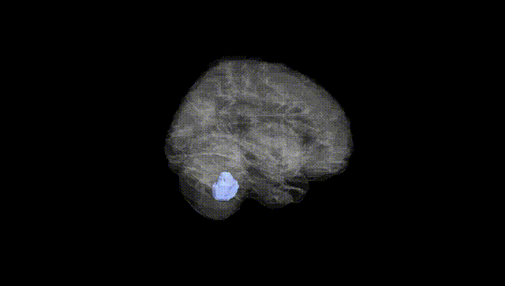
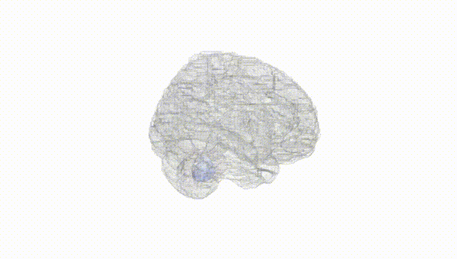
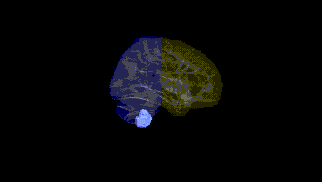
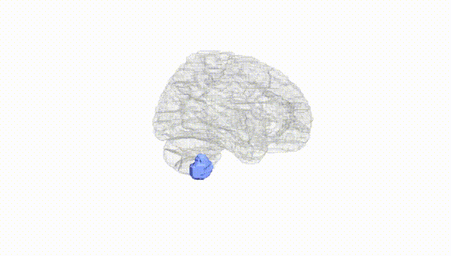
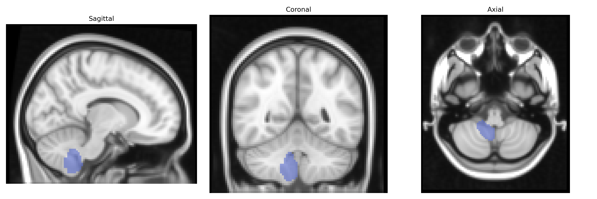
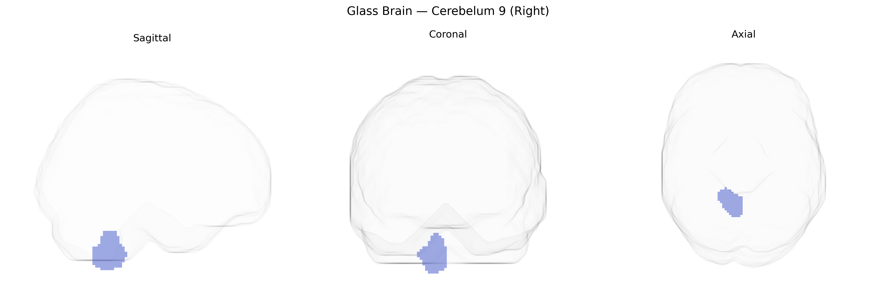

# Cerebelum 9 (Right)
 
## Overview
 
The right Cerebellum 9 region in the AAL atlas corresponds to lobule IX of the posterior cerebellar hemisphere on the right side, a component of the so‑called “tonsillar” region that lies inferiorly and medially near the midline. Histologically, it shares the classic cerebellar cortical trilaminar organization (molecular layer, Purkinje cell layer, and granular layer) and receives diverse afferents from vestibular, spinal, and pontine sources, while projecting via deep cerebellar nuclei (primarily the fastigial and dentate nuclei) to brainstem and thalamic targets. Functionally, right Cerebellum 9 has been implicated in oculomotor and postural control, vestibular processing, and higher-order cognitive and affective functions through its participation in cerebro-cerebellar loops with association cortices. There is no direct Wikipedia article for “Cerebellum 9”; a closely related structure is [Cerebellar tonsil](https://en.wikipedia.org/wiki/Cerebellar_tonsil).
 
The right cerebellar lobule IX (Cerebelum_9_R in the AAL atlas) has been implicated in several imaging‑genetics and GWAS studies, mainly through cerebellar volume or functional connectivity phenotypes rather than direct region-specific genetic association screens. Large-scale MRI GWAS (e.g., UK Biobank–based) have identified common variants in genes involved in neurodevelopment, synaptic organization, and axon guidance—such as those in or near KIAA0586, LINC-PINT, MAPT, and genes in the PI3K–AKT and Wnt pathways—associated with cerebellar gray matter volume and lobule-specific morphometry, including inferior posterior lobules that encompass lobule IX. Polygenic overlap has been reported between cerebellar structural measures and schizophrenia, major depressive disorder, bipolar disorder, and autism spectrum disorder, as well as with cognitive traits (general intelligence, working memory, educational attainment) and neuroticism, consistent with the role of lobule IX in cognitive–affective and default-mode networks. Some rare variant and copy number studies in neurodevelopmental disorders (e.g., 22q11.2 deletion, SHANK and CHD gene disruptions) show convergent evidence of reduced inferior posterior cerebellar volumes, again implicating lobule IX among other regions. However, no major locus has been identified as uniquely or specifically determining right lobule IX structure or function; rather, this region appears to be influenced by highly polygenic, pleiotropic architecture shared with broader cerebellar and cortical networks.
 
*Overview generated by GPT-4o (2026).*
 
---
 
**Region ID:** 9072  
**Hemisphere:** right  
**Atlas:** AAL 
 
---
 
## Cerebelum 9 (Right) – Black Background (Full Brain)
 

 
**Full Quality Version:** <a href="full_black.mp4" download>Download MP4</a>
 
---
 
## Cerebelum 9 (Right) – White Background (Full Brain)
 

 
**Full Quality Version:** <a href="full_white.mp4" download>Download MP4</a>
 
---

## Cerebelum 9 (Right) – Black Background (Hemisphere)
 

 
**Full Quality Version:** <a href="hemi_black.mp4" download>Download MP4</a>
 
---
 
## Cerebelum 9 (Right) – White Background (Hemisphere)
 

 
**Full Quality Version:** <a href="hemi_white.mp4" download>Download MP4</a>
 
---

## Triplanar View – T1 Background
 

 
---
 
## Triplanar View – Ghost Brain
 


