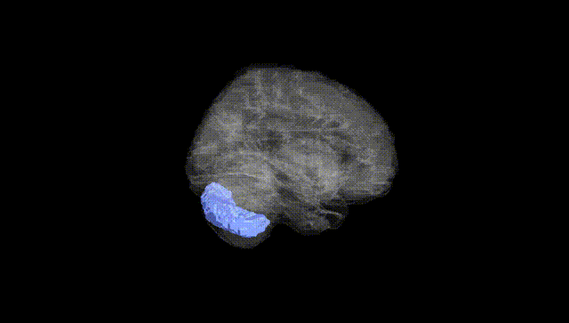
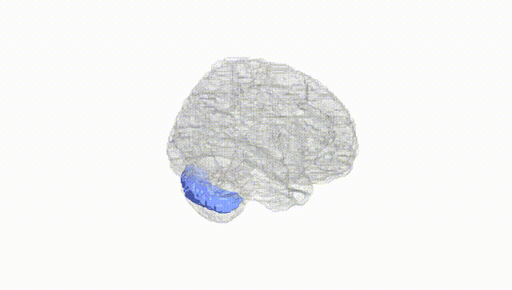
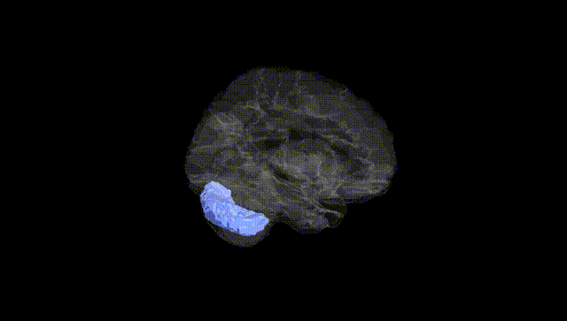
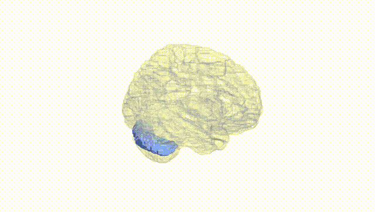
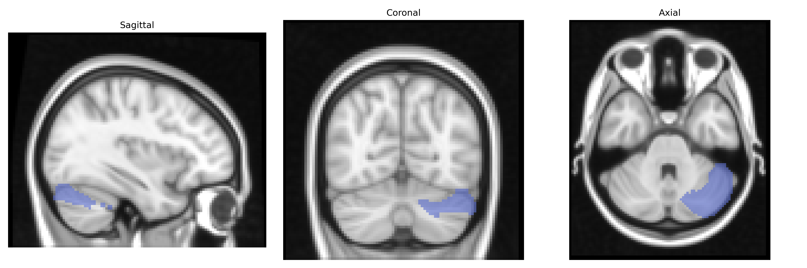
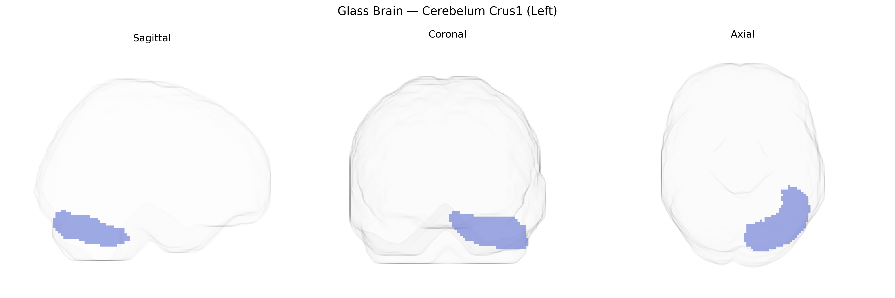

# Cerebelum Crus1 (Left)
 
## Overview
 
The left Cerebellum Crus I (AAL: “Cerebelum_Crus1_L”) is a lateral hemispheric subdivision of the cerebellar posterior lobe, located between lobule VI and Crus II and forming part of the cerebellar “cognitive” or “neocerebellar” territory. It is composed primarily of cerebellar cortex with its characteristic three-layered organization (molecular layer, Purkinje cell layer, and granular layer) and deep connections via mossy and climbing fiber inputs and Purkinje cell outputs to the dentate nucleus. Functionally, Crus I is strongly interconnected with association cortices, including prefrontal and parietal regions, and is implicated in higher-order processes such as working memory, language, executive control, and social-cognitive functions, in addition to subtle roles in motor coordination. There is no direct link for this subregion; see the related structure [Cerebellum](https://en.wikipedia.org/wiki/Cerebellum).
 
The left Cerebellum Crus I, as defined in the AAL atlas, has emerged in imaging genetics and cerebellar GWAS studies as a locus implicated in higher-order cognitive and affective functions, with several genetic associations reported. Large-scale brain-structure GWAS (e.g., ENIGMA and UK Biobank–based analyses) have identified multiple variants in genes related to neurodevelopment, synaptic signaling, and cell adhesion (such as KIAA0319, DLG2, and GRM family genes) influencing cerebellar lobular volumes, including Crus I, although associations are often regionally broad rather than Crus I–specific. Polygenic scores for cognitive performance and educational attainment show positive correlations with gray matter volume and functional activity in Crus I, consistent with its role in working memory and executive processing. Variants conferring risk for schizophrenia, bipolar disorder, and major depression (e.g., within CACNA1C, GRM3, and other glutamatergic and calcium-channel genes) have been linked to altered cerebellar connectivity and volume, with several studies reporting Crus I involvement in cortico-cerebellar circuit dysfunction. Autism spectrum disorder GWAS and rare variant studies have also implicated genes affecting cerebellar development (such as CHD8 and other chromatin-remodeling and synaptic genes), with imaging findings pointing to structural and functional abnormalities in Crus I that align with social cognition and language deficits. In addition, GWAS of functional networks and task-related activation have associated polygenic architectures for attention, language, and default-mode network connectivity with activity patterns in Crus I, reinforcing the view that genetic influences on higher cognition and neuropsychiatric risk commonly converge on this cerebellar subregion, though specific variant–Crus I associations remain dispersed and often indirect rather than uniquely localized.
 
*Overview generated by GPT-4o (2026).*
 
---
 
**Region ID:** 9001  
**Hemisphere:** left  
**Atlas:** AAL 
 
---
 
## Cerebelum Crus1 (Left) – Black Background (Full Brain)
 

 
**Full Quality Version:** <a href="full_black.mp4" download>Download MP4</a>
 
---
 
## Cerebelum Crus1 (Left) – White Background (Full Brain)
 

 
**Full Quality Version:** <a href="full_white.mp4" download>Download MP4</a>
 
---

## Cerebelum Crus1 (Left) – Black Background (Hemisphere)
 

 
**Full Quality Version:** <a href="hemi_black.mp4" download>Download MP4</a>
 
---
 
## Cerebelum Crus1 (Left) – White Background (Hemisphere)
 

 
**Full Quality Version:** <a href="hemi_white.mp4" download>Download MP4</a>
 
---

## Triplanar View – T1 Background
 

 
---
 
## Triplanar View – Ghost Brain
 


