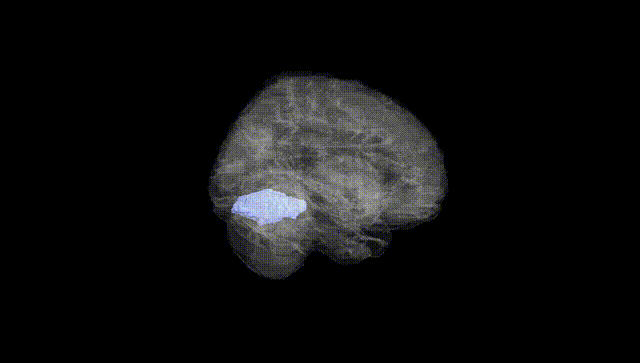
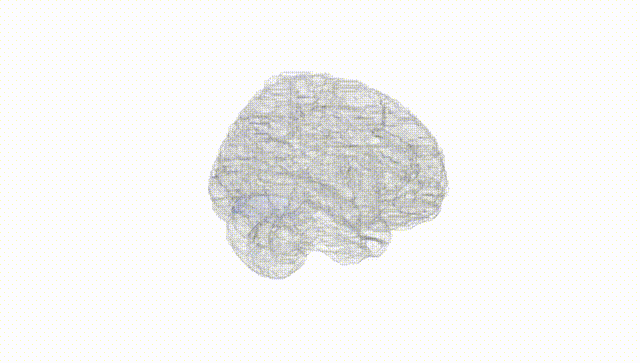
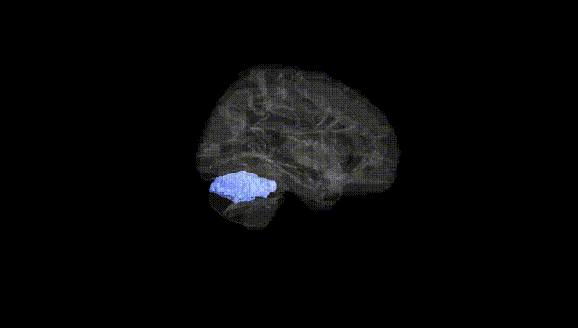
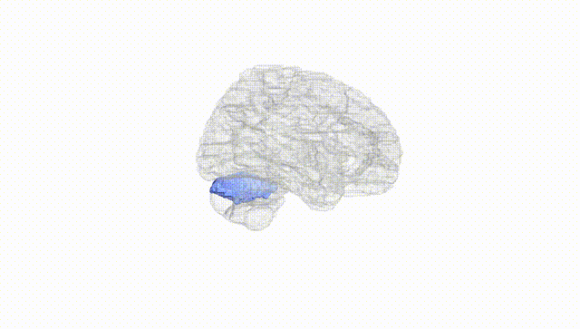
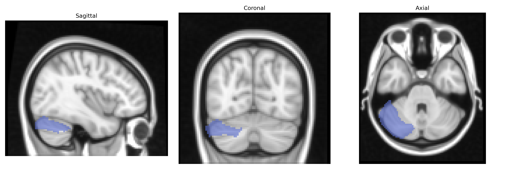
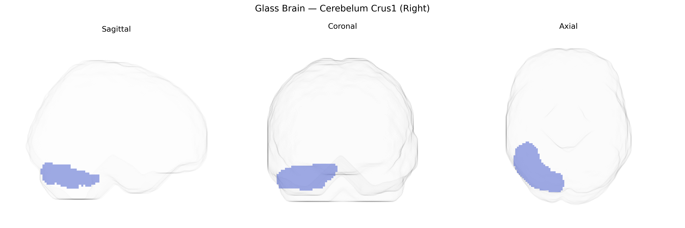

# Cerebelum Crus1 (Right)
 
## Overview
 
The right cerebellar Crus I is a lateral portion of the cerebellar hemisphere within the posterior lobe, forming part of the cerebellar cognitive network rather than primarily mediating sensorimotor control. Anatomically, it lies superior to Crus II and is connected via extensive cortico-ponto-cerebellar and cerebello-thalamo-cortical pathways with association areas of the cerebral cortex, including prefrontal and parietal regions. Functionally, Crus I is implicated in higher-order processes such as working memory, language, executive functions, and social cognition, reflecting the broader role of the cerebellum in predictive modeling and error correction beyond motor coordination. In the AAL atlas, right Crus I is defined as a distinct parcellation used in neuroimaging studies to investigate cerebellar contributions to cognition and its involvement in clinical conditions affecting these domains. There is no direct Wikipedia article specifically for Cerebellum Crus I; see the related entry on the [Cerebellum](https://en.wikipedia.org/wiki/Cerebellum).
 
The right cerebellar Crus I region, as defined in the AAL atlas, has been implicated in multiple genetic and GWAS findings that reflect its role in higher-order cognitive and affective functions rather than purely motor control. Imaging genetics and large-scale brain-structure GWAS (e.g., ENIGMA, UK Biobank) report associations between common variants in genes involved in neurodevelopment, synaptic function, and axon guidance (such as CNTNAP2, DISC1, and neurexin-related genes) and volumetric or structural variation in Crus I, often in bilateral or lobule-specific analyses that include Crus I. Polygenic risk scores for schizophrenia, bipolar disorder, major depressive disorder, and autism spectrum disorder have been associated with altered cerebellar morphology and connectivity, including Crus I, consistent with this region’s involvement in cortico-cerebellar loops supporting working memory, language, and social cognition. GWAS of cognitive traits (general intelligence, educational attainment, and working memory) and neuroticism or anxiety-related traits also show cerebellar involvement, with Crus I frequently emerging within distributed patterns linking frontal association cortices and cerebellar territories. Additionally, rare variant and copy-number studies in developmental disorders and cerebellar malformations implicate genes affecting cerebellar patterning (e.g., SHH pathway and other hindbrain-development genes) that can impact Crus I structure, although these findings are typically reported at the level of broader cerebellar lobules rather than this specific AAL parcel.
 
*Overview generated by GPT-4o (2026).*
 
---
 
**Region ID:** 9002  
**Hemisphere:** right  
**Atlas:** AAL 
 
---
 
## Cerebelum Crus1 (Right) – Black Background (Full Brain)
 

 
**Full Quality Version:** <a href="full_black.mp4" download>Download MP4</a>
 
---
 
## Cerebelum Crus1 (Right) – White Background (Full Brain)
 

 
**Full Quality Version:** <a href="full_white.mp4" download>Download MP4</a>
 
---

## Cerebelum Crus1 (Right) – Black Background (Hemisphere)
 

 
**Full Quality Version:** <a href="hemi_black.mp4" download>Download MP4</a>
 
---
 
## Cerebelum Crus1 (Right) – White Background (Hemisphere)
 

 
**Full Quality Version:** <a href="hemi_white.mp4" download>Download MP4</a>
 
---

## Triplanar View – T1 Background
 

 
---
 
## Triplanar View – Ghost Brain
 


