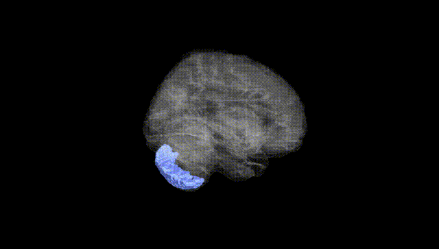
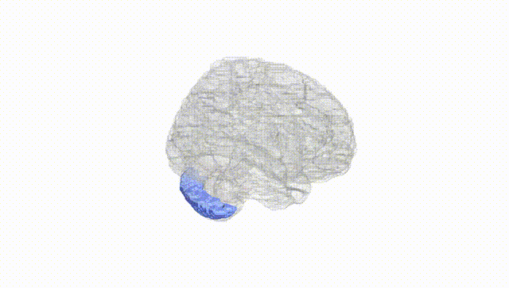
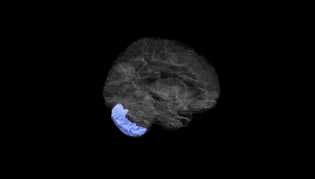
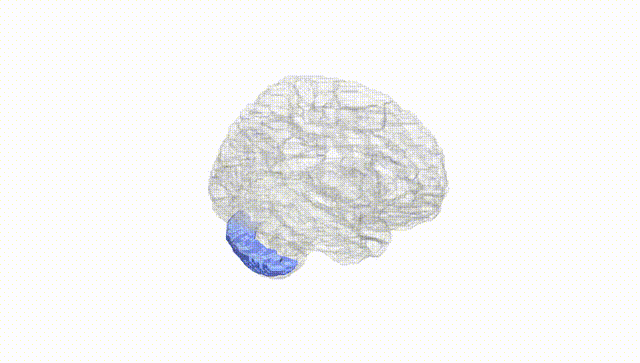
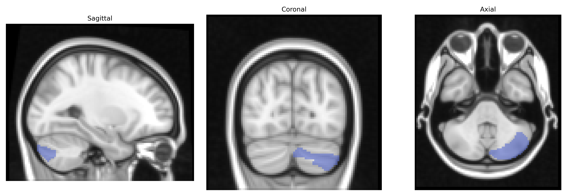
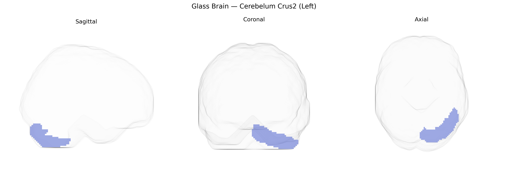

# Cerebelum Crus2 (Left)
 
## Overview
 
The left Cerebellum Crus II (Left), as defined in the AAL atlas, corresponds to a lateral subdivision of the cerebellar hemisphere within the posterior lobe, situated inferior to Crus I and dorsal to lobules VIIb/VIII. Structurally, Crus II is composed of densely packed cerebellar cortex with Purkinje cells projecting to the dentate nucleus, forming part of cortico-cerebellar loops that connect via the superior cerebellar peduncle to prefrontal, parietal, and association cortices. Functionally, this region is implicated in higher-order cognitive processes including working memory, language, and executive control, as well as aspects of social cognition, rather than primarily sensorimotor coordination. In the AAL parcellation, “Left Cerebelum Crus2” designates the left-hemispheric component of this territory, used in functional neuroimaging to localize and quantify activity related to these non-motor cerebellar functions. There is no direct Wikipedia article for “Cerebellum Crus II,” but it is part of the [Cerebellum](https://en.wikipedia.org/wiki/Cerebellum).
 
The left Cerebellum Crus II region, as defined in the AAL atlas, has been implicated in several genetic and GWAS-based findings that tie cerebellar structure and function to cognition, psychiatric risk, and neurodevelopmental traits. Large-scale imaging–genetics studies (e.g., UK Biobank–based GWAS of regional brain volumes) have identified common variants in genes related to neurodevelopment, synaptic organization, and neuroplasticity (such as those broadly enriched in neurogenesis and axon guidance pathways) that influence Crus II volume and morphology, with notable loci overlapping genes previously associated with intelligence, educational attainment, and cortical–cerebellar connectivity. Polygenic risk scores for schizophrenia, bipolar disorder, major depression, and autism spectrum disorder show associations with altered cerebellar volumes and activity patterns, including Crus II, supporting a shared genetic architecture between this region and psychiatric vulnerability. Additional GWAS of cognitive performance, working memory, and language-related traits demonstrate that variants affecting Crus II structure and cerebello-cortical networks co-localize with loci linked to general cognitive ability and neurodevelopmental disorders such as ADHD and dyslexia, consistent with Crus II’s role in higher-order cognitive and affective processing.
 
*Overview generated by GPT-4o (2026).*
 
---
 
**Region ID:** 9011  
**Hemisphere:** left  
**Atlas:** AAL 
 
---
 
## Cerebelum Crus2 (Left) – Black Background (Full Brain)
 

 
**Full Quality Version:** <a href="full_black.mp4" download>Download MP4</a>
 
---
 
## Cerebelum Crus2 (Left) – White Background (Full Brain)
 

 
**Full Quality Version:** <a href="full_white.mp4" download>Download MP4</a>
 
---

## Cerebelum Crus2 (Left) – Black Background (Hemisphere)
 

 
**Full Quality Version:** <a href="hemi_black.mp4" download>Download MP4</a>
 
---
 
## Cerebelum Crus2 (Left) – White Background (Hemisphere)
 

 
**Full Quality Version:** <a href="hemi_white.mp4" download>Download MP4</a>
 
---

## Triplanar View – T1 Background
 

 
---
 
## Triplanar View – Ghost Brain
 


