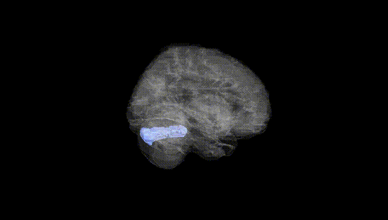
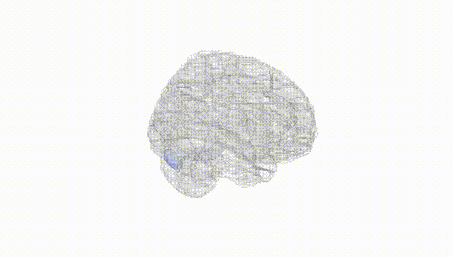
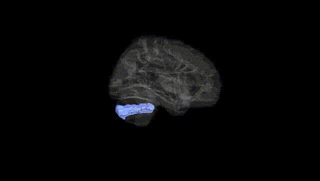
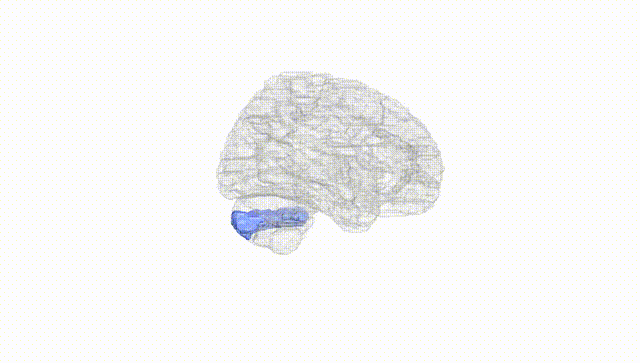
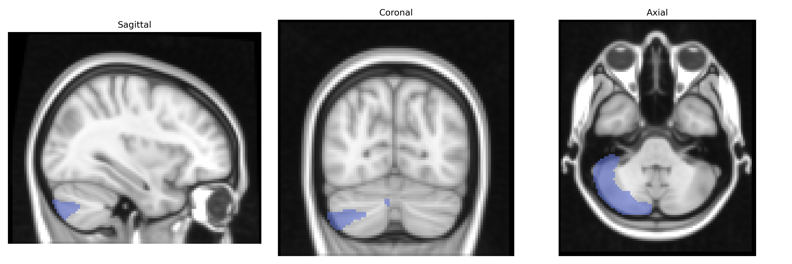
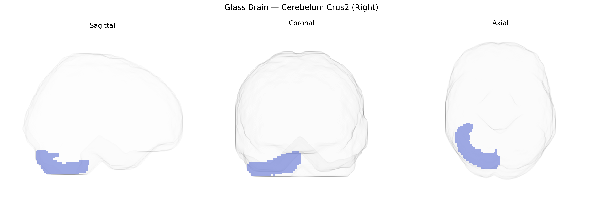

# Cerebelum Crus2 (Right)
 
## Overview
 
The right Cerebellum Crus II (Right), as defined in the AAL atlas, corresponds to the lateral and posterior portion of the cerebellar hemisphere within lobule VII, situated inferior to Crus I and dorsal to lobule VIII. Histologically, this region is composed of the typical cerebellar cortical layers (molecular, Purkinje cell, and granular layers) overlying the deep cerebellar nuclei, and it receives dense input from pontine nuclei relaying signals from association areas of the cerebral cortex, particularly prefrontal and parietal regions. Functionally, Crus II is strongly implicated in higher-order cognitive and affective processes, including working memory, language, social cognition, and executive control, rather than in primary motor coordination alone. Neuroimaging studies frequently show Crus II activation in tasks requiring abstract reasoning, verbal fluency, and mentalizing, supporting its role as part of large-scale cortico-cerebellar networks. There is no Wikipedia article specific to Crus II alone; a closely related entry is [Cerebellum](https://en.wikipedia.org/wiki/Cerebellum).
 
The right cerebellar Crus II region, as defined in the AAL atlas, has emerged in imaging‑genetics and GWAS studies as part of cortico‑cerebellar networks implicated in cognitive, affective, and neurodevelopmental phenotypes, though few findings are specific to this subregion alone. Large brain-structure GWAS (e.g., ENIGMA and UK Biobank–based analyses) have reported common variants near genes involved in neurodevelopment, synaptic function, and cell adhesion (such as MAPT, KIAA0586, and several loci in chromosomal regions 3p, 6p, and 17q) that influence cerebellar gray‑matter volume or surface measures, often including Crus II as part of broader lobular or hemispheric cerebellar factors. Imaging‑genetics work has linked polygenic risk scores for schizophrenia, autism spectrum disorder, and major depressive disorder to altered structure or functional connectivity of the cerebellar Crus I/II territories, which participate in frontoparietal and default‑mode networks supporting working memory, language, and social cognition. In addition, GWAS of cognitive performance, educational attainment, and general intelligence frequently show that alleles associated with higher cognitive ability correspond to increased volume or stronger connectivity in lateral posterior cerebellar regions including Crus II, consistent with its role in higher-order cognition rather than pure motor control.
 
*Overview generated by GPT-4o (2026).*
 
---
 
**Region ID:** 9012  
**Hemisphere:** right  
**Atlas:** AAL 
 
---
 
## Cerebelum Crus2 (Right) – Black Background (Full Brain)
 

 
**Full Quality Version:** <a href="full_black.mp4" download>Download MP4</a>
 
---
 
## Cerebelum Crus2 (Right) – White Background (Full Brain)
 

 
**Full Quality Version:** <a href="full_white.mp4" download>Download MP4</a>
 
---

## Cerebelum Crus2 (Right) – Black Background (Hemisphere)
 

 
**Full Quality Version:** <a href="hemi_black.mp4" download>Download MP4</a>
 
---
 
## Cerebelum Crus2 (Right) – White Background (Hemisphere)
 

 
**Full Quality Version:** <a href="hemi_white.mp4" download>Download MP4</a>
 
---

## Triplanar View – T1 Background
 

 
---
 
## Triplanar View – Ghost Brain
 


