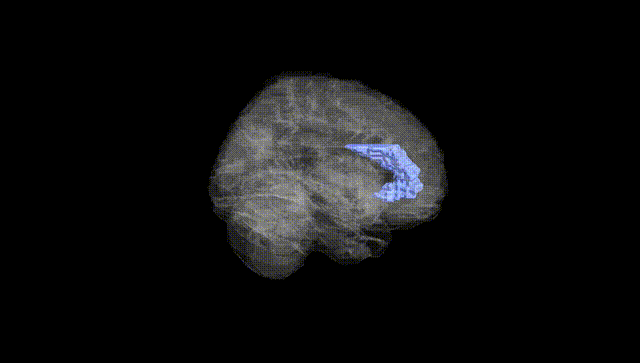
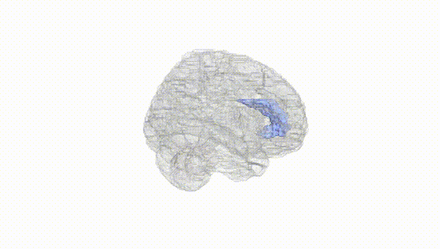
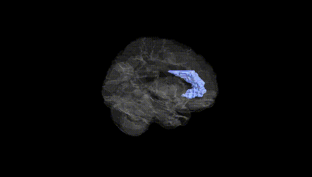
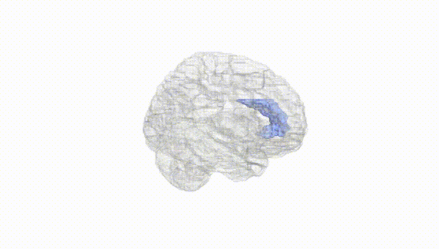
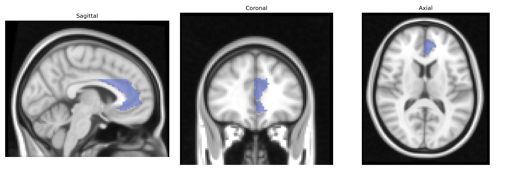
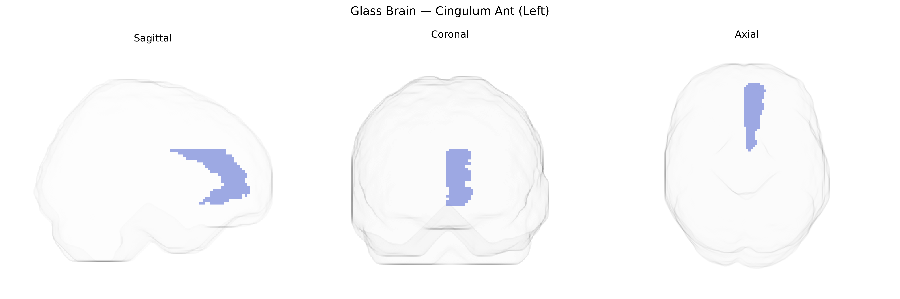

# Cingulum Ant (Left)
 
## Overview
 
The left cingulum anterior (Left; AAL: Cingulum Ant L) corresponds to the anterior segment of the cingulate gyrus and its underlying white matter within the medial aspect of the frontal lobe. It forms a key component of the limbic system, connecting prefrontal, premotor, and limbic structures, and is heavily implicated in cognitive control, error monitoring, attention, emotional regulation, and the integration of motivational and autonomic information. Functionally, this region contributes to decision-making, conflict detection, and adaptation of behavior based on feedback, as well as to the affective dimension of pain and negative emotional states. Structurally, it is part of the cingulum bundle, a major association tract that links the cingulate cortex with the hippocampus and other medial temporal lobe regions, supporting memory and higher-order executive functions. There is no direct link for “cingulum anterior (left)” as a separate entry; a related structure is the [Anterior cingulate cortex](https://en.wikipedia.org/wiki/Anterior_cingulate_cortex).
 
Genetic associations involving the left anterior cingulum (left anterior cingulate cortex, AAL “Cingulum Ant (L)”) arise largely from imaging-genetics and GWAS of brain structure, connectivity, and related psychopathology rather than direct region-specific GWAS hits. Variants in genes involved in synaptic plasticity, neurodevelopment, and myelination—such as BDNF (e.g., Val66Met), COMT, DISC1, and genes related to glutamatergic and dopaminergic signaling—have been repeatedly linked to anterior cingulate volume, cortical thickness, functional connectivity, and activation patterns during cognitive and emotional tasks. Large-scale ENIGMA and UK Biobank–based GWAS have identified polygenic influences on cingulate morphology and microstructure, with many loci overlapping general neurodevelopmental and cortical architecture genes rather than being unique to this region. Polygenic risk for major depressive disorder, schizophrenia, bipolar disorder, ADHD, and anxiety traits has been associated with altered anterior cingulate structure and function, including in the left hemisphere, and intermediate phenotypes such as pain sensitivity, cognitive control, and conflict monitoring show genetic correlations with anterior cingulate measures. Additionally, GWAS of white matter integrity and cingulum bundle microstructure have implicated genes regulating axonal guidance and oligodendrocyte function, suggesting that genetic variation in neurodevelopmental and connectivity pathways contributes to individual differences in left anterior cingulate anatomy and its involvement in mood, psychotic, and cognitive disorders.
 
*Overview generated by GPT-4o (2026).*
 
---
 
**Region ID:** 4001  
**Hemisphere:** left  
**Atlas:** AAL 
 
---
 
## Cingulum Ant (Left) – Black Background (Full Brain)
 

 
**Full Quality Version:** <a href="full_black.mp4" download>Download MP4</a>
 
---
 
## Cingulum Ant (Left) – White Background (Full Brain)
 

 
**Full Quality Version:** <a href="full_white.mp4" download>Download MP4</a>
 
---

## Cingulum Ant (Left) – Black Background (Hemisphere)
 

 
**Full Quality Version:** <a href="hemi_black.mp4" download>Download MP4</a>
 
---
 
## Cingulum Ant (Left) – White Background (Hemisphere)
 

 
**Full Quality Version:** <a href="hemi_white.mp4" download>Download MP4</a>
 
---

## Triplanar View – T1 Background
 

 
---
 
## Triplanar View – Ghost Brain
 


