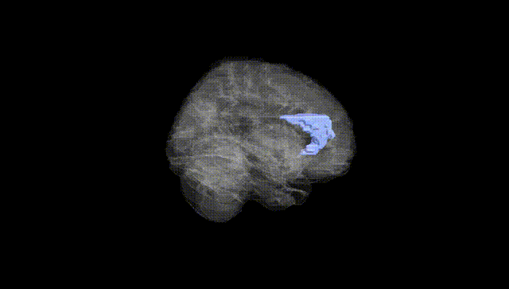
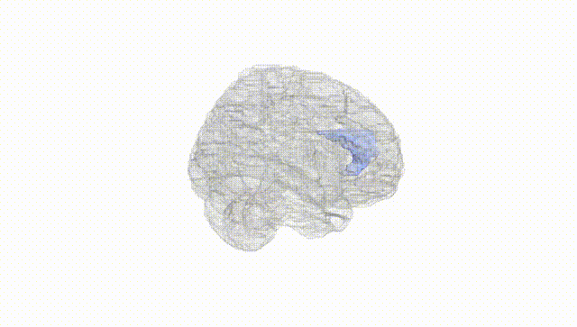
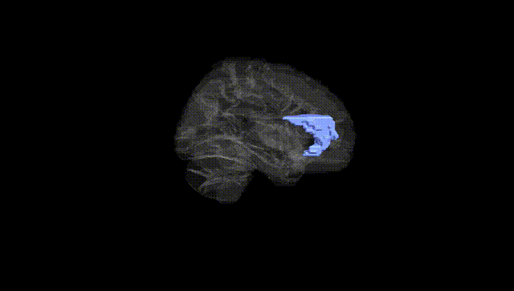
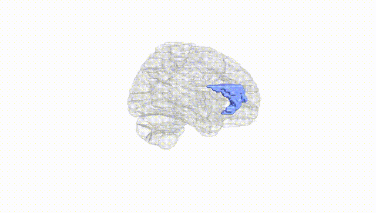
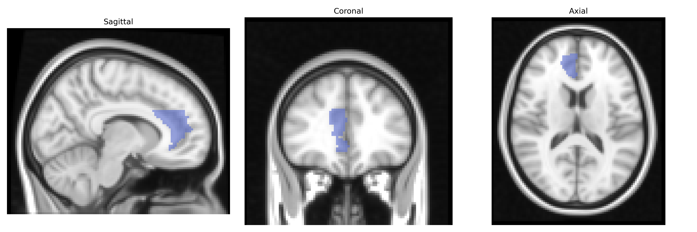
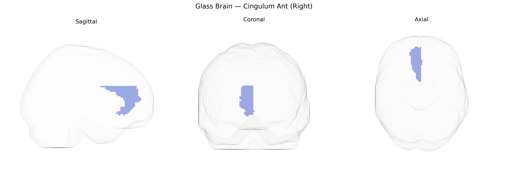

# Cingulum Ant (Right)
 
## Overview
 
The right cingulum anterior (Right Cingulum Ant) in the AAL atlas corresponds to the anterior segment of the cingulate gyrus and its associated cingulum bundle within the right cerebral hemisphere. This region lies on the medial surface of the frontal lobe, arching above the corpus callosum, and is a key component of the limbic system. It participates in higher-order functions including emotional regulation, autonomic control, motivation, decision-making, and attentional processes, and is strongly interconnected with prefrontal, parietal, and limbic structures such as the amygdala and hippocampus via the cingulum white-matter tract. Functionally, it contributes to conflict monitoring, error detection, and the integration of cognitive and affective information, and is implicated in neuropsychiatric and pain-related conditions. There is no direct Wikipedia article for “Right Cingulum Ant”; a related structure is the [Anterior cingulate cortex](https://en.wikipedia.org/wiki/Anterior_cingulate_cortex).
 
The right anterior cingulum (cingulate) from the AAL atlas has been implicated in multiple imaging-genetics studies, particularly through GWAS of cortical thickness, surface area, and white-matter microstructure. Large consortia such as ENIGMA and UK Biobank have identified variants in genes involved in neurodevelopment and synaptic function (e.g., CACNA1C, GRIN2A, DCC, CNTNAP2, and loci near MIR137) that influence cingulate morphology or connectivity, some of which overlap with risk loci for schizophrenia, major depressive disorder, bipolar disorder, ADHD, and anxiety traits. Polygenic risk scores for schizophrenia, depression, and neuroticism have been associated with structural or functional alterations in the anterior cingulate, including the right cingulum bundle, and GWAS of diffusion MRI metrics have linked variants in myelination- and axon-guidance–related genes (such as NRG1, MAG, and ROBO1) to fractional anisotropy and other measures in cingulum tracts. Additional genetic associations involve pain sensitivity, emotion regulation, and cognitive control phenotypes—functions heavily supported by the anterior cingulate—with overlapping loci in serotonin, dopamine, and glutamate signaling pathways. Overall, genetic influences on the right anterior cingulum appear to converge on neurodevelopmental, synaptic, and myelin-related mechanisms that are shared across mood, psychotic, and cognitive trait architectures, although many associations remain broadly cingulate- or cingulum-wide rather than specific to the AAL-defined right Cingulum Ant region.
 
*Overview generated by GPT-4o (2026).*
 
---
 
**Region ID:** 4002  
**Hemisphere:** right  
**Atlas:** AAL 
 
---
 
## Cingulum Ant (Right) – Black Background (Full Brain)
 

 
**Full Quality Version:** <a href="full_black.mp4" download>Download MP4</a>
 
---
 
## Cingulum Ant (Right) – White Background (Full Brain)
 

 
**Full Quality Version:** <a href="full_white.mp4" download>Download MP4</a>
 
---

## Cingulum Ant (Right) – Black Background (Hemisphere)
 

 
**Full Quality Version:** <a href="hemi_black.mp4" download>Download MP4</a>
 
---
 
## Cingulum Ant (Right) – White Background (Hemisphere)
 

 
**Full Quality Version:** <a href="hemi_white.mp4" download>Download MP4</a>
 
---

## Triplanar View – T1 Background
 

 
---
 
## Triplanar View – Ghost Brain
 


