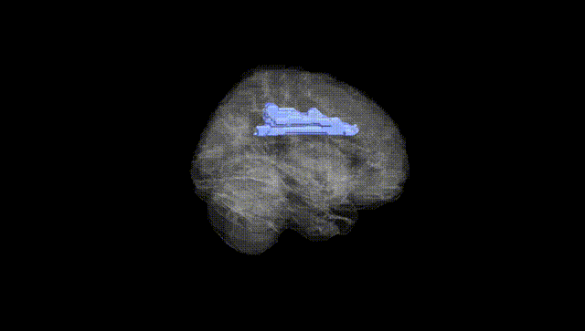
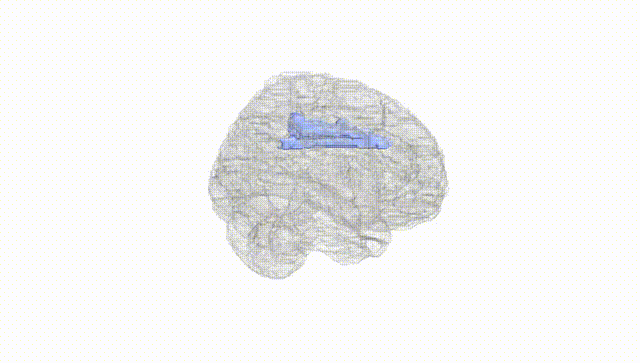
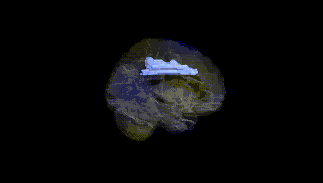
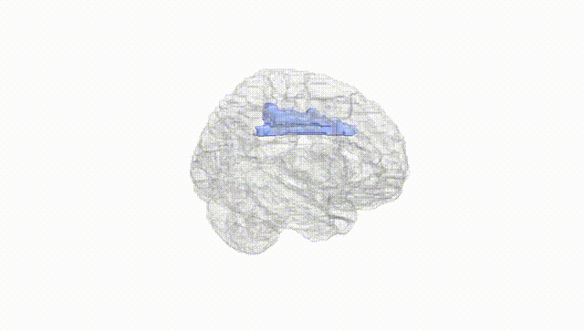
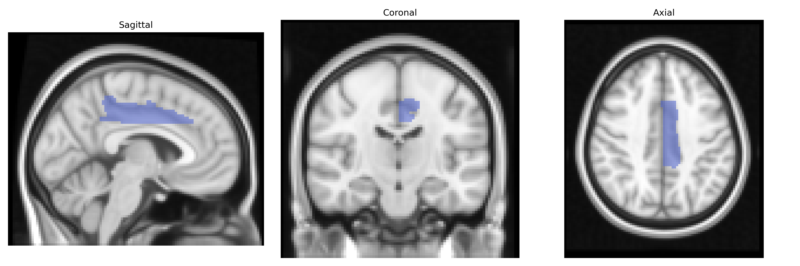
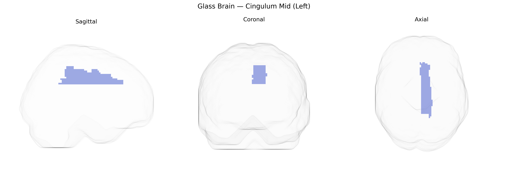

# Cingulum Mid (Left)
 
## Overview
 
The left Cingulum Mid (Left) region in the AAL atlas corresponds to the middle segment of the left cingulate gyrus, a component of the limbic cortex situated on the medial surface of the cerebral hemisphere, superior to the corpus callosum. This area is cytoarchitectonically heterogeneous and participates in cognitive control, attention, conflict monitoring, and aspects of pain and emotion processing, integrating information from prefrontal, parietal, and limbic structures. Functionally, it is often associated with the dorsal anterior and mid-cingulate regions implicated in goal-directed behavior, motor control, and performance monitoring, as well as in large-scale networks such as the salience and frontoparietal control networks. There is no direct link for “Cingulum Mid” as an AAL label; a closely related structure is the [Cingulate gyrus](https://en.wikipedia.org/wiki/Cingulate_gyrus).
 
The left cingulum (mid) region, a key white-matter tract connecting medial frontal, parietal, and limbic structures, shows robust heritability and has been implicated in multiple genetic studies of brain structure and psychopathology. GWAS of diffusion MRI–derived cingulum integrity (e.g., fractional anisotropy, mean diffusivity) have identified loci near genes involved in axon guidance, myelination, and synaptic function, including variants in or near genes such as NTRK1/2, CNTN4, and oligodendrocyte-related pathways, although specific signals vary across cohorts. Polygenic risk scores for major depressive disorder, schizophrenia, bipolar disorder, and anxiety have been associated with altered microstructure of the cingulum, consistent with its role in emotional regulation and default mode network connectivity. Genetic studies of Alzheimer’s disease risk (including APOE-related variants) and small-vessel disease have linked risk alleles to reduced cingulum integrity, paralleling findings in cognitive decline and memory impairment. Additionally, GWAS of traits such as neuroticism, cognitive performance, and general brain connectivity have reported associations with cingulum metrics, suggesting that common genetic variation influencing white-matter development and maintenance contributes to individual differences in both cingulum structure and related behavioral and clinical phenotypes.
 
*Overview generated by GPT-4o (2026).*
 
---
 
**Region ID:** 4011  
**Hemisphere:** left  
**Atlas:** AAL 
 
---
 
## Cingulum Mid (Left) – Black Background (Full Brain)
 

 
**Full Quality Version:** <a href="full_black.mp4" download>Download MP4</a>
 
---
 
## Cingulum Mid (Left) – White Background (Full Brain)
 

 
**Full Quality Version:** <a href="full_white.mp4" download>Download MP4</a>
 
---

## Cingulum Mid (Left) – Black Background (Hemisphere)
 

 
**Full Quality Version:** <a href="hemi_black.mp4" download>Download MP4</a>
 
---
 
## Cingulum Mid (Left) – White Background (Hemisphere)
 

 
**Full Quality Version:** <a href="hemi_white.mp4" download>Download MP4</a>
 
---

## Triplanar View – T1 Background
 

 
---
 
## Triplanar View – Ghost Brain
 


