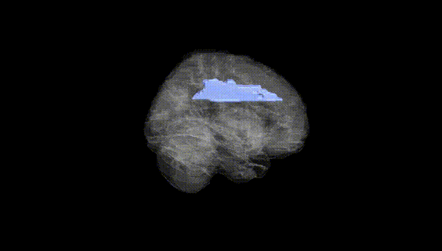
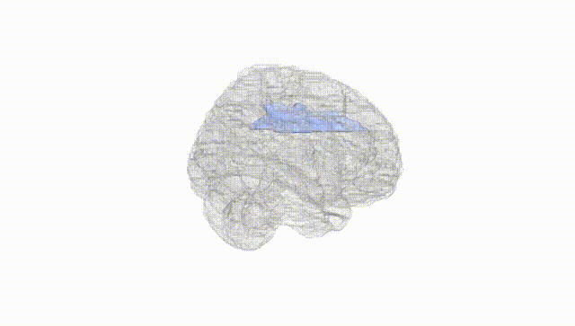
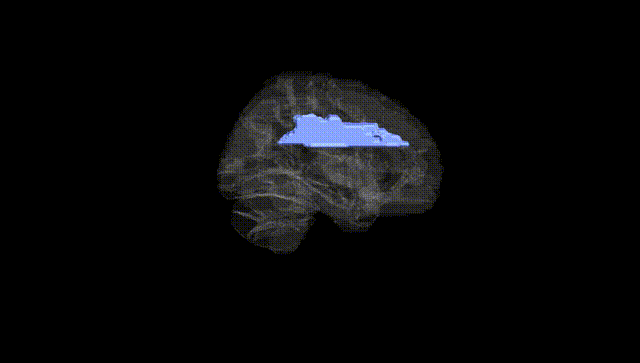
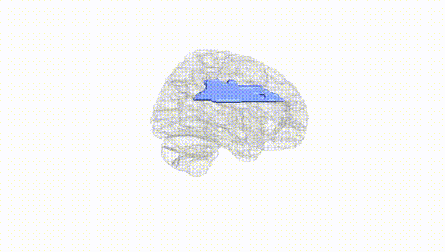
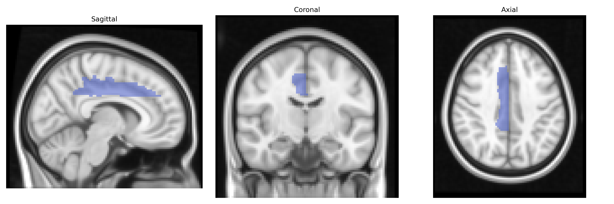
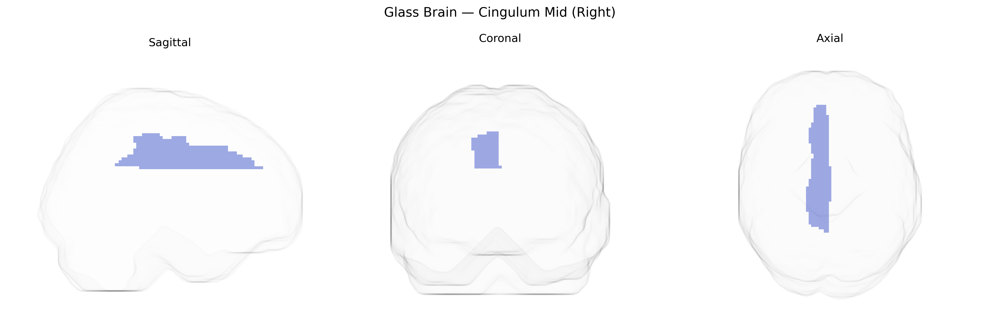

# Cingulum Mid (Right)
 
## Overview
 
The right Cingulum Mid (Right) in the AAL atlas corresponds to the middle portion of the right cingulate gyrus, typically encompassing mid-cingulate cortex involved in motor control, action selection, pain perception, and cognitive aspects of emotion. Anatomically, it lies above the corpus callosum in the medial aspect of the cerebral hemisphere and forms part of the limbic system and its associated white-matter pathway, the cingulum bundle, which interconnects frontal, parietal, and medial temporal regions. Functionally, this area participates in performance monitoring, response selection under conflict, and integration of motivational and sensorimotor information, often activating during tasks that require effortful control, error detection, or processing of aversive stimuli. There is no direct link for “Cingulum Mid (Right)”; a closely related structure is the [Cingulate gyrus](https://en.wikipedia.org/wiki/Cingulate_gyrus).
 
The right cingulum (mid), as defined in the AAL atlas, lies within the medial fronto-parietal white matter and forms part of the cingulum bundle, a tract repeatedly implicated in imaging–genetics and GWAS of brain structure and connectivity. Large-scale GWAS of diffusion MRI metrics (e.g., ENIGMA, UK Biobank) have identified multiple loci influencing fractional anisotropy and mean diffusivity in the cingulum, including variants near or within genes involved in axon guidance, myelination, and neurodevelopment such as NTRK3, CNTN4, and NCAN, though effects are typically polygenic and not region-specific to the right mid segment alone. Polygenic risk scores for schizophrenia, bipolar disorder, major depressive disorder, and autism spectrum disorder have been associated with altered cingulum microstructure, with right-sided or mid-cingulum effects reported in some studies of psychosis and mood disorders, suggesting shared genetic influences on fronto-limbic connectivity. GWAS of brain functional networks and default mode network connectivity have also identified overlaps between genetic variants affecting cingulum-related connectivity and risk loci for psychiatric and neurodevelopmental conditions, including schizophrenia and ADHD. Additionally, imaging–genetics work links cingulum microstructure to cognitive traits such as working memory and processing speed, with variants in neurodevelopmental and synaptic genes (e.g., BDNF Val66Met, COMT, and APOE in aging cohorts) modulating structure–function relationships in this region, although these associations are often modest and not exclusive to the right mid-cingulum. Overall, genetic contributions to the right cingulum (mid) appear highly polygenic and shared with broader white-matter and default-mode–network architectures rather than being driven by single, region-specific loci.
 
*Overview generated by GPT-4o (2026).*
 
---
 
**Region ID:** 4012  
**Hemisphere:** right  
**Atlas:** AAL 
 
---
 
## Cingulum Mid (Right) – Black Background (Full Brain)
 

 
**Full Quality Version:** <a href="full_black.mp4" download>Download MP4</a>
 
---
 
## Cingulum Mid (Right) – White Background (Full Brain)
 

 
**Full Quality Version:** <a href="full_white.mp4" download>Download MP4</a>
 
---

## Cingulum Mid (Right) – Black Background (Hemisphere)
 

 
**Full Quality Version:** <a href="hemi_black.mp4" download>Download MP4</a>
 
---
 
## Cingulum Mid (Right) – White Background (Hemisphere)
 

 
**Full Quality Version:** <a href="hemi_white.mp4" download>Download MP4</a>
 
---

## Triplanar View – T1 Background
 

 
---
 
## Triplanar View – Ghost Brain
 


