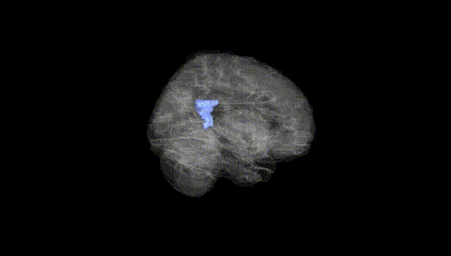
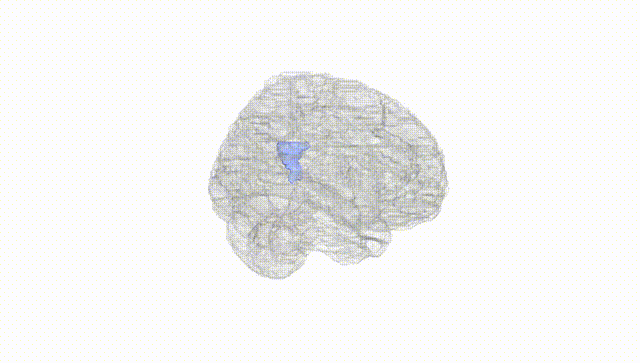
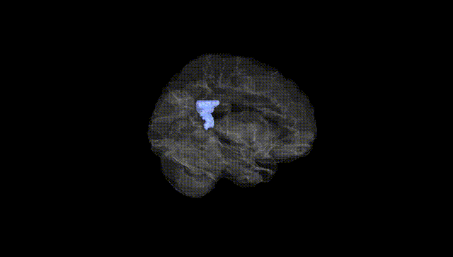
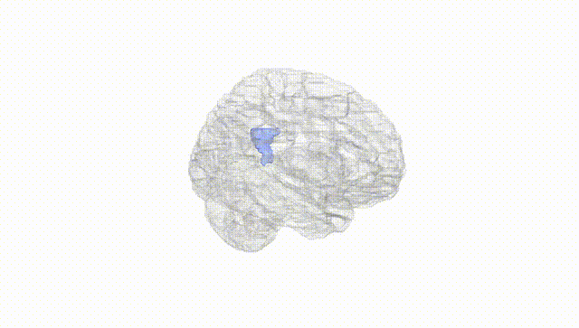
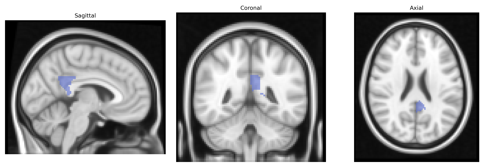
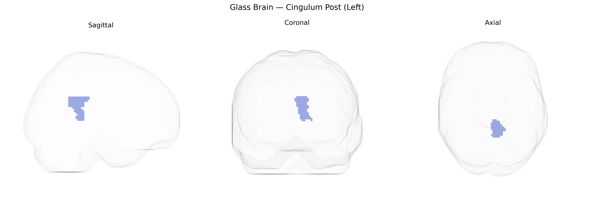

# Cingulum Post (Left)
 
## Overview
 
The left cingulum posterior (Left Cingulum Post) in the AAL atlas corresponds primarily to the posterior segment of the cingulate gyrus and its associated white-matter bundle within the limbic system. Anatomically, this region lies dorsal to the corpus callosum in the medial parietal cortex and overlaps largely with the posterior cingulate cortex and adjacent retrosplenial areas. It forms a key hub of the default mode network and participates in integrating internally directed cognition, autobiographical memory, visuospatial orientation, and aspects of emotional processing. The cingulum bundle here serves as a major association pathway linking medial prefrontal, parietal, and medial temporal structures (including the hippocampal formation), thereby supporting coordinated activity across limbic and association cortices. There is no direct Wikipedia article for “left cingulum posterior”; a closely related structure is the [Posterior cingulate cortex](https://en.wikipedia.org/wiki/Posterior_cingulate_cortex).
 
The left posterior cingulum (Cingulum_Post_L in the AAL atlas), a key white-matter tract linking posterior cingulate, precuneus, and medial temporal regions, has been implicated in multiple genetic and GWAS-based associations, primarily via imaging genetics studies of cingulum microstructure and posterior cingulate/cingulum-based functional networks rather than region-specific GWAS hits. Variants in genes influencing myelination and axonal integrity (such as BDNF, NRG1, and genes in oligodendrocyte and axon guidance pathways) have been associated with fractional anisotropy and structural integrity of the cingulum bundle, including its posterior segment, while large consortia (e.g., ENIGMA, UK Biobank imaging GWAS) report polygenic influences with enrichment in neurodevelopmental and synaptic genes but few single-region, genome-wide–significant loci specific to the left posterior cingulum. Genetically influenced alterations of this tract have been linked to risk or endophenotypes for major depressive disorder, schizophrenia, bipolar disorder, autism spectrum disorder, and Alzheimer’s disease, including associations with APOE-related risk for posterior cingulate/precuneus connectivity and white-matter changes, as well as memory performance and default mode network function. Overall, evidence indicates that variation in genes governing white-matter development, synaptic function, and neurodegeneration contributes to interindividual differences in the structure and connectivity of the left posterior cingulum, which in turn relate to psychiatric vulnerability, cognitive traits, and dementia risk, though direct, region-specific GWAS hits for this exact AAL-defined region remain limited and largely embedded in broader cingulum or default mode network findings.
 
*Overview generated by GPT-4o (2026).*
 
---
 
**Region ID:** 4021  
**Hemisphere:** left  
**Atlas:** AAL 
 
---
 
## Cingulum Post (Left) – Black Background (Full Brain)
 

 
**Full Quality Version:** <a href="full_black.mp4" download>Download MP4</a>
 
---
 
## Cingulum Post (Left) – White Background (Full Brain)
 

 
**Full Quality Version:** <a href="full_white.mp4" download>Download MP4</a>
 
---

## Cingulum Post (Left) – Black Background (Hemisphere)
 

 
**Full Quality Version:** <a href="hemi_black.mp4" download>Download MP4</a>
 
---
 
## Cingulum Post (Left) – White Background (Hemisphere)
 

 
**Full Quality Version:** <a href="hemi_white.mp4" download>Download MP4</a>
 
---

## Triplanar View – T1 Background
 

 
---
 
## Triplanar View – Ghost Brain
 


