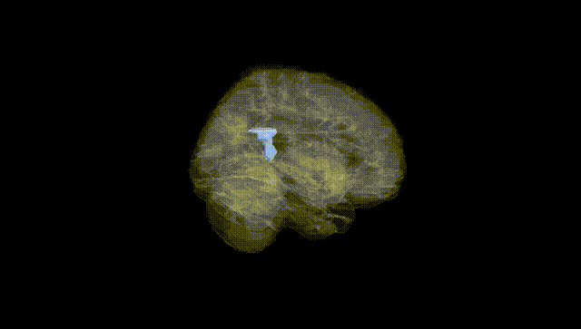
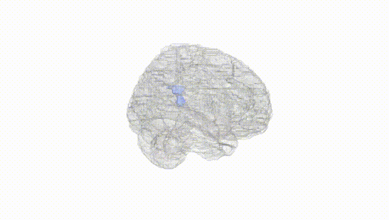
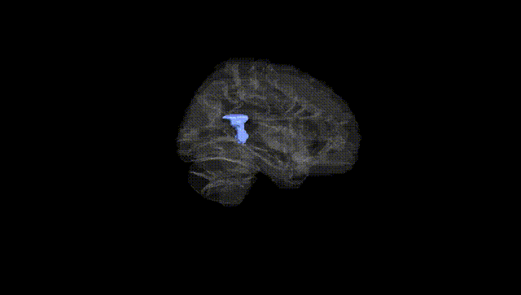
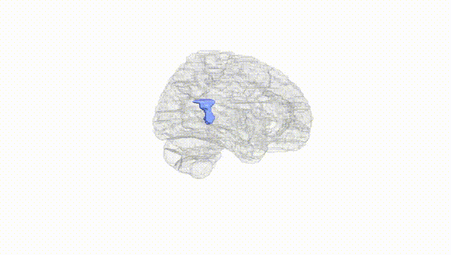
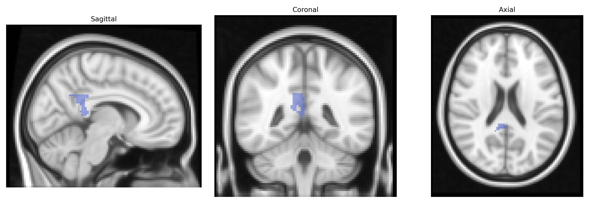
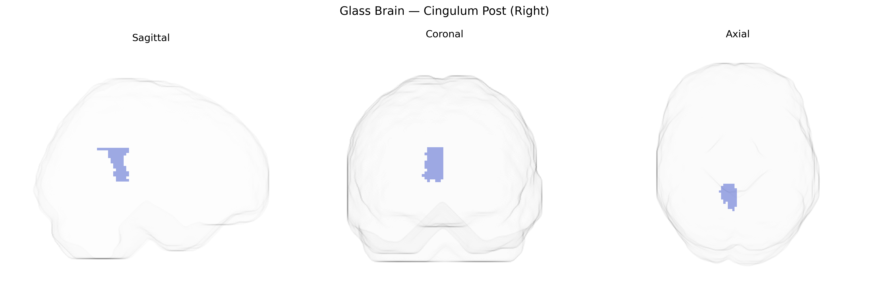

# Cingulum Post (Right)
 
## Overview
 
The right posterior cingulate cortex (Right Cingulum Post), as defined in the AAL atlas, corresponds to the posterior segment of the cingulate gyrus located on the medial aspect of the right cerebral hemisphere, bordering the precuneus and retrosplenial cortex. It is a key hub of the default mode network and is heavily involved in internally directed cognition, including autobiographical memory, self-referential processing, and aspects of visuospatial orientation and attention. This region shows dense structural and functional connectivity with the medial prefrontal cortex, hippocampal formation, and lateral parietal areas, supporting its role in integrating mnemonic, emotional, and contextual information. Metabolically, it is one of the most active cortical regions at rest and is notably implicated in neurodegenerative and psychiatric conditions, such as Alzheimer’s disease and major depression, where altered metabolism or connectivity of the posterior cingulate cortex is frequently observed. There is no direct link for “Right Cingulum Post”; a related structure is the [Posterior cingulate cortex](https://en.wikipedia.org/wiki/Posterior_cingulate_cortex).
 
The right posterior cingulum (Cingulum Post R) in the AAL atlas has been implicated in several genetic and GWAS findings primarily through its role in episodic memory, default mode network connectivity, and neurodegenerative and psychiatric disorders. Imaging genetics studies show that common variants in APOE (especially ε4) and CLU, CR1, and PICALM influence microstructural integrity and functional connectivity of the posterior cingulum, particularly in the context of Alzheimer’s disease risk and progression. GWAS of white-matter microstructure and connectome measures have identified heritable variation in cingulum fractional anisotropy and mean diffusivity, with associated loci including genes involved in axonal guidance, myelination, and synaptic function (e.g., variants near NTRK3, CNTN4, and genes in the neurexin–neuroligin pathway), although findings are often reported for the cingulum bundle as a whole rather than lateralized posterior segments. In psychiatric genetics, schizophrenia and major depression risk variants (such as those in CACNA1C, ZNF804A, and other polygenic risk score–derived loci) have been associated with altered cingulum connectivity and structure, and GWAS of cognitive traits and educational attainment show polygenic influences on posterior cingulum volume and connectivity as part of broader default mode and memory networks. Additionally, cingulum microstructure, including the posterior portion, has been linked in genetic and GWAS-based studies to traits such as neuroticism, rumination, stress reactivity, and susceptibility to dementia, reflecting convergent evidence that common genetic variation affects this region via pathways related to myelin integrity, immune function, synaptic plasticity, and large-scale brain network organization.
 
*Overview generated by GPT-4o (2026).*
 
---
 
**Region ID:** 4022  
**Hemisphere:** right  
**Atlas:** AAL 
 
---
 
## Cingulum Post (Right) – Black Background (Full Brain)
 

 
**Full Quality Version:** <a href="full_black.mp4" download>Download MP4</a>
 
---
 
## Cingulum Post (Right) – White Background (Full Brain)
 

 
**Full Quality Version:** <a href="full_white.mp4" download>Download MP4</a>
 
---

## Cingulum Post (Right) – Black Background (Hemisphere)
 

 
**Full Quality Version:** <a href="hemi_black.mp4" download>Download MP4</a>
 
---
 
## Cingulum Post (Right) – White Background (Hemisphere)
 

 
**Full Quality Version:** <a href="hemi_white.mp4" download>Download MP4</a>
 
---

## Triplanar View – T1 Background
 

 
---
 
## Triplanar View – Ghost Brain
 


