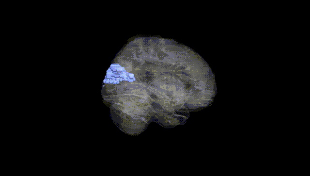
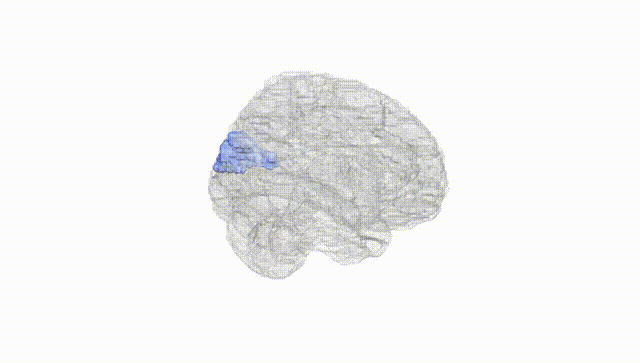
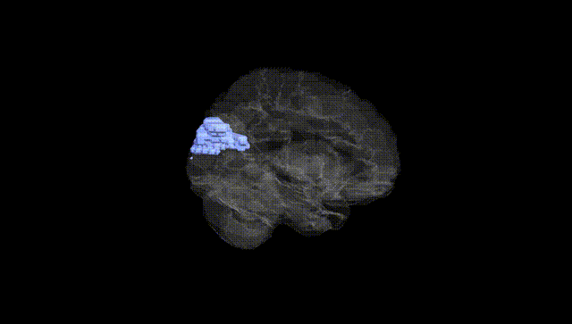
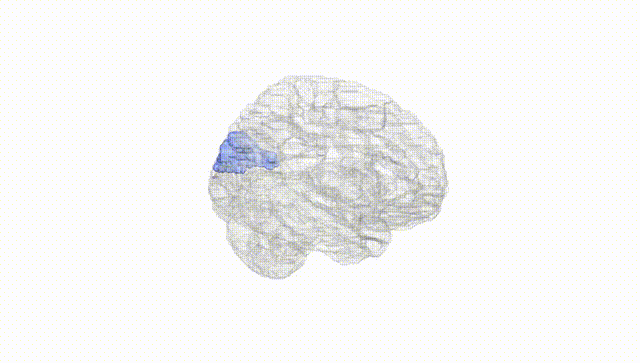
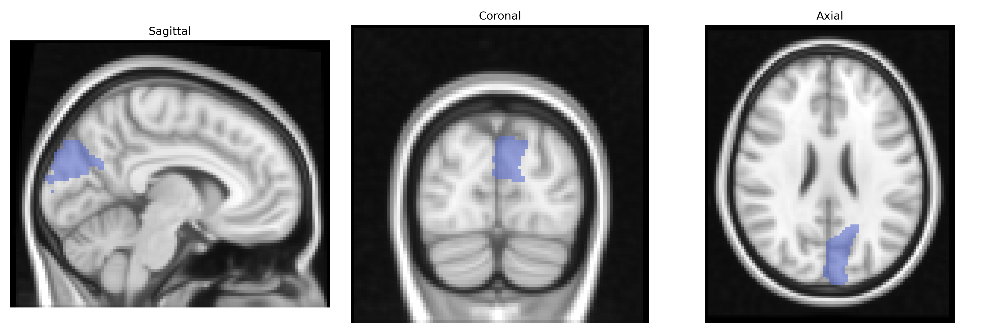
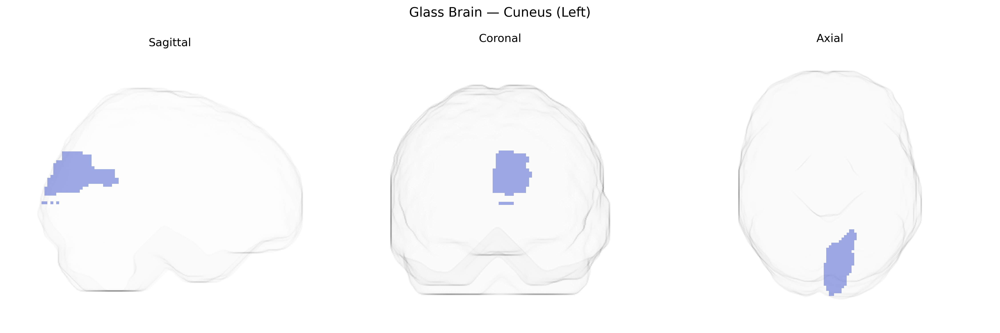

# Cuneus (Left)
 
## Overview
 
The left cuneus is a wedge-shaped region of the medial occipital lobe, bordered superiorly by the parieto-occipital sulcus and inferiorly by the calcarine sulcus, and corresponds largely to the posteromedial portion of the primary and secondary visual cortex (Brodmann areas 17–19). It is organized retinotopically, with a representation of the contralateral (right) visual field, and participates in early-stage visual processing, including basic feature detection, spatial orientation, and integration of visual input for higher-order perceptual functions. The cuneus receives major afferents from the lateral geniculate nucleus via the optic radiations and projects to higher-tier visual areas, contributing to visuospatial attention, motion and form perception, and aspects of visual imagery. Developmentally and cytoarchitectonically, it belongs to the archistriate and peristriate cortex, and is a key node in dorsal and ventral visual processing streams. [Cuneus](https://en.wikipedia.org/wiki/Cuneus_(brain))
 
The left cuneus, a medial occipital region implicated in visual processing and higher-order cognition, has been associated in genetic studies primarily through imaging genetics and GWAS of brain structure and function rather than region-specific single-gene effects. Large-scale GWAS of cortical thickness and surface area (e.g., ENIGMA and UK Biobank) have identified variants near genes involved in neurodevelopment, synaptic function, and cell adhesion—such as those in the WNT signaling pathway and candidate loci on chromosomes 14 and 17—that modulate occipital and cuneus morphology, although these influences are typically distributed and polygenic. Functional MRI genetics studies have linked cuneus activation patterns to polymorphisms in genes affecting dopaminergic and serotonergic signaling (including COMT and 5-HTTLPR), especially in tasks involving attention, emotional processing, and visual memory. Through broader brain-network GWAS, cuneus measures have appeared in polygenic architectures of traits such as general cognitive ability, educational attainment, and risk for major depressive disorder, schizophrenia, and ADHD, usually as part of occipital–parietal or default-mode network alterations rather than isolated cuneus-specific effects. Overall, genetic associations with the left cuneus reflect highly polygenic and pleiotropic influences on cortical development, visual-network integration, and cognitive-emotional functioning, with no single variant or disorder uniquely tied to this region but consistent convergence on neurodevelopmental and psychiatric trait architectures.
 
*Overview generated by GPT-4o (2026).*
 
---
 
**Region ID:** 5011  
**Hemisphere:** left  
**Atlas:** AAL 
 
---
 
## Cuneus (Left) – Black Background (Full Brain)
 

 
**Full Quality Version:** <a href="full_black.mp4" download>Download MP4</a>
 
---
 
## Cuneus (Left) – White Background (Full Brain)
 

 
**Full Quality Version:** <a href="full_white.mp4" download>Download MP4</a>
 
---

## Cuneus (Left) – Black Background (Hemisphere)
 

 
**Full Quality Version:** <a href="hemi_black.mp4" download>Download MP4</a>
 
---
 
## Cuneus (Left) – White Background (Hemisphere)
 

 
**Full Quality Version:** <a href="hemi_white.mp4" download>Download MP4</a>
 
---

## Triplanar View – T1 Background
 

 
---
 
## Triplanar View – Ghost Brain
 


