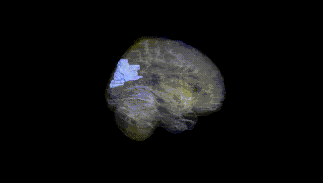
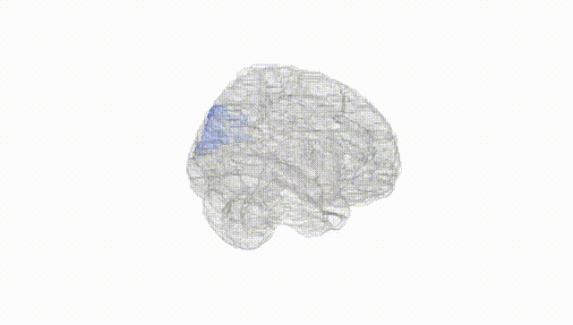
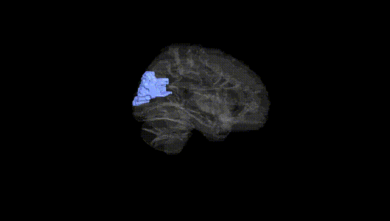
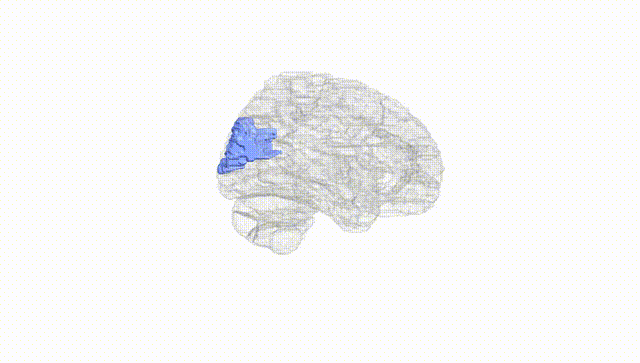
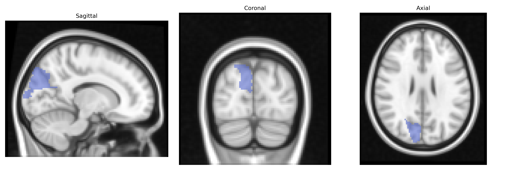
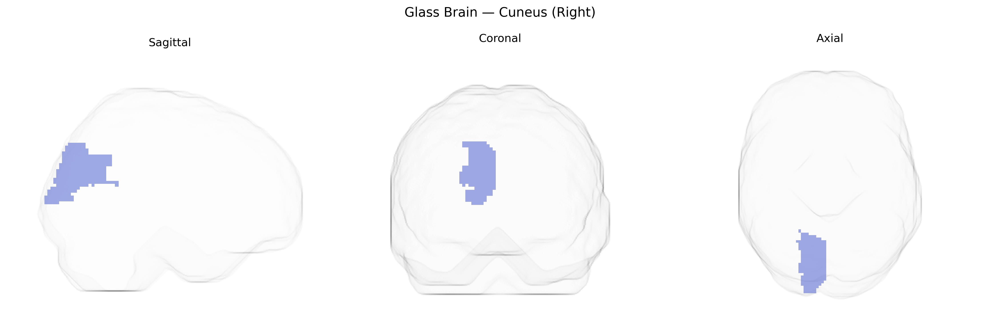

# Cuneus (Right)
 
## Overview
 
The right cuneus is a medial occipital lobe structure defined in the AAL atlas, located between the calcarine sulcus and the parieto-occipital sulcus, and bordered superiorly by the superior occipital gyrus and anteriorly by the precuneus. It is composed primarily of early visual cortex (notably parts of Brodmann areas 17, 18, and 19), and is critically involved in basic visual processing, including reception and integration of visual input related to orientation, motion, and spatial features from the contralateral (left) visual field. The cuneus contributes to visuospatial attention, visual imagery, and higher-order visual functions by relaying and transforming information from primary visual areas to associative visual and parietal regions. Functional imaging frequently implicates the cuneus in tasks involving visual attention, eye movements, and integration of visual context, as well as in resting-state visual networks. [Cuneus](https://en.wikipedia.org/wiki/Cuneus)
 
The right cuneus, a visual association region in the occipital lobe as defined in the AAL atlas, has been implicated in several genetic and GWAS-based findings, although typically as part of broader cortical or occipital measures rather than as an isolated ROI. Large neuroimaging GWAS consortia (e.g., ENIGMA, UK Biobank–based studies) have identified common variants in genes such as HMGA2, IGF1, and loci near DAAM1, PAX6, and WNT pathway genes associated with occipital cortical thickness and surface area, which often include or overlap cuneus parcels; these structural measures in turn show genetic correlations with cognitive performance, educational attainment, and general intelligence. Functional activation in the cuneus during visual processing, attention, and memory tasks has been linked to polygenic risk for schizophrenia, major depressive disorder, and autism spectrum disorder in imaging–genetics studies, with risk variants in genes such as CACNA1C, GRIN2A, and complement pathway loci showing associations with altered occipital and cuneus activation or connectivity. Additionally, GWAS of migraine, particularly visual aura subtypes, and occipital epilepsy have pointed to variants in ion channel and synaptic genes (e.g., KCNK18, CACNA1A, SCN1A) whose downstream effects include altered excitability of occipital regions including the cuneus. While few studies focus exclusively on the right cuneus AAL parcel, convergent evidence from structural, functional, and connectivity GWAS indicates that genetically influenced variation in this region contributes to individual differences in visual processing, higher-order cognition, and vulnerability to neuropsychiatric and neurological disorders.
 
*Overview generated by GPT-4o (2026).*
 
---
 
**Region ID:** 5012  
**Hemisphere:** right  
**Atlas:** AAL 
 
---
 
## Cuneus (Right) – Black Background (Full Brain)
 

 
**Full Quality Version:** <a href="full_black.mp4" download>Download MP4</a>
 
---
 
## Cuneus (Right) – White Background (Full Brain)
 

 
**Full Quality Version:** <a href="full_white.mp4" download>Download MP4</a>
 
---

## Cuneus (Right) – Black Background (Hemisphere)
 

 
**Full Quality Version:** <a href="hemi_black.mp4" download>Download MP4</a>
 
---
 
## Cuneus (Right) – White Background (Hemisphere)
 

 
**Full Quality Version:** <a href="hemi_white.mp4" download>Download MP4</a>
 
---

## Triplanar View – T1 Background
 

 
---
 
## Triplanar View – Ghost Brain
 


