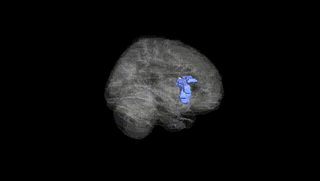
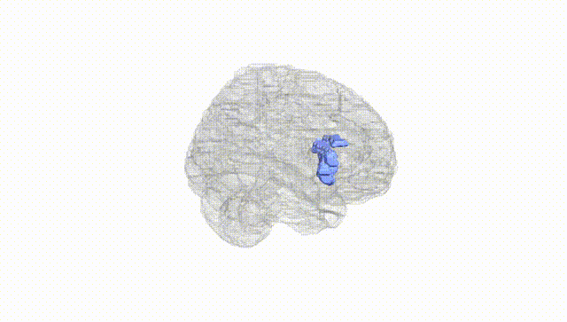
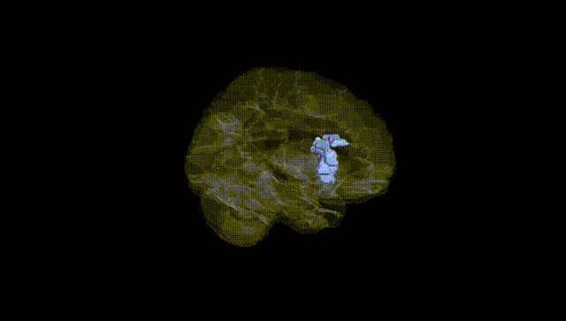
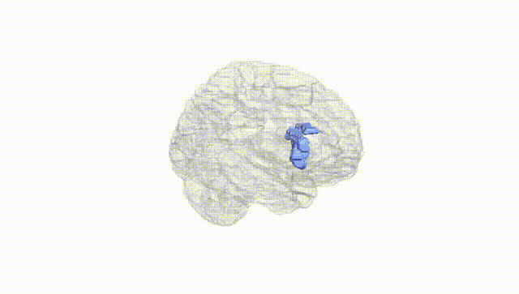
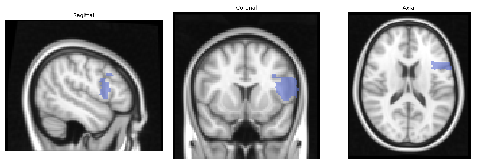
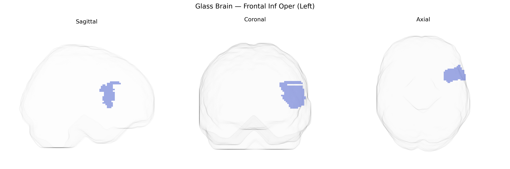

# Frontal Inf Oper (Left)
 
## Overview
 
The left Frontal Inf Oper (Left) region in the AAL atlas corresponds to the opercular part of the left inferior frontal gyrus, a subdivision of the inferior frontal cortex located on the lateral surface of the frontal lobe just anterior to the precentral gyrus. This area forms part of the classical Broca’s region involved in speech production, phonological processing, and aspects of syntactic and semantic integration, and it also participates in motor planning and cognitive control functions such as response inhibition and working memory. Cytoarchitectonically, it overlaps primarily with Brodmann areas 44 and partially 45, and it is heavily interconnected with temporal, parietal, and premotor regions, supporting its role in language and action-related networks. No direct Wikipedia article exists for “Frontal Inf Oper,” but it is encompassed within the [Inferior frontal gyrus](https://en.wikipedia.org/wiki/Inferior_frontal_gyrus).
 
Genetic associations involving the left inferior frontal operculum (left Frontal Inf Oper in the AAL atlas), a key component of Broca’s region, have been implicated mainly through imaging-genetics and GWAS of cortical structure and language-related traits. Large-scale MRI-based GWAS (e.g., ENIGMA, UK Biobank) have linked variation in cortical thickness, surface area, and gyrification of inferior frontal regions to loci near genes involved in neurodevelopment and synaptic function (such as FOXP2-related pathways, CNTNAP2, and LINGO1), although effects are typically small and distributed. Polygenic scores for educational attainment, intelligence, and reading ability show associations with structural and functional measures in inferior frontal areas, suggesting a diffuse genetic contribution to language and cognitive control. Disorder-focused GWAS and imaging-genetics studies have connected altered structure or activation of the left inferior frontal operculum to schizophrenia, major depressive disorder, autism spectrum disorder, ADHD, and developmental language disorders, with implicated genes often converging on synaptic plasticity, neuronal migration, and glutamatergic signaling (e.g., CACNA1C, GRIN2B, and other psychiatric risk loci). Additionally, genetic risk for stuttering, dyslexia, and aphasia-related phenotypes has been associated with functional anomalies in this region, although robust single-gene–to–region mappings remain rare and most evidence supports a highly polygenic architecture influencing the development and function of the left inferior frontal operculum.
 
*Overview generated by GPT-4o (2026).*
 
---
 
**Region ID:** 2301  
**Hemisphere:** left  
**Atlas:** AAL 
 
---
 
## Frontal Inf Oper (Left) – Black Background (Full Brain)
 

 
**Full Quality Version:** <a href="full_black.mp4" download>Download MP4</a>
 
---
 
## Frontal Inf Oper (Left) – White Background (Full Brain)
 

 
**Full Quality Version:** <a href="full_white.mp4" download>Download MP4</a>
 
---

## Frontal Inf Oper (Left) – Black Background (Hemisphere)
 

 
**Full Quality Version:** <a href="hemi_black.mp4" download>Download MP4</a>
 
---
 
## Frontal Inf Oper (Left) – White Background (Hemisphere)
 

 
**Full Quality Version:** <a href="hemi_white.mp4" download>Download MP4</a>
 
---

## Triplanar View – T1 Background
 

 
---
 
## Triplanar View – Ghost Brain
 


