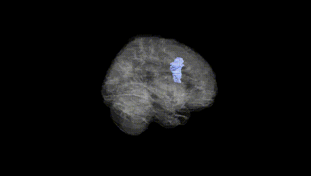
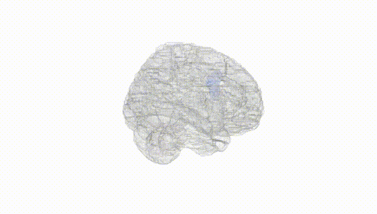
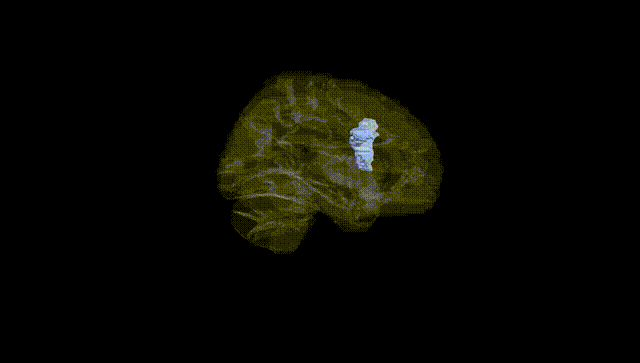
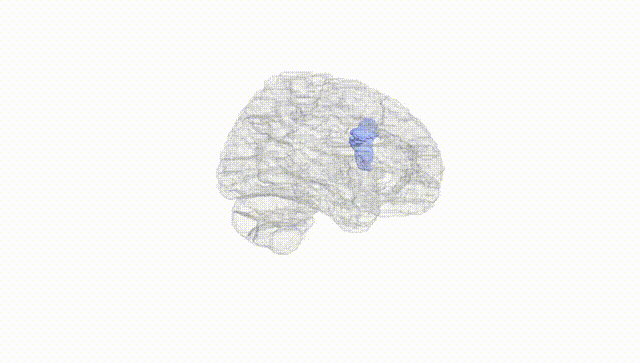
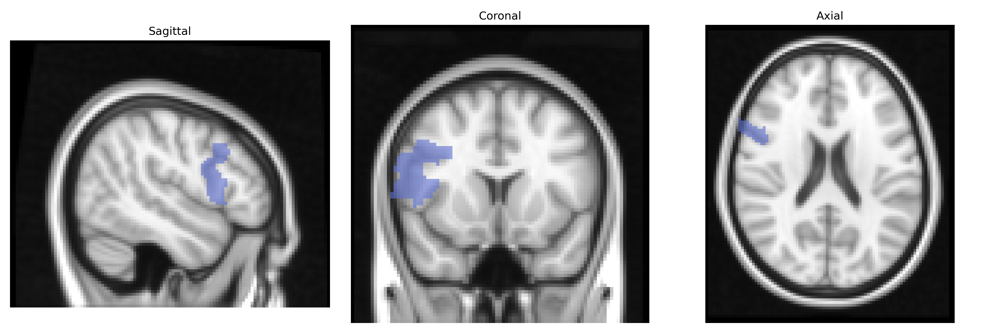
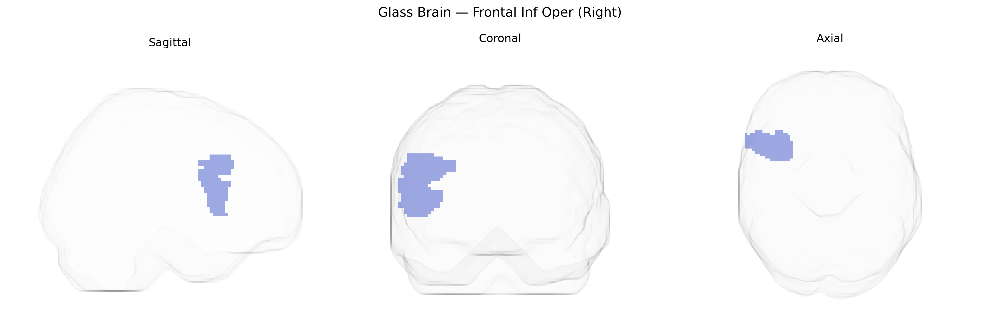

# Frontal Inf Oper (Right)
 
## Overview
 
The right Frontal Inf Oper (Right) region, as defined in the AAL atlas, corresponds to the opercular part of the right inferior frontal gyrus, a cortical area of the frontal lobe situated above the lateral sulcus and posterior to the triangular part of the inferior frontal gyrus. This region is involved in executive control, response inhibition, phonological processing, and aspects of language and speech articulation, and it participates in broader fronto-parietal and language networks. Cytoarchitectonically, it overlaps mainly with Brodmann areas 44 and partly 45, and it maintains reciprocal connections with premotor, prefrontal, and temporal cortices as well as subcortical structures. There is no direct Wikipedia article specifically for “Frontal Inf Oper (Right)”; a closely related structure is the inferior frontal gyrus: [Inferior frontal gyrus](https://en.wikipedia.org/wiki/Inferior_frontal_gyrus).
 
The right inferior frontal operculum (right Frontal Inf Oper in the AAL atlas), a core component of the right inferior frontal gyrus and a key hub for response inhibition, language, and emotional processing, has been implicated in multiple genetic and genome-wide association studies (GWAS) through its structural and functional variation. Large-scale imaging–genetics consortia such as ENIGMA and UK Biobank have reported heritable differences in cortical thickness and surface area in right inferior frontal regions associated with common variants in genes involved in neurodevelopment, synaptic plasticity, and axon guidance (for example, genes in the MAPT, WNT, and FGF signaling pathways), and polygenic scores for cognitive ability and educational attainment show associations with structural and functional measures in this area. GWAS of ADHD, impulsivity, and externalizing behaviors highlight that higher polygenic risk for these traits correlates with altered morphology and activation of the right inferior frontal operculum, paralleling task-based fMRI findings that link this region to inhibitory control; similar imaging–genetic analyses in schizophrenia, bipolar disorder, and major depression identify right inferior frontal abnormalities that covary with disorder-related polygenic risk. Additionally, autism spectrum disorder risk variants and polygenic scores have been related to atypical activation and connectivity in the right inferior frontal opercular/pars opercularis region during social cognition and language tasks, while GWAS of smoking, risk-taking, and obesity-related traits report associations between polygenic liability and structural variation in nearby right inferior frontal regions. Overall, although specific single variants with large effects are uncommon, convergent evidence from polygenic risk scores and large-scale imaging–GWAS indicates that common genetic variation influencing neurodevelopment, cognition, and psychiatric liability contributes to individual differences in structure and function of the right inferior frontal operculum.
 
*Overview generated by GPT-4o (2026).*
 
---
 
**Region ID:** 2302  
**Hemisphere:** right  
**Atlas:** AAL 
 
---
 
## Frontal Inf Oper (Right) – Black Background (Full Brain)
 

 
**Full Quality Version:** <a href="full_black.mp4" download>Download MP4</a>
 
---
 
## Frontal Inf Oper (Right) – White Background (Full Brain)
 

 
**Full Quality Version:** <a href="full_white.mp4" download>Download MP4</a>
 
---

## Frontal Inf Oper (Right) – Black Background (Hemisphere)
 

 
**Full Quality Version:** <a href="hemi_black.mp4" download>Download MP4</a>
 
---
 
## Frontal Inf Oper (Right) – White Background (Hemisphere)
 

 
**Full Quality Version:** <a href="hemi_white.mp4" download>Download MP4</a>
 
---

## Triplanar View – T1 Background
 

 
---
 
## Triplanar View – Ghost Brain
 


