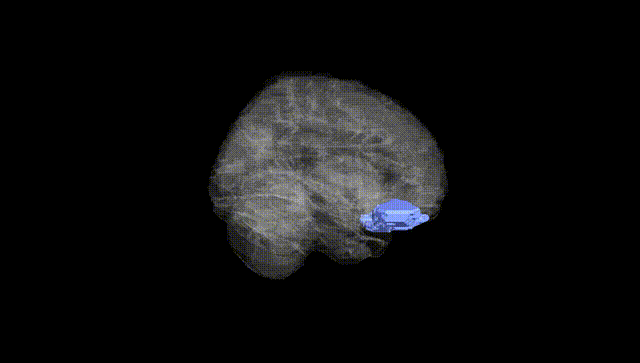
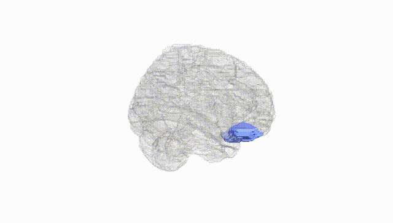
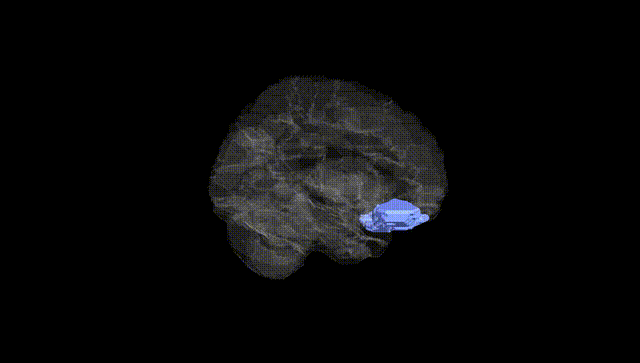
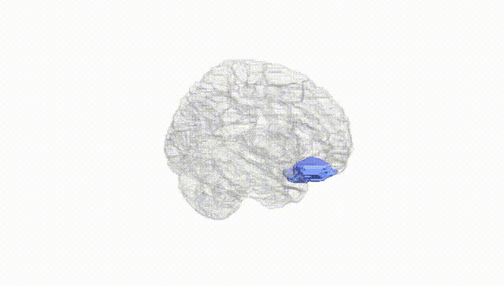
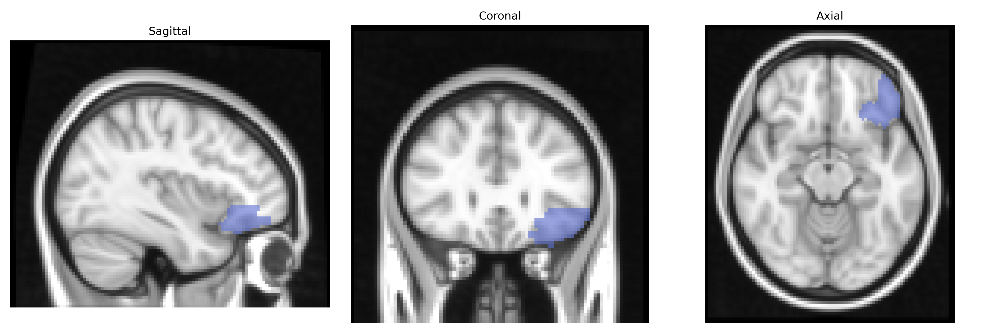
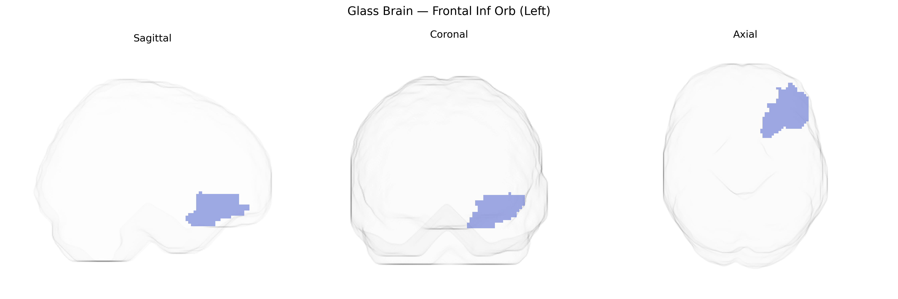

# Frontal Inf Orb (Left)
 
## Overview
 
The left Frontal Inf Orb (left orbitofrontal part of the inferior frontal gyrus) in the AAL atlas corresponds to portions of the **left orbitofrontal cortex**, located on the ventral surface of the frontal lobe just above the orbits of the eyes. This region is strongly implicated in reward evaluation, decision‑making under uncertainty, emotional and social behavior, and the integration of sensory information (especially olfactory and gustatory) with value-based judgments. It contributes to updating stimulus–reward associations, assessing the emotional significance of outcomes, and modulating behavior based on changing reinforcement contingencies. The left orbitofrontal cortex also interacts with limbic structures such as the amygdala and ventral striatum, supporting adaptive responses to both positive and negative feedback. There is no direct link for “Left Frontal Inf Orb,” but the related structure is the orbitofrontal cortex: [Orbitofrontal cortex](https://en.wikipedia.org/wiki/Orbitofrontal_cortex).
 
The left inferior frontal gyrus (often corresponding to the “Frontal Inf Orb L” in the AAL atlas, encompassing pars orbitalis of Brodmann areas 45/47) has been implicated in multiple genetic association studies linking its structure and function to diverse traits and disorders. GWAS of cortical thickness and surface area have associated common variants in genes regulating neurodevelopment, synaptic plasticity, and axon guidance (for example, pathways involving MAPT, FOXP2-related networks, and general neurodevelopmental loci identified by ENIGMA and UK Biobank consortia) with individual differences in inferior frontal morphology and activation. Functional and structural variants influencing this region have been reported in relation to language and speech traits (including stuttering and expressive language ability), cognitive control and intelligence, and risk-taking and impulsivity measures. Psychiatric and neurodevelopmental disorder GWAS and imaging–genetics studies repeatedly implicate the left inferior frontal gyrus in schizophrenia, major depressive disorder, bipolar disorder, autism spectrum disorder, and ADHD, where polygenic risk scores correlate with altered volume, thickness, or task-evoked activation in this region, especially during language, working memory, and inhibitory control tasks. Additionally, variants linked to substance use (alcohol, nicotine, and other drugs), obesity-related traits, and social behavior have been associated with structural and functional differences in the left inferior frontal gyrus, supporting a genetically influenced role of this area in higher-order cognition, affect regulation, and reward-related decision-making.
 
*Overview generated by GPT-4o (2026).*
 
---
 
**Region ID:** 2321  
**Hemisphere:** left  
**Atlas:** AAL 
 
---
 
## Frontal Inf Orb (Left) – Black Background (Full Brain)
 

 
**Full Quality Version:** <a href="full_black.mp4" download>Download MP4</a>
 
---
 
## Frontal Inf Orb (Left) – White Background (Full Brain)
 

 
**Full Quality Version:** <a href="full_white.mp4" download>Download MP4</a>
 
---

## Frontal Inf Orb (Left) – Black Background (Hemisphere)
 

 
**Full Quality Version:** <a href="hemi_black.mp4" download>Download MP4</a>
 
---
 
## Frontal Inf Orb (Left) – White Background (Hemisphere)
 

 
**Full Quality Version:** <a href="hemi_white.mp4" download>Download MP4</a>
 
---

## Triplanar View – T1 Background
 

 
---
 
## Triplanar View – Ghost Brain
 


