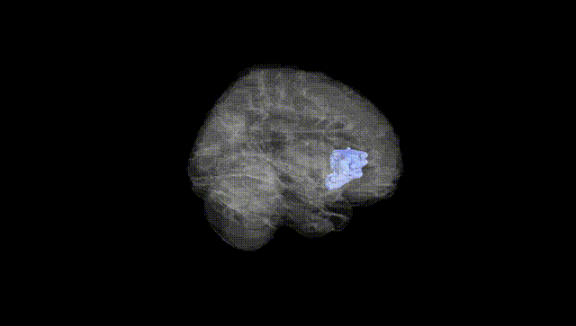
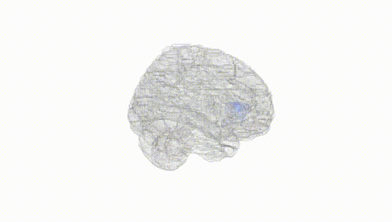
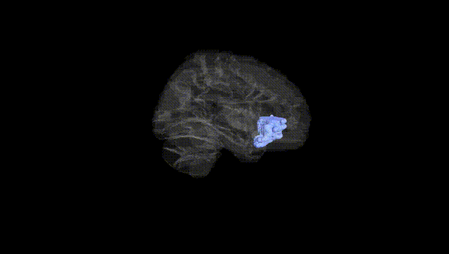
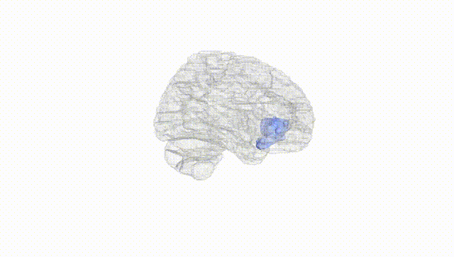
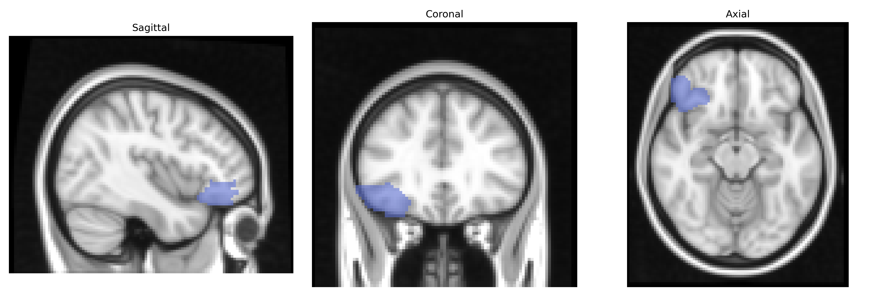
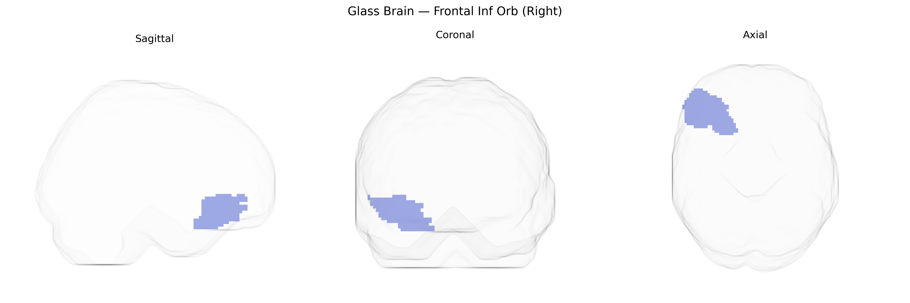

# Frontal Inf Orb (Right)
 
## Overview
 
The right inferior frontal gyrus, orbital part (often labeled “Frontal Inf Orb R” in the AAL atlas), is a ventrolateral prefrontal cortical region located on the orbital surface of the frontal lobe, overlying the roofs of the anterior cranial fossa and anterior to the insula. It corresponds to the orbital subdivision of the inferior frontal gyrus and is cytoarchitectonically related to Brodmann areas in the orbitofrontal cortex (notably parts of BA47/12). This region is implicated in affective processing, reward evaluation, and decision-making, as well as in inhibitory control and the modulation of social and emotional behaviors through its extensive connections with limbic, striatal, and sensory association areas. There is no direct link for this exact subregion; a related structure within which it is commonly grouped is the [Orbitofrontal Cortex](https://en.wikipedia.org/wiki/Orbitofrontal_cortex).
 
The right inferior frontal gyrus (Frontal Inf Orb R in the AAL atlas, encompassing orbital portions of the IFG) has been implicated in multiple genetic and GWAS-based findings, primarily through imaging genetics linking common variants to structural volume, cortical thickness, and functional activation. Variants in genes involved in synaptic function and neurodevelopment—such as BDNF, COMT, and serotonin-related genes (e.g., SLC6A4)—have been associated with differences in right inferior frontal structure or activation, particularly in tasks requiring response inhibition and emotion regulation. Large-scale imaging GWAS (e.g., ENIGMA, UK Biobank) have reported associations between common SNPs and cortical thickness or surface area in right frontal regions including the inferior frontal and orbitofrontal cortex, with loci near genes such as HMGA2, CENPO, and others implicated in general brain size and frontal morphology. Clinically, genetic risk for attention-deficit/hyperactivity disorder, schizophrenia, major depressive disorder, and bipolar disorder has been linked to structural and functional alterations in this region, with polygenic risk scores for these conditions correlating with inferior frontal and orbitofrontal measures in some cohorts. For example, ADHD risk alleles and variants in dopaminergic genes have been associated with reduced right IFG volume and altered activation in inhibition tasks; schizophrenia and depression risk variants have been tied to orbitofrontal thickness and connectivity changes. In addition, GWAS of cognitive traits (e.g., general intelligence, executive function, educational attainment) and personality dimensions such as impulsivity have identified genetic architectures that partially converge on frontal cortical measures, including the right inferior frontal/orbitofrontal regions, reinforcing this area’s role as a genetically influenced hub for cognitive control, affect regulation, and vulnerability to psychiatric disorders.
 
*Overview generated by GPT-4o (2026).*
 
---
 
**Region ID:** 2322  
**Hemisphere:** right  
**Atlas:** AAL 
 
---
 
## Frontal Inf Orb (Right) – Black Background (Full Brain)
 

 
**Full Quality Version:** <a href="full_black.mp4" download>Download MP4</a>
 
---
 
## Frontal Inf Orb (Right) – White Background (Full Brain)
 

 
**Full Quality Version:** <a href="full_white.mp4" download>Download MP4</a>
 
---

## Frontal Inf Orb (Right) – Black Background (Hemisphere)
 

 
**Full Quality Version:** <a href="hemi_black.mp4" download>Download MP4</a>
 
---
 
## Frontal Inf Orb (Right) – White Background (Hemisphere)
 

 
**Full Quality Version:** <a href="hemi_white.mp4" download>Download MP4</a>
 
---

## Triplanar View – T1 Background
 

 
---
 
## Triplanar View – Ghost Brain
 


