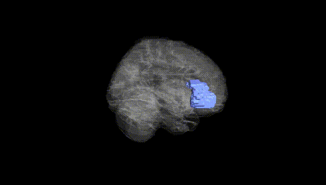
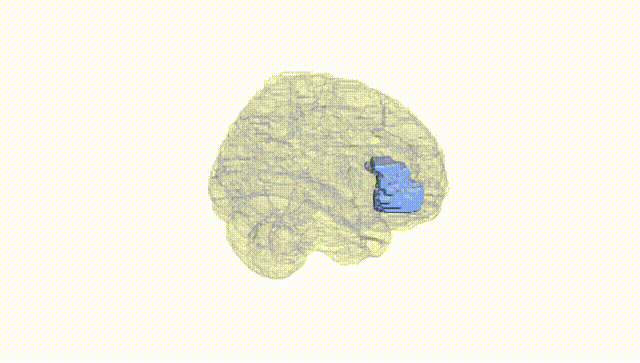
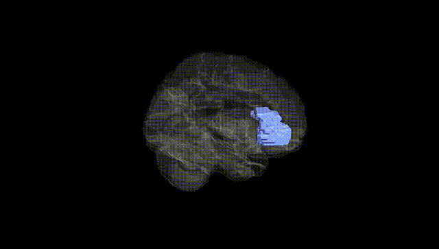
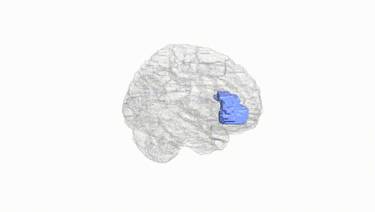
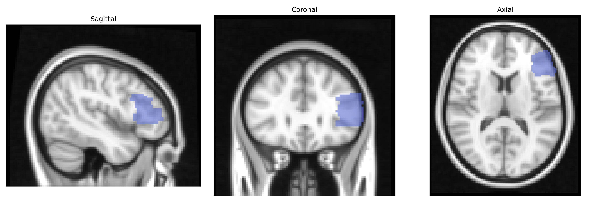
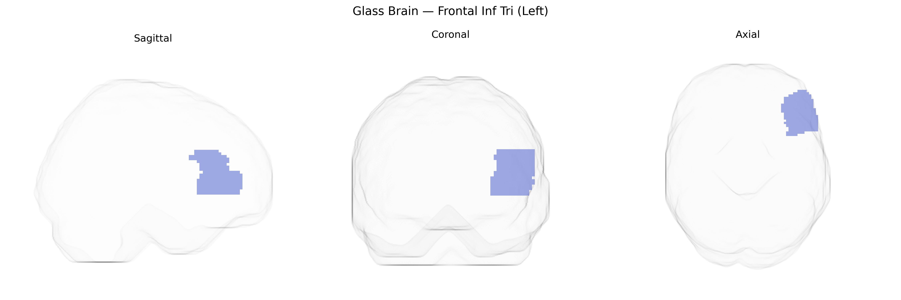

# Frontal Inf Tri (Left)
 
## Overview
 
The left Frontal Inf Tri (Left) region in the AAL atlas corresponds to the left triangular part of the inferior frontal gyrus, a subdivision of the lateral prefrontal cortex situated anterior to the precentral gyrus and inferior to the middle frontal gyrus, bounded by the anterior ascending and horizontal rami of the lateral sulcus. This area is a key component of the dominant-hemisphere language network and substantially overlaps with classical Broca’s area, contributing to speech production, syntactic processing, semantic retrieval, and aspects of verbal working memory and cognitive control. It is heavily interconnected with other frontal regions, the superior temporal gyrus, and subcortical structures, and is typically supplied by branches of the middle cerebral artery. Lesions in this region can lead to expressive (Broca’s) aphasia, impaired speech fluency, and deficits in complex language operations. [Inferior frontal gyrus](https://en.wikipedia.org/wiki/Inferior_frontal_gyrus)
 
The left inferior frontal gyrus (IFG, triangular part; “Frontal Inf Tri (Left)” in the AAL atlas) has been implicated in multiple genetic and GWAS-based associations, primarily involving language, cognitive control, and psychiatric risk. Imaging genetics studies have linked common variants in FOXP2, CNTNAP2, KIAA0319, and DCDC2—genes involved in speech and reading— to structural and functional differences in left IFG, especially in language and phonological processing tasks. Large-scale GWAS of brain structure (e.g., ENIGMA consortium) have identified SNPs near genes such as HMGA2, IGF1, and others associated with frontal lobe volume and cortical thickness, with some loci showing specific or stronger effects in the left IFG. Polygenic risk scores for schizophrenia, major depressive disorder, ADHD, and autism spectrum disorder have been associated with altered gray matter volume, cortical thickness, or activation patterns in the left IFG, consistent with its role in executive function and emotion regulation. Additional GWAS and candidate-gene studies have connected left IFG morphology or activity to educational attainment, general cognitive ability, risk-taking, and impulsivity, often through variants influencing synaptic plasticity, neurodevelopmental pathways, or cortical patterning, although individual effect sizes are small and findings are frequently distributed across many loci rather than specific to a single gene or pathway.
 
*Overview generated by GPT-4o (2026).*
 
---
 
**Region ID:** 2311  
**Hemisphere:** left  
**Atlas:** AAL 
 
---
 
## Frontal Inf Tri (Left) – Black Background (Full Brain)
 

 
**Full Quality Version:** <a href="full_black.mp4" download>Download MP4</a>
 
---
 
## Frontal Inf Tri (Left) – White Background (Full Brain)
 

 
**Full Quality Version:** <a href="full_white.mp4" download>Download MP4</a>
 
---

## Frontal Inf Tri (Left) – Black Background (Hemisphere)
 

 
**Full Quality Version:** <a href="hemi_black.mp4" download>Download MP4</a>
 
---
 
## Frontal Inf Tri (Left) – White Background (Hemisphere)
 

 
**Full Quality Version:** <a href="hemi_white.mp4" download>Download MP4</a>
 
---

## Triplanar View – T1 Background
 

 
---
 
## Triplanar View – Ghost Brain
 


