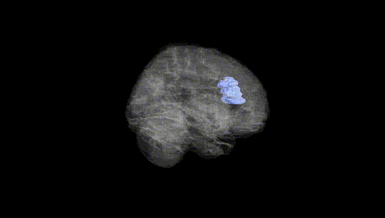
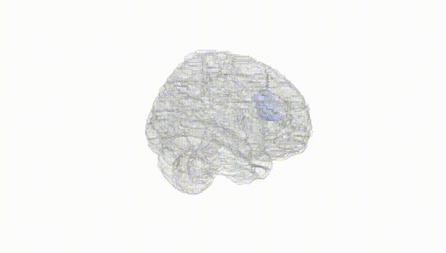
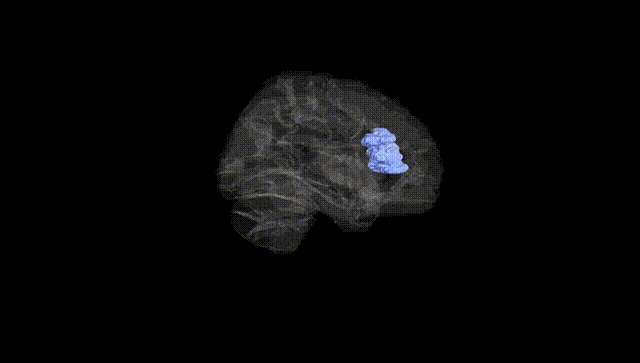
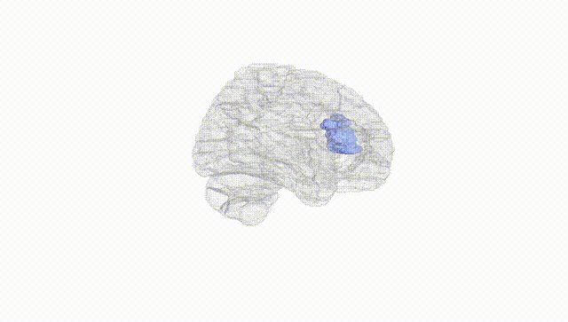
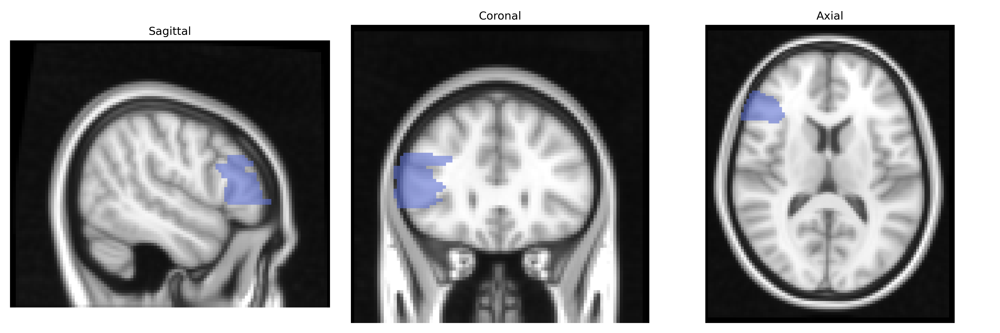
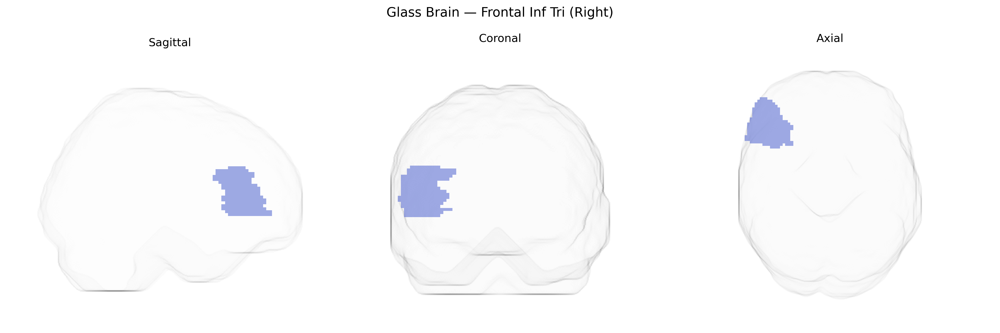

# Frontal Inf Tri (Right)
 
## Overview
 
The right Frontal Inf Tri (Right) region in the AAL atlas corresponds to the right inferior frontal gyrus, pars triangularis, a subdivision of the inferior frontal gyrus located in the lateral prefrontal cortex anterior to the ventrolateral premotor areas and dorsal to the pars opercularis. Cytoarchitectonically, it largely overlaps with Brodmann areas 45 (part of the classical Broca’s complex in the left hemisphere) and adjacent prefrontal fields, and is supplied mainly by branches of the middle cerebral artery. Functionally, the right pars triangularis is implicated in cognitive control, response inhibition, and aspects of social cognition and language prosody rather than core speech production, often showing activation during tasks requiring stopping or overriding prepotent responses and reappraisal of emotional stimuli. It forms part of large-scale frontoparietal control and ventral attention networks via reciprocal connections with the inferior parietal lobule, insula, anterior cingulate cortex, and subcortical nuclei. [Inferior frontal gyrus](https://en.wikipedia.org/wiki/Inferior_frontal_gyrus)
 
The right inferior frontal gyrus (often labeled “Frontal Inf Tri R” in the AAL atlas) has been implicated in genetic studies primarily through its roles in cognitive control, response inhibition, language, and social cognition, with structural and functional variation influenced by common polymorphisms and polygenic risk. GWAS and imaging‑genetics studies link this region’s gray matter volume, cortical thickness, or activation to variants in genes involved in neurodevelopment, synaptic plasticity, and neurotransmission (for example, COMT Val158Met, BDNF Val66Met, DRD2/ANKK1, and various glutamatergic and GABAergic loci), and to broader polygenic scores for intelligence, educational attainment, ADHD, schizophrenia, and major depression, suggesting that many small‑effect variants collectively modulate its structure and function. The right inferior frontal gyrus frequently emerges in large‑scale consortia (e.g., ENIGMA) as a site where cortical morphology is associated with schizophrenia and bipolar disorder risk loci and with autism‑spectrum and ADHD‑related genetic variation affecting fronto‑striatal circuitry. Additionally, genetic influences on impulsivity, risk‑taking, and substance use traits—identified in large GWAS—are often reflected in altered activation of the right inferior frontal gyrus during inhibitory control and decision‑making tasks, indicating that this region serves as a key anatomical substrate through which distributed polygenic risk for psychiatric and behavioral traits exerts its effects.
 
*Overview generated by GPT-4o (2026).*
 
---
 
**Region ID:** 2312  
**Hemisphere:** right  
**Atlas:** AAL 
 
---
 
## Frontal Inf Tri (Right) – Black Background (Full Brain)
 

 
**Full Quality Version:** <a href="full_black.mp4" download>Download MP4</a>
 
---
 
## Frontal Inf Tri (Right) – White Background (Full Brain)
 

 
**Full Quality Version:** <a href="full_white.mp4" download>Download MP4</a>
 
---

## Frontal Inf Tri (Right) – Black Background (Hemisphere)
 

 
**Full Quality Version:** <a href="hemi_black.mp4" download>Download MP4</a>
 
---
 
## Frontal Inf Tri (Right) – White Background (Hemisphere)
 

 
**Full Quality Version:** <a href="hemi_white.mp4" download>Download MP4</a>
 
---

## Triplanar View – T1 Background
 

 
---
 
## Triplanar View – Ghost Brain
 


