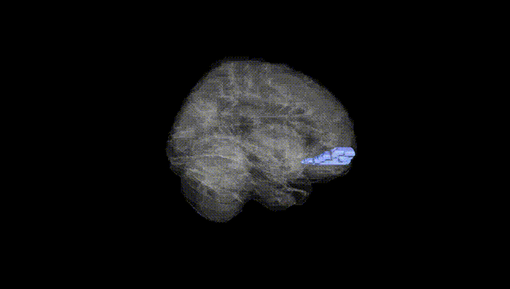
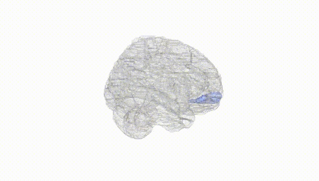
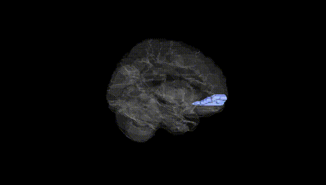
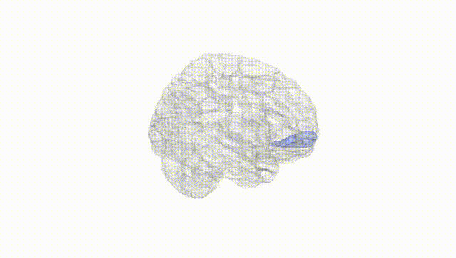
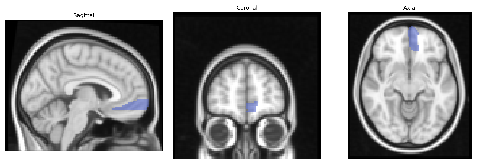
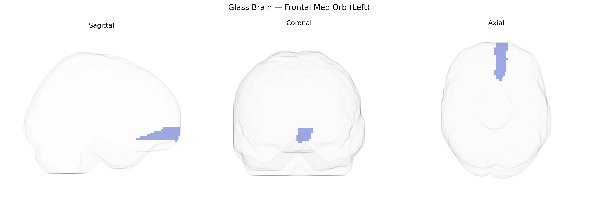

# Frontal Med Orb (Left)
 
## Overview
 
The left Frontal Med Orb (Left) region in the AAL atlas corresponds to the left medial orbital portion of the prefrontal cortex, typically encompassing areas of the ventromedial prefrontal cortex situated on the medial orbital surface of the frontal lobe. This region is highly interconnected with limbic structures, including the amygdala and ventral striatum, and plays key roles in reward processing, valuation, emotion regulation, and decision making, particularly in integrating affective and motivational information to guide goal-directed behavior. It is also implicated in social cognition and moral judgment, as well as in clinical syndromes involving impaired emotional decision making, such as in certain mood and personality disorders. There is no direct Wikipedia article for “Frontal Med Orb,” but it is part of the broader [Ventromedial prefrontal cortex](https://en.wikipedia.org/wiki/Ventromedial_prefrontal_cortex).
 
The left medial orbitofrontal cortex (Frontal Med Orb Left in the AAL atlas) has been implicated in several genetic and neuropsychiatric associations, primarily via imaging–genetics and GWAS of cortical thickness, surface area, and functional activation. Large-scale consortia such as ENIGMA have identified common variants in genes related to neurodevelopment and synaptic function (for example, loci near HMGA2, MIR9-2, and genes regulating neuronal growth and myelination) that associate with orbitofrontal morphology, including regional volume and thickness. Polygenic risk scores for major depressive disorder, bipolar disorder, schizophrenia, and autism spectrum disorder have been linked to altered left medial orbitofrontal structure or activation, consistent with this region’s role in reward valuation, affect regulation, and social cognition. GWAS of behavioral and cognitive traits—such as risk-taking, impulsivity, and neuroticism—also show convergent evidence that genetic variants influencing these traits affect orbitofrontal structure or function. Moreover, some Alzheimer’s disease and general cognitive ability loci (for example, in APOE and other neurodegeneration- or plasticity-related genes) have been associated with orbitofrontal measures in older cohorts, though these effects are typically modest and distributed across many cortical regions rather than specific to the left Frontal Med Orb alone.
 
*Overview generated by GPT-4o (2026).*
 
---
 
**Region ID:** 2611  
**Hemisphere:** left  
**Atlas:** AAL 
 
---
 
## Frontal Med Orb (Left) – Black Background (Full Brain)
 

 
**Full Quality Version:** <a href="full_black.mp4" download>Download MP4</a>
 
---
 
## Frontal Med Orb (Left) – White Background (Full Brain)
 

 
**Full Quality Version:** <a href="full_white.mp4" download>Download MP4</a>
 
---

## Frontal Med Orb (Left) – Black Background (Hemisphere)
 

 
**Full Quality Version:** <a href="hemi_black.mp4" download>Download MP4</a>
 
---
 
## Frontal Med Orb (Left) – White Background (Hemisphere)
 

 
**Full Quality Version:** <a href="hemi_white.mp4" download>Download MP4</a>
 
---

## Triplanar View – T1 Background
 

 
---
 
## Triplanar View – Ghost Brain
 


