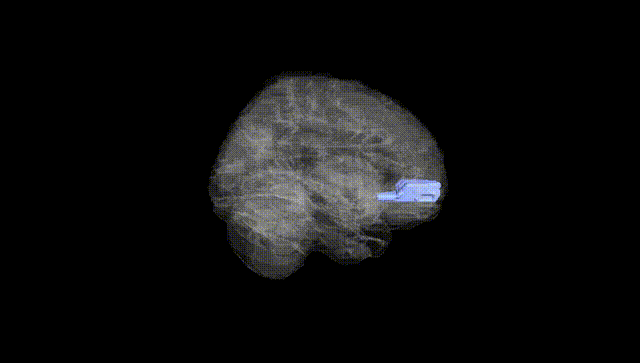
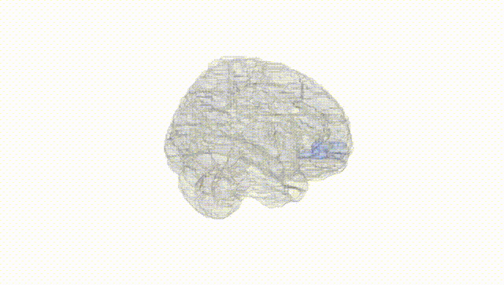
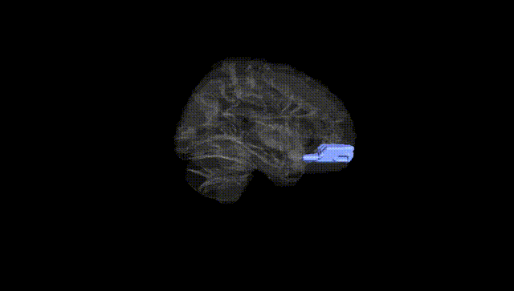
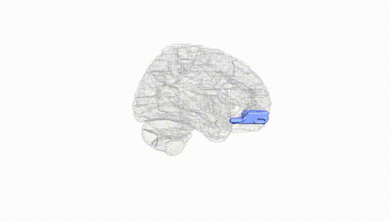
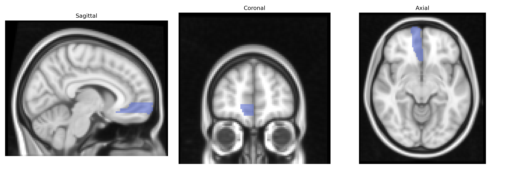
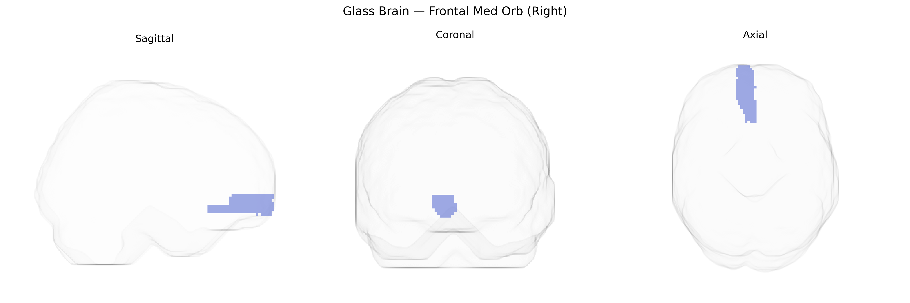

# Frontal Med Orb (Right)
 
## Overview
 
The right Frontal Med Orb region in the AAL atlas corresponds to the right medial orbital part of the frontal cortex, typically encompassing portions of the ventromedial prefrontal cortex and orbitofrontal cortex situated on the medial aspect of the frontal lobe above the orbits. This area is critically involved in valuation, reward processing, affective decision-making, emotional regulation, social cognition, and integration of internal states with external stimuli to guide behavior. It receives dense input from limbic structures (including the amygdala and ventral striatum) and is heavily interconnected with other prefrontal regions, allowing modulation of autonomic and behavioral responses based on expected outcomes and subjective value. In humans, dysfunction or damage in this region has been associated with impaired judgment, altered risk-taking, changes in personality, and mood and anxiety disorders. There is no direct Wikipedia article for “Frontal Med Orb”; a closely related structure is the orbitofrontal cortex: [Orbitofrontal cortex](https://en.wikipedia.org/wiki/Orbitofrontal_cortex).
 
The right medial orbitofrontal cortex (Frontal Med Orb R in the AAL atlas) has been implicated in multiple genetic and GWAS-based findings, mostly through imaging genetics studies that link common variants to structural and functional measures in this region and to disorders affecting reward, affect regulation, and decision-making. Variants in dopaminergic and serotonergic genes (e.g., COMT, DRD2, SLC6A4) have repeatedly been associated with orbitofrontal volume or activation, often in the context of impulsivity, addiction, and mood disorders. Large MRI GWAS consortia (e.g., ENIGMA, UK Biobank-based studies) have identified polygenic influences on orbitofrontal cortical thickness and surface area, with loci spanning genes involved in neurodevelopment (such as those in axon guidance and synaptic formation pathways), and have shown genetic correlations between medial orbitofrontal morphology and traits like general cognitive performance, educational attainment, neuroticism, and risk-taking. Psychiatric GWAS for major depressive disorder, obsessive-compulsive disorder, schizophrenia, and substance use have not typically single out right Frontal Med Orb specifically but, combined with imaging genetics, implicate risk loci (for example within CACNA1C, GRM3, and immune-related genes such as those in the MHC region) that modulate activity and connectivity of medial orbitofrontal networks involved in valuation and affective regulation. Additionally, genome-wide polygenic scores for BMI, alcohol and nicotine use, and externalizing behavior show associations with orbitofrontal cortical measures, supporting a genetically mediated role of the right medial orbitofrontal cortex in reward processing, behavioral control, and vulnerability to psychiatric and addictive disorders.
 
*Overview generated by GPT-4o (2026).*
 
---
 
**Region ID:** 2612  
**Hemisphere:** right  
**Atlas:** AAL 
 
---
 
## Frontal Med Orb (Right) – Black Background (Full Brain)
 

 
**Full Quality Version:** <a href="full_black.mp4" download>Download MP4</a>
 
---
 
## Frontal Med Orb (Right) – White Background (Full Brain)
 

 
**Full Quality Version:** <a href="full_white.mp4" download>Download MP4</a>
 
---

## Frontal Med Orb (Right) – Black Background (Hemisphere)
 

 
**Full Quality Version:** <a href="hemi_black.mp4" download>Download MP4</a>
 
---
 
## Frontal Med Orb (Right) – White Background (Hemisphere)
 

 
**Full Quality Version:** <a href="hemi_white.mp4" download>Download MP4</a>
 
---

## Triplanar View – T1 Background
 

 
---
 
## Triplanar View – Ghost Brain
 


