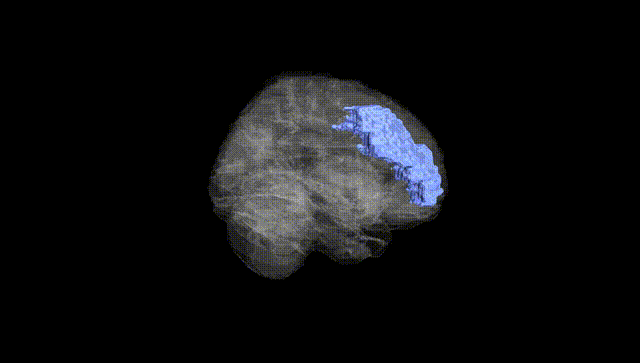
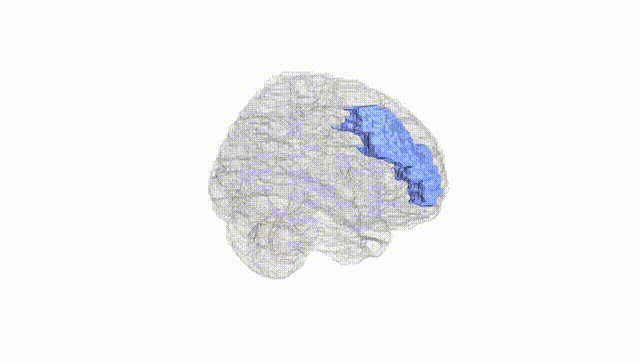
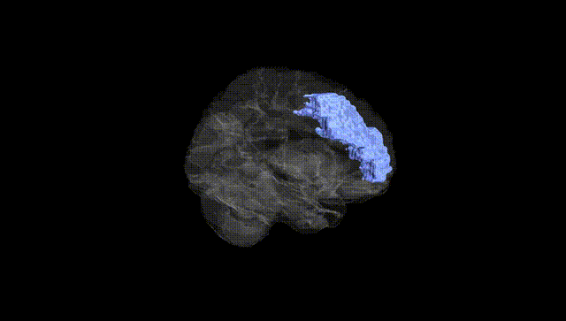
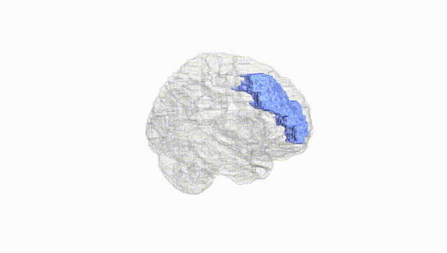
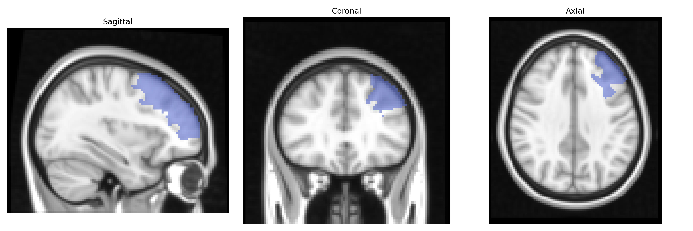
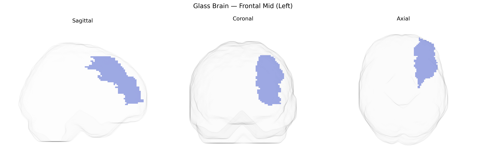

# Frontal Mid (Left)
 
## Overview
 
The left Frontal Mid region in the AAL atlas corresponds primarily to the **left middle frontal gyrus**, a key component of the dorsolateral prefrontal cortex involved in higher-order executive functions. This area participates in working memory, attentional control, planning, decision-making, and the regulation of goal-directed behavior, and it integrates sensory and mnemonic information to guide complex cognitive operations. Neurally, it is heavily interconnected with other prefrontal areas, premotor cortex, parietal association cortices, and subcortical structures such as the basal ganglia, forming part of fronto-striatal and fronto-parietal networks that support cognitive flexibility and top-down control. Functionally, activity in the left middle frontal gyrus is often lateralized for language-related tasks, verbal working memory, and strategic retrieval processes. There is no direct link for “Frontal Mid (Left)” as an AAL label; a closely related structure is the [Middle frontal gyrus](https://en.wikipedia.org/wiki/Middle_frontal_gyrus).
 
The left middle frontal gyrus (Frontal_Mid_L in the AAL atlas), a core component of dorsolateral prefrontal cortex, has been implicated in numerous imaging genetics and GWAS findings linking genetic variation to executive function, working memory, cognitive control, and psychiatric risk. Large neuroimaging GWAS (e.g., ENIGMA, UK Biobank) have identified associations between common variants in genes related to neurodevelopment and synaptic function—such as those in the glutamatergic (GRIN2B, GRIA genes), dopaminergic (COMT), and calcium signaling pathways—and cortical thickness or volume in this region, as well as task-related activation during working memory and inhibition paradigms. Polygenic risk scores for schizophrenia, bipolar disorder, and major depressive disorder frequently show correlations with altered structure or activity in the left middle frontal gyrus, and risk loci in genes like CACNA1C, ZNF804A, and MIR137 have been associated with prefrontal dysfunction that includes AAL-defined Frontal_Mid regions. ADHD and autism-spectrum GWAS and imaging-genetic studies have also reported that variants in genes such as DRD4, SNAP25, and CNTNAP2 modulate prefrontal activation and connectivity during attention and social cognition tasks, with effects often lateralized to the left hemisphere. In cognitive GWAS, alleles associated with general intelligence, educational attainment, and processing speed show downstream associations with morphology and functional efficiency of this region, reinforcing its role as a key anatomical substrate through which distributed polygenic influences on cognition and psychiatric vulnerability are expressed.
 
*Overview generated by GPT-4o (2026).*
 
---
 
**Region ID:** 2201  
**Hemisphere:** left  
**Atlas:** AAL 
 
---
 
## Frontal Mid (Left) – Black Background (Full Brain)
 

 
**Full Quality Version:** <a href="full_black.mp4" download>Download MP4</a>
 
---
 
## Frontal Mid (Left) – White Background (Full Brain)
 

 
**Full Quality Version:** <a href="full_white.mp4" download>Download MP4</a>
 
---

## Frontal Mid (Left) – Black Background (Hemisphere)
 

 
**Full Quality Version:** <a href="hemi_black.mp4" download>Download MP4</a>
 
---
 
## Frontal Mid (Left) – White Background (Hemisphere)
 

 
**Full Quality Version:** <a href="hemi_white.mp4" download>Download MP4</a>
 
---

## Triplanar View – T1 Background
 

 
---
 
## Triplanar View – Ghost Brain
 


