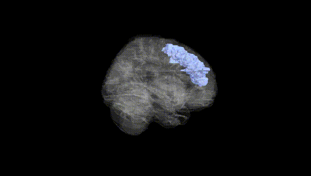
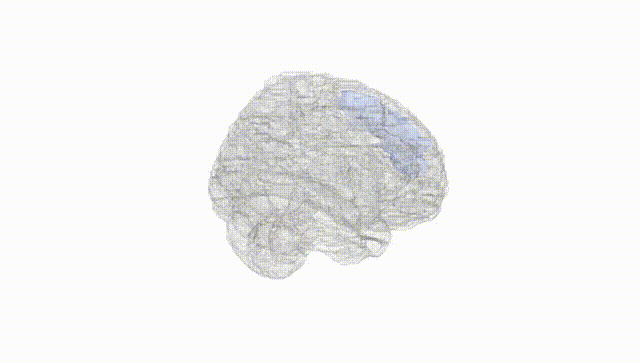
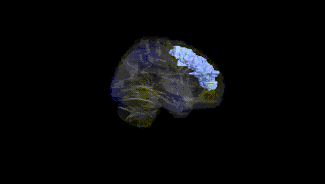
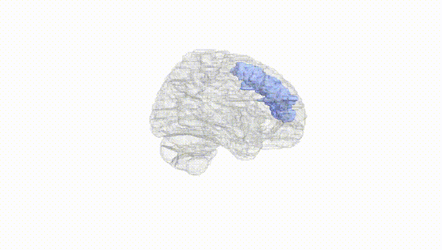
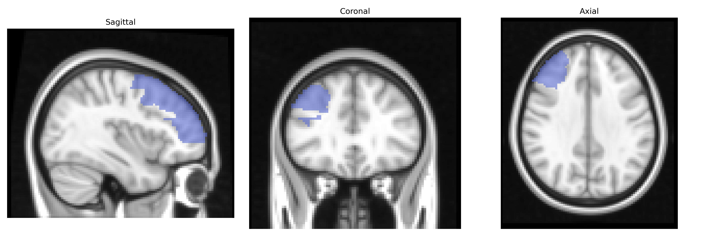
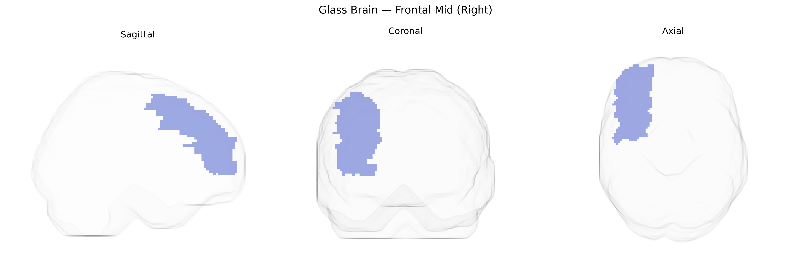

# Frontal Mid (Right)
 
## Overview
 
The right Frontal Mid region in the AAL atlas corresponds mainly to the middle frontal gyrus of the right frontal lobe, a key component of the dorsolateral prefrontal cortex (DLPFC). This area participates in higher-order executive functions, including working memory, attentional control, planning, decision-making, and the regulation of goal-directed behavior. It is heavily interconnected with other prefrontal regions, parietal association cortices, basal ganglia, and limbic structures, enabling integration of sensory, mnemonic, and emotional information for adaptive behavior. Functionally, it contributes to cognitive flexibility, inhibition of inappropriate responses, and the manipulation of information in mind, and is frequently implicated in neuropsychiatric conditions such as depression, schizophrenia, and attention-deficit/hyperactivity disorder. There is no direct link for “Frontal Mid (Right)”; a closely related structure is the [Middle frontal gyrus](https://en.wikipedia.org/wiki/Middle_frontal_gyrus).
 
The right middle frontal gyrus (Frontal Mid Right in the AAL atlas), a core component of the dorsolateral prefrontal cortex, has been implicated in multiple GWAS and imaging–genetic studies linking its structure and function to cognitive traits and neuropsychiatric disorders. Variants in genes affecting synaptic plasticity and neurodevelopment—such as those in the CNTNAP2, DISC1, and BDNF pathways—have been associated with altered right middle frontal volume or activation and with working memory, executive function, and general cognitive performance in large cohorts. Imaging GWAS, including ENIGMA and UK Biobank–derived studies, report significant heritability of cortical thickness and surface area in this region and associations with loci near genes involved in neuronal migration and axonal guidance (e.g., CDH13, DCC), which also show links to attention-deficit/hyperactivity disorder, schizophrenia, bipolar disorder, and major depression. In schizophrenia and bipolar disorder GWAS, polygenic risk scores correlate with right middle frontal structural measures, and right dorsolateral prefrontal dysfunction has been observed in carriers of risk variants in CACNA1C and ZNF804A. Additionally, GWAS of risk-taking, impulsivity, and educational attainment show convergent associations between genetic variants influencing prefrontal morphology and behavioral traits dependent on right middle frontal circuitry, underscoring this region as a genetically modulated hub for executive control, decision-making, and vulnerability to mood and psychotic disorders.
 
*Overview generated by GPT-4o (2026).*
 
---
 
**Region ID:** 2202  
**Hemisphere:** right  
**Atlas:** AAL 
 
---
 
## Frontal Mid (Right) – Black Background (Full Brain)
 

 
**Full Quality Version:** <a href="full_black.mp4" download>Download MP4</a>
 
---
 
## Frontal Mid (Right) – White Background (Full Brain)
 

 
**Full Quality Version:** <a href="full_white.mp4" download>Download MP4</a>
 
---

## Frontal Mid (Right) – Black Background (Hemisphere)
 

 
**Full Quality Version:** <a href="hemi_black.mp4" download>Download MP4</a>
 
---
 
## Frontal Mid (Right) – White Background (Hemisphere)
 

 
**Full Quality Version:** <a href="hemi_white.mp4" download>Download MP4</a>
 
---

## Triplanar View – T1 Background
 

 
---
 
## Triplanar View – Ghost Brain
 


