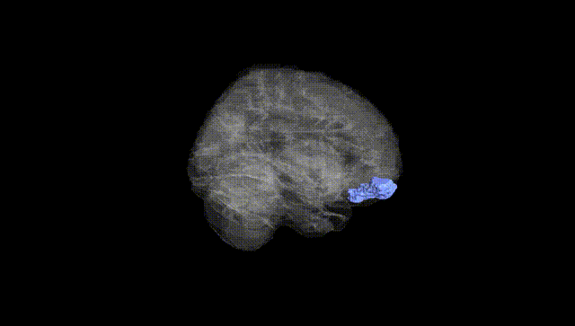
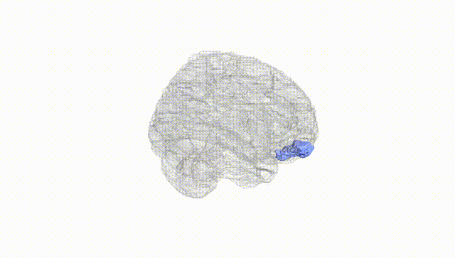
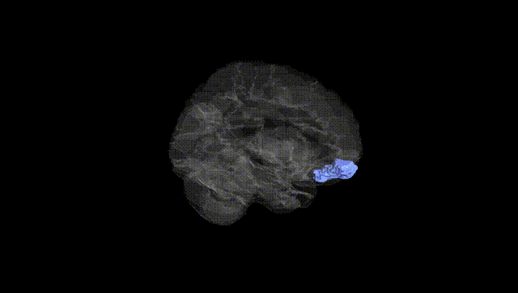
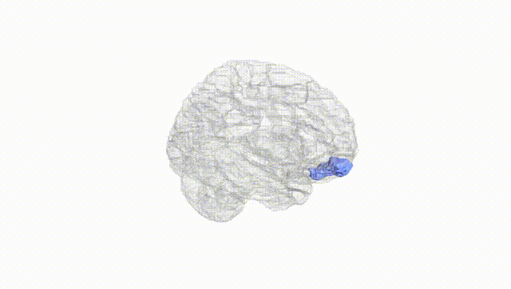
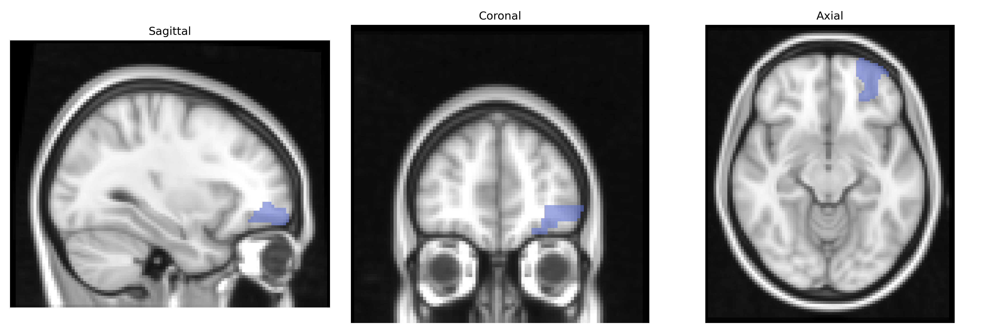
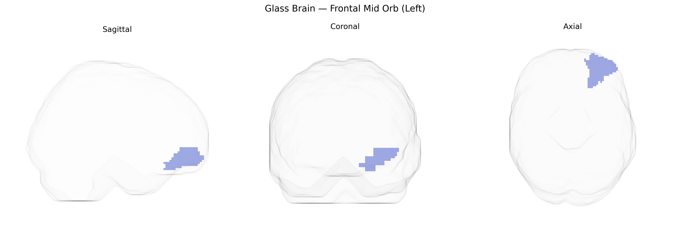

# Frontal Mid Orb (Left)
 
## Overview
 
The left Frontal Mid Orb (Left) region in the AAL atlas corresponds to the left middle frontal gyrus, orbital part, located on the ventral (orbital) surface of the frontal lobe overlying the orbits. This region is part of the prefrontal cortex and is implicated in higher-order cognitive and affective functions, including emotional evaluation, reward-based decision making, and aspects of social cognition and inhibitory control. It maintains extensive connectivity with other prefrontal areas, limbic structures (such as the amygdala), and orbitofrontal networks involved in integrating sensory, visceral, and emotional information to guide behavior, particularly in contexts requiring valuation of outcomes and adaptive regulation of responses. No direct link exists under the exact AAL label, but it corresponds most closely to the [Orbitofrontal cortex](https://en.wikipedia.org/wiki/Orbitofrontal_cortex).
 
The left orbital part of the middle frontal gyrus (Frontal Mid Orb L in the AAL atlas), a core component of the ventromedial/orbitofrontal prefrontal cortex, has been implicated in several genetic association and imaging-genetics studies, though findings are typically reported at the level of broader orbitofrontal or ventromedial prefrontal regions rather than this parcel alone. Large-scale GWAS of cortical thickness and surface area (e.g., ENIGMA, UK Biobank) have identified common variants in genes involved in neurodevelopment, synaptic function, and cell adhesion—such as variants in PLEKHM1, WNT signaling–related loci, and multiple intergenic regions—associated with structural measures in orbitofrontal and adjacent frontal regions that encompass the middle frontal orbital area. Polygenic risk scores for major depression, bipolar disorder, schizophrenia, and ADHD show associations with altered structure or function in orbitofrontal and medial prefrontal areas, including the left orbitofrontal/middle frontal cortex, consistent with this region’s role in reward valuation, affect regulation, and decision-making. In addition, imaging-genetics work links dopaminergic (e.g., DRD2, COMT), serotonergic (e.g., 5-HTTLPR/SLC6A4), and glutamatergic (e.g., GRIN family) variants to orbitofrontal activity during tasks involving reward, punishment, and cognitive control, often reporting left-lateralized or bilateral effects that include the Frontal Mid Orb L parcel. Collectively, available evidence supports genetic contributions to interindividual variation in morphology and function of the left middle frontal orbital region, particularly in relation to mood and psychotic disorders, impulsivity, reward-related traits, and broader neurodevelopmental liability; however, precise gene–region mappings specific strictly to the AAL-defined Frontal Mid Orb L remain limited and are usually inferred from studies targeting larger orbitofrontal or ventromedial prefrontal territories.
 
*Overview generated by GPT-4o (2026).*
 
---
 
**Region ID:** 2211  
**Hemisphere:** left  
**Atlas:** AAL 
 
---
 
## Frontal Mid Orb (Left) – Black Background (Full Brain)
 

 
**Full Quality Version:** <a href="full_black.mp4" download>Download MP4</a>
 
---
 
## Frontal Mid Orb (Left) – White Background (Full Brain)
 

 
**Full Quality Version:** <a href="full_white.mp4" download>Download MP4</a>
 
---

## Frontal Mid Orb (Left) – Black Background (Hemisphere)
 

 
**Full Quality Version:** <a href="hemi_black.mp4" download>Download MP4</a>
 
---
 
## Frontal Mid Orb (Left) – White Background (Hemisphere)
 

 
**Full Quality Version:** <a href="hemi_white.mp4" download>Download MP4</a>
 
---

## Triplanar View – T1 Background
 

 
---
 
## Triplanar View – Ghost Brain
 


