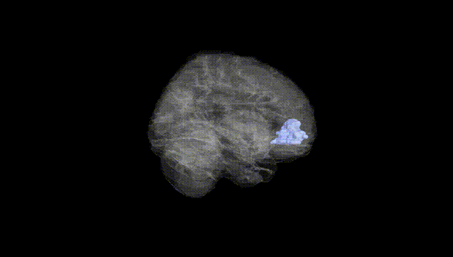
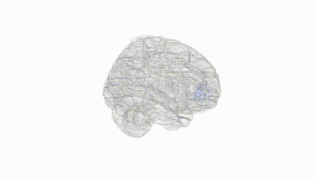
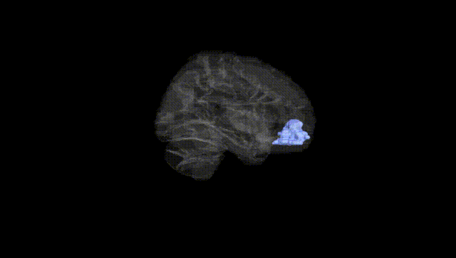
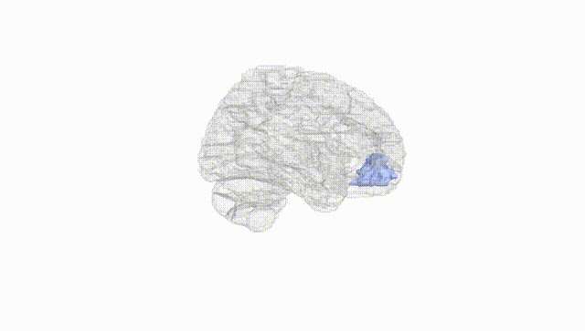
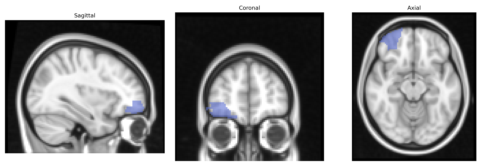
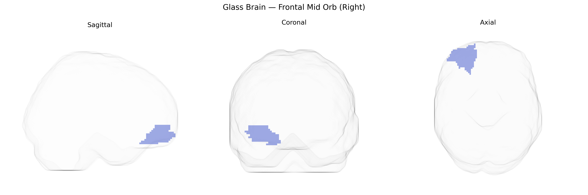

# Frontal Mid Orb (Right)
 
## Overview
 
The right frontal mid orbital region (Frontal_Mid_Orb_R in the AAL atlas) corresponds to the orbital portion of the middle frontal gyrus in the right frontal lobe, forming part of the orbitofrontal cortex situated above the orbits. This region is implicated in reward processing, value-based decision-making, emotional regulation, and the integration of sensory and visceral information to guide behavior. It maintains extensive connections with limbic structures (including the amygdala), the ventral striatum, and other prefrontal areas, supporting roles in evaluating outcomes, adapting behavior to changing contingencies, and modulating social and affective responses. There is no direct Wikipedia article for this exact AAL label; a related structure is the [Orbitofrontal cortex](https://en.wikipedia.org/wiki/Orbitofrontal_cortex).
 
Genetic associations involving the right middle orbital frontal gyrus (often termed right frontal mid orbital in the AAL atlas) largely emerge from imaging-genetics and GWAS of brain structure, function, and connectivity rather than from region-specific single-gene studies; polygenic influences on cortical thickness, surface area, and volume in orbital frontal regions implicate loci near genes involved in neurodevelopment, synaptic signaling, and cell adhesion (for example, variants near MIR137, FOXO3, and cell-adhesion or axon-guidance genes reported in large cortical GWAS), while functional MRI–based GWAS link right orbitofrontal activation during reward and decision-making tasks to dopaminergic and serotonergic gene variants, including DRD2/ANKK1 and SLC6A4. The right orbital frontal cortex has been implicated in psychiatric and neurodevelopmental disorders such as major depressive disorder, bipolar disorder, obsessive–compulsive disorder, attention-deficit/hyperactivity disorder, schizophrenia, and autism spectrum disorder through convergent genetic and imaging evidence, including polygenic risk score studies showing that higher genetic liability for these disorders associates with altered right orbitofrontal thickness or activity. Additional associations include links between orbitofrontal structure/function and genetic risk for substance-use phenotypes (e.g., alcohol and nicotine dependence), impulsivity, neuroticism, and other personality traits, as well as cognitive and social-behavioral dimensions such as risk-taking and reward sensitivity; however, these findings generally implicate broader orbital frontal and ventromedial prefrontal territories, and precise, AAL-defined right frontal mid orbital–specific genetic associations remain comparatively coarse and highly polygenic.
 
*Overview generated by GPT-4o (2026).*
 
---
 
**Region ID:** 2212  
**Hemisphere:** right  
**Atlas:** AAL 
 
---
 
## Frontal Mid Orb (Right) – Black Background (Full Brain)
 

 
**Full Quality Version:** <a href="full_black.mp4" download>Download MP4</a>
 
---
 
## Frontal Mid Orb (Right) – White Background (Full Brain)
 

 
**Full Quality Version:** <a href="full_white.mp4" download>Download MP4</a>
 
---

## Frontal Mid Orb (Right) – Black Background (Hemisphere)
 

 
**Full Quality Version:** <a href="hemi_black.mp4" download>Download MP4</a>
 
---
 
## Frontal Mid Orb (Right) – White Background (Hemisphere)
 

 
**Full Quality Version:** <a href="hemi_white.mp4" download>Download MP4</a>
 
---

## Triplanar View – T1 Background
 

 
---
 
## Triplanar View – Ghost Brain
 


