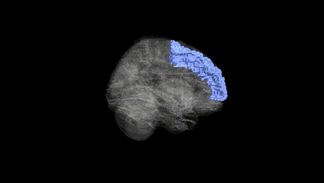
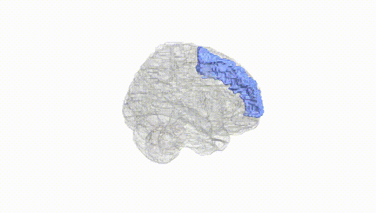
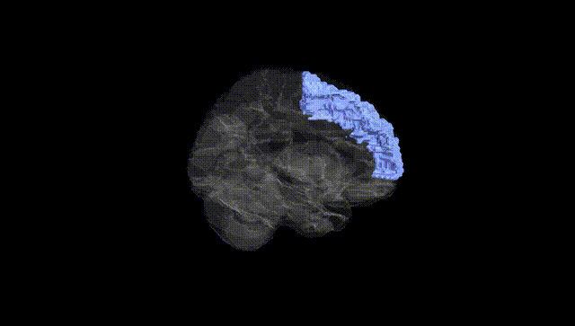
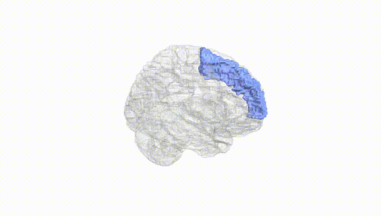
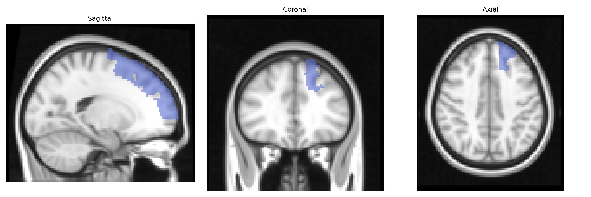
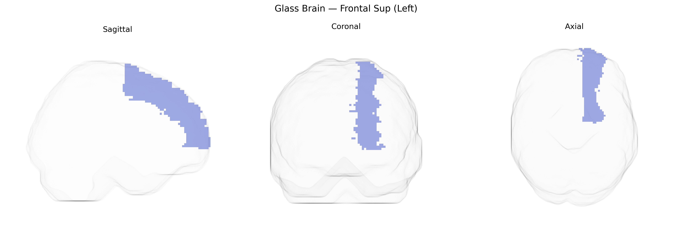

# Frontal Sup (Left)
 
## Overview
 
The left Frontal Superior (Frontal Sup Left) region in the AAL atlas corresponds primarily to the superior frontal gyrus of the left frontal lobe, a dorsomedial cortical territory extending from anterior prefrontal areas toward premotor and supplementary motor regions. It is involved in higher-order executive functions, including working memory, attentional control, decision making, and aspects of self-referential and internally directed thought, as well as contributing to motor planning through its connections with premotor and supplementary motor areas. This region participates in large-scale networks such as the frontoparietal control network and the default mode network, integrating cognitive control signals with sensory and limbic inputs, and shows functional specializations along its anterior–posterior axis, with more anterior portions linked to abstract, strategic processing and more posterior portions linked to action-related planning. [Superior frontal gyrus](https://en.wikipedia.org/wiki/Superior_frontal_gyrus)
 
The left superior frontal gyrus (Frontal Sup (Left) in the AAL atlas), a core component of the dorsomedial and dorsolateral prefrontal cortex, shows substantial heritability in twin and SNP-based studies, with common variants collectively explaining a significant fraction of its surface area and cortical thickness. Large-scale imaging genetics consortia (e.g., ENIGMA, UK Biobank–based GWAS) have identified multiple loci associated with superior frontal morphology, including variants near genes involved in neurodevelopment and synaptic function such as HMGA2, IGF1, MIR137, and genes in Wnt and Notch signaling pathways, although specific loci often show pleiotropic effects across frontal regions rather than being unique to this parcel. Polygenic risk scores for schizophrenia, bipolar disorder, major depressive disorder, and ADHD have been associated with altered thickness or volume in the superior frontal gyrus, and GWAS of cognitive traits (general intelligence, executive function, educational attainment) frequently implicate this region’s structure as a mediator of genetic effects on cognition. Additionally, risk alleles for neuropsychiatric conditions (e.g., CACNA1C and other calcium channel genes, and genes regulating glutamatergic signaling) have been linked to functional and structural variation in medial and superior frontal cortex, including altered activation during working memory and emotion regulation tasks. While direct gene–region mappings specific to the AAL-defined Frontal Sup (Left) remain coarse, convergent genetic evidence supports this region as a key anatomical target of polygenic influences on higher-order cognition and vulnerability to mood and psychotic disorders.
 
*Overview generated by GPT-4o (2026).*
 
---
 
**Region ID:** 2101  
**Hemisphere:** left  
**Atlas:** AAL 
 
---
 
## Frontal Sup (Left) – Black Background (Full Brain)
 

 
**Full Quality Version:** <a href="full_black.mp4" download>Download MP4</a>
 
---
 
## Frontal Sup (Left) – White Background (Full Brain)
 

 
**Full Quality Version:** <a href="full_white.mp4" download>Download MP4</a>
 
---

## Frontal Sup (Left) – Black Background (Hemisphere)
 

 
**Full Quality Version:** <a href="hemi_black.mp4" download>Download MP4</a>
 
---
 
## Frontal Sup (Left) – White Background (Hemisphere)
 

 
**Full Quality Version:** <a href="hemi_white.mp4" download>Download MP4</a>
 
---

## Triplanar View – T1 Background
 

 
---
 
## Triplanar View – Ghost Brain
 


