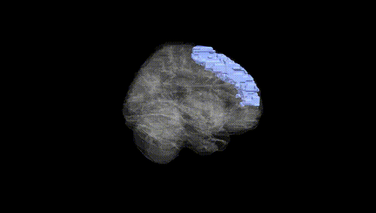
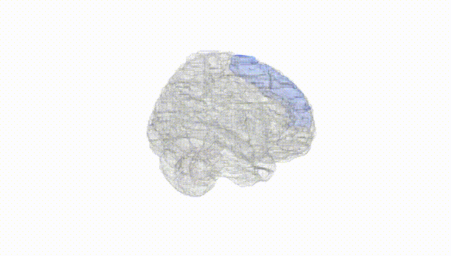
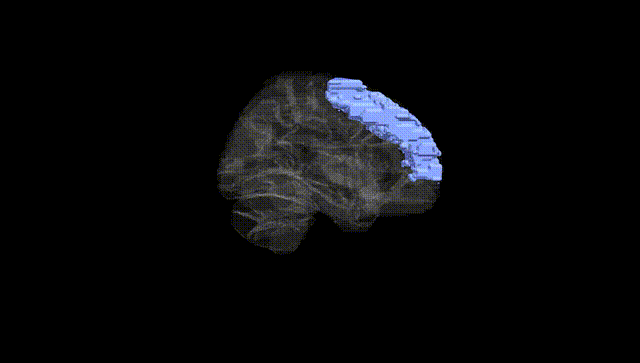
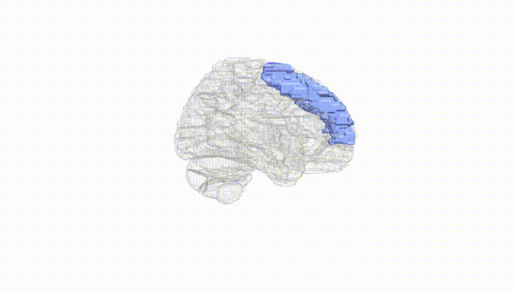
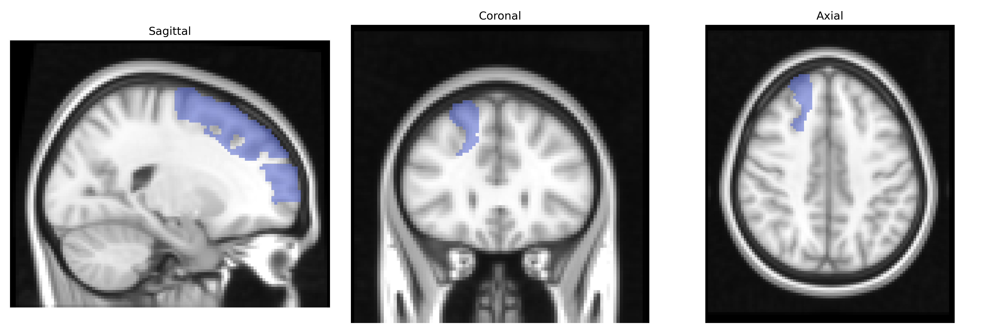
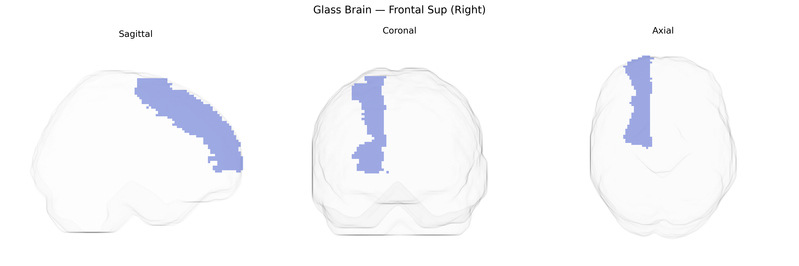

# Frontal Sup (Right)
 
## Overview
 
The right Frontal Sup (Right) region in the AAL atlas corresponds to the right superior frontal gyrus, a dorsal frontal lobe structure situated anterior to the precentral gyrus and extending along the superior frontal surface toward the medial wall. It encompasses parts of Brodmann areas commonly associated with higher-order cognitive functions, including working memory, attentional control, and aspects of executive processing, as well as contributions to self-related cognition and motor planning via connections with premotor and supplementary motor areas. This region is interconnected with other prefrontal, parietal, and cingulate cortices, forming part of large-scale networks such as the frontoparietal control network and, more medially, components of the default mode network. A related overview of this structure and its functions is provided in the article on the [Superior frontal gyrus](https://en.wikipedia.org/wiki/Superior_frontal_gyrus).
 
The right superior frontal gyrus (Frontal Sup Right) in the AAL atlas has been implicated in genetic studies primarily through its roles in executive function, cognitive control, and higher-order social and affective processing. GWAS and imaging genetics work involving cortical thickness, surface area, and functional activation in superior frontal regions—often bilaterally but including right-lateralized clusters—have identified associations with variants in genes involved in neurodevelopment and synaptic function, such as those in glutamatergic and GABAergic pathways, and large-effect loci highlighted in ENIGMA and UK Biobank–based studies of cortical structure. Polygenic scores for intelligence, educational attainment, and working memory correlate with structural and functional measures in superior frontal territories, while risk alleles for schizophrenia, bipolar disorder, major depression, and ADHD show links to altered superior frontal morphology or connectivity, suggesting that part of the genetic liability for these disorders is expressed through this region’s structure and function. Additional GWAS of risk-taking, impulsivity, and neuroticism have identified right frontal and frontopolar clusters where genetic variants modulate activation during decision-making and emotion regulation tasks, and structural imaging genetics has connected common variants in genes such as CACNA1C, GRIN2A, and BDNF to differences in superior frontal cortical thickness or volume. Collectively, these findings support the right superior frontal gyrus as a convergence zone where distributed polygenic influences shape cognitive control, affective regulation, and vulnerability to psychiatric and personality traits.
 
*Overview generated by GPT-4o (2026).*
 
---
 
**Region ID:** 2102  
**Hemisphere:** right  
**Atlas:** AAL 
 
---
 
## Frontal Sup (Right) – Black Background (Full Brain)
 

 
**Full Quality Version:** <a href="full_black.mp4" download>Download MP4</a>
 
---
 
## Frontal Sup (Right) – White Background (Full Brain)
 

 
**Full Quality Version:** <a href="full_white.mp4" download>Download MP4</a>
 
---

## Frontal Sup (Right) – Black Background (Hemisphere)
 

 
**Full Quality Version:** <a href="hemi_black.mp4" download>Download MP4</a>
 
---
 
## Frontal Sup (Right) – White Background (Hemisphere)
 

 
**Full Quality Version:** <a href="hemi_white.mp4" download>Download MP4</a>
 
---

## Triplanar View – T1 Background
 

 
---
 
## Triplanar View – Ghost Brain
 


