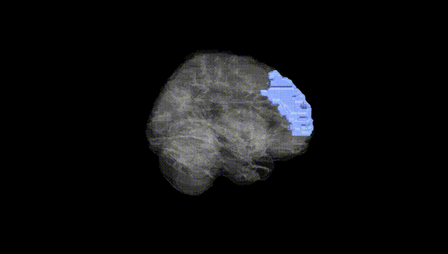
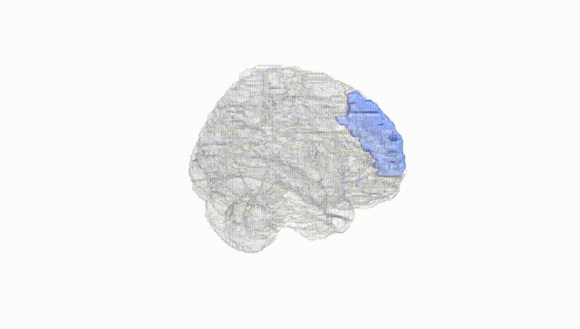
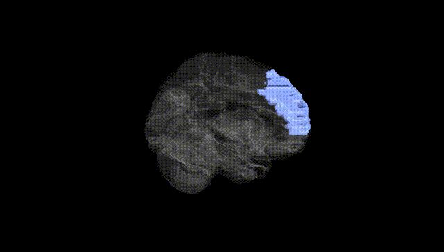
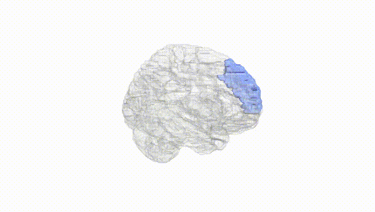
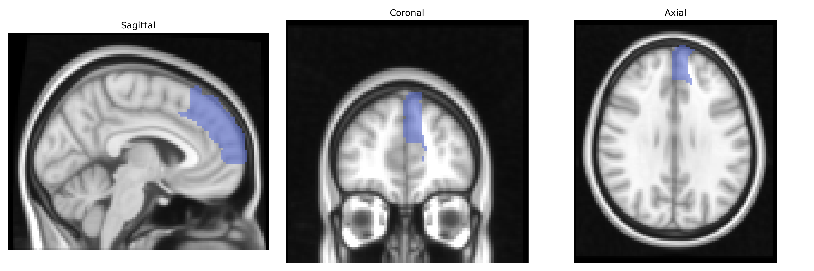
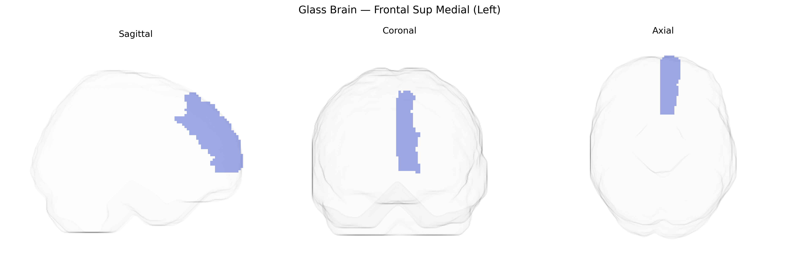

# Frontal Sup Medial (Left)
 
## Overview
 
The left Frontal Sup Medial region in the AAL atlas corresponds primarily to the medial portion of the superior frontal gyrus within the medial prefrontal cortex, extending along the superior aspect of the frontal lobe adjacent to the interhemispheric fissure. This area is implicated in higher-order cognitive functions including self-referential processing, decision-making, aspects of working memory, and regulation of attention, and it participates in networks involved in social cognition and emotion regulation. Anatomically, it lies anterior to the supplementary motor area and superior to the cingulate gyrus, with strong connectivity to other prefrontal, limbic, and parietal regions. There is no direct link for the AAL label “Frontal Sup Medial,” but a closely related structure is the [Medial prefrontal cortex](https://en.wikipedia.org/wiki/Medial_prefrontal_cortex).
 
The left superior medial frontal region (often encompassing medial prefrontal and dorsal anterior cingulate territories in the AAL atlas) shows consistent genetic associations through GWAS and imaging‑genetics studies with traits and disorders involving executive control, mood regulation, and social cognition. Common variants in genes related to synaptic function and neurodevelopment—such as CACNA1C, ZNF804A, MIR137, DRD2, and GRIN2A—have been linked to volumetric, cortical thickness, or functional connectivity measures in this region, particularly in the context of schizophrenia, bipolar disorder, and major depressive disorder. Polygenic risk scores for schizophrenia and depression correlate with altered structure and activation of medial frontal areas during cognitive control and emotion‑processing tasks. Large neuroimaging GWAS consortia (e.g., ENIGMA, UK Biobank) report heritable variation in medial frontal morphology and resting‑state activity associated with genetic loci involved in calcium signaling, glutamatergic transmission, and axon guidance, which also overlap with risk loci for ADHD, autism spectrum disorder, and anxiety. Moreover, genetic variants linked to personality traits (e.g., neuroticism), educational attainment, and general cognitive ability show associations with medial frontal cortical measures, underscoring this region as a key genetically influenced hub for higher-order cognition and affective regulation, although most findings implicate networks that include but are not specific to the left Frontal Sup Medial AAL parcel.
 
*Overview generated by GPT-4o (2026).*
 
---
 
**Region ID:** 2601  
**Hemisphere:** left  
**Atlas:** AAL 
 
---
 
## Frontal Sup Medial (Left) – Black Background (Full Brain)
 

 
**Full Quality Version:** <a href="full_black.mp4" download>Download MP4</a>
 
---
 
## Frontal Sup Medial (Left) – White Background (Full Brain)
 

 
**Full Quality Version:** <a href="full_white.mp4" download>Download MP4</a>
 
---

## Frontal Sup Medial (Left) – Black Background (Hemisphere)
 

 
**Full Quality Version:** <a href="hemi_black.mp4" download>Download MP4</a>
 
---
 
## Frontal Sup Medial (Left) – White Background (Hemisphere)
 

 
**Full Quality Version:** <a href="hemi_white.mp4" download>Download MP4</a>
 
---

## Triplanar View – T1 Background
 

 
---
 
## Triplanar View – Ghost Brain
 


