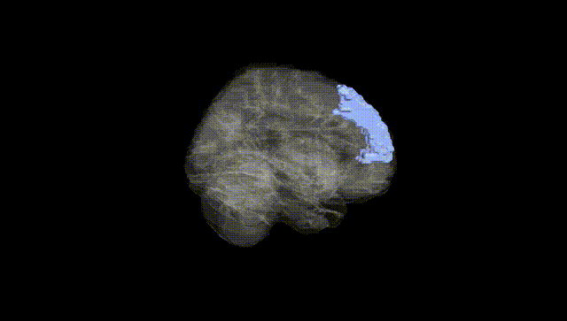
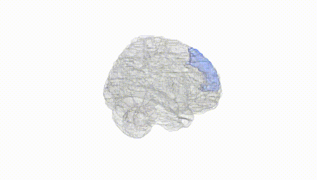
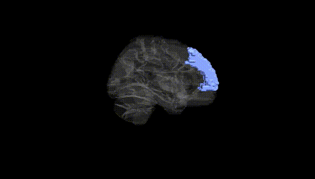
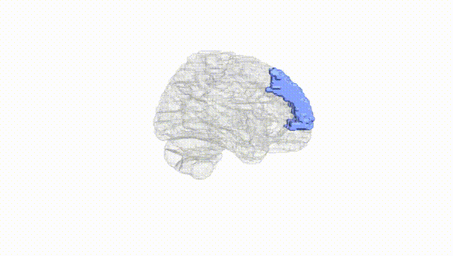
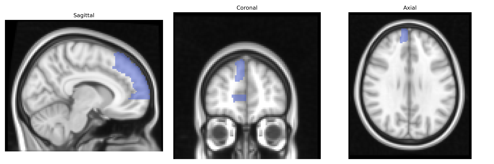
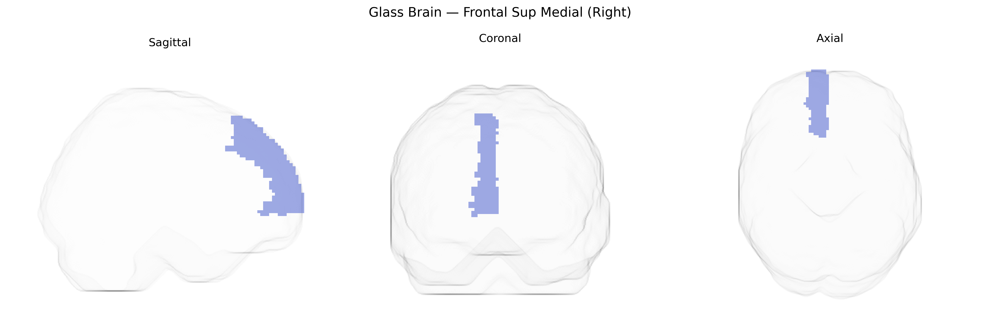

# Frontal Sup Medial (Right)
 
## Overview
 
The right Frontal Superior Medial region (AAL: Frontal_Sup_Medial_R) corresponds primarily to the medial portion of the superior frontal gyrus in the right hemisphere, encompassing parts of the medial prefrontal cortex and often overlapping with the dorsomedial prefrontal and supplementary motor areas. This region is involved in high-level executive functions, including decision-making, cognitive control, and aspects of self-referential processing, as well as in the regulation of motivation and affect via connections with limbic structures such as the cingulate cortex. It participates in large-scale networks such as the default mode and frontoparietal control networks, integrating internally generated information with goal-directed behavior. There is no direct link for this exact atlas label; a related structure is the medial prefrontal cortex: [Medial prefrontal cortex](https://en.wikipedia.org/wiki/Medial_prefrontal_cortex).
 
Genetic associations for the right superior medial frontal region (often encompassing medial prefrontal and anterior cingulate–adjacent areas in the AAL atlas) arise largely from imaging-genetics and GWAS of cortical structure and function rather than single gene–region mappings; large consortia such as ENIGMA and UK Biobank have reported that common variants in genes involved in neuronal development, synaptic signaling, and myelination (for example, loci near genes like CENPW, MIR924HG, and PLEKHM1 identified in global or frontal cortical thickness GWAS) show significant associations with medial frontal thickness, surface area, or volume, and polygenic scores for schizophrenia, major depressive disorder, ADHD, and autism spectrum disorder correlate with altered medial frontal morphology or activity. GWAS of resting-state networks and task fMRI implicate variants near genes related to glutamatergic and GABAergic signaling in modulating medial prefrontal connectivity within default mode and cognitive control networks, while studies of executive function, risk-taking, and neuroticism link frontal medial morphology and activation to polygenic liability for these traits. Additionally, APOE and other Alzheimer’s disease risk loci have been associated with subtle atrophy and hypometabolism in medial frontal regions, and candidate-gene and GWAS-based imaging studies in mood and anxiety disorders repeatedly implicate this area as a structural and functional mediator of genetic risk, although findings are typically distributed and not specific to the right hemisphere alone.
 
*Overview generated by GPT-4o (2026).*
 
---
 
**Region ID:** 2602  
**Hemisphere:** right  
**Atlas:** AAL 
 
---
 
## Frontal Sup Medial (Right) – Black Background (Full Brain)
 

 
**Full Quality Version:** <a href="full_black.mp4" download>Download MP4</a>
 
---
 
## Frontal Sup Medial (Right) – White Background (Full Brain)
 

 
**Full Quality Version:** <a href="full_white.mp4" download>Download MP4</a>
 
---

## Frontal Sup Medial (Right) – Black Background (Hemisphere)
 

 
**Full Quality Version:** <a href="hemi_black.mp4" download>Download MP4</a>
 
---
 
## Frontal Sup Medial (Right) – White Background (Hemisphere)
 

 
**Full Quality Version:** <a href="hemi_white.mp4" download>Download MP4</a>
 
---

## Triplanar View – T1 Background
 

 
---
 
## Triplanar View – Ghost Brain
 


